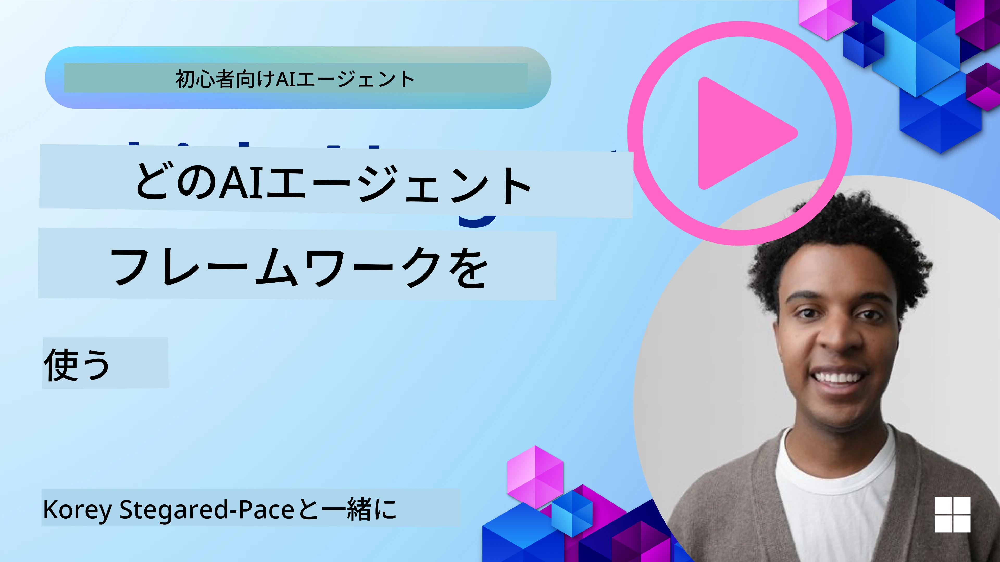

[](https://youtu.be/ODwF-EZo_O8?si=1xoy_B9RNQfrYdF7)

> _(上の画像をクリックするとこのレッスンの動画をご覧いただけます)_

# AIエージェントフレームワークを探る

AIエージェントフレームワークは、AIエージェントの作成、展開、管理を簡素化するために設計されたソフトウェアプラットフォームです。これらのフレームワークは、複雑なAIシステムの開発を効率化するためのあらかじめ構築されたコンポーネント、抽象化、およびツールを開発者に提供します。

これらのフレームワークは、AIエージェント開発における共通の課題に対する標準化されたアプローチを提供することで、開発者がアプリケーションのユニークな側面に集中できるよう支援します。スケーラビリティ、アクセシビリティ、効率性を向上させ、AIシステムの構築を促進します。

## はじめに

このレッスンで扱う内容は以下の通りです：

- AIエージェントフレームワークとは何か、開発者に何を可能にするのか？
- チームがこれらを使ってエージェントの能力を迅速にプロトタイプ作成、反復、改善する方法
- Microsoftが提供するフレームワークやツール（<a href="https://aka.ms/ai-agents-beginners/ai-agent-service" target="_blank">Microsoft Foundry Agent Service</a> と <a href="https://learn.microsoft.com/azure/ai-services/openai/how-to/responses" target="_blank">Microsoft Agent Framework</a>）の違いは何か？
- 既存のAzureエコシステムツールを直接統合できるのか、それともスタンドアロンのソリューションが必要なのか？
- Microsoft Foundry Agent Serviceとは何か、どのように役立つのか？

## 学習目標

このレッスンの目標は、以下を理解する手助けをすることです：

- AIエージェントフレームワークがAI開発に果たす役割
- AIエージェントフレームワークを活用してインテリジェントなエージェントを構築する方法
- AIエージェントフレームワークで可能になる主要な機能
- Microsoft Agent FrameworkとMicrosoft Foundry Agent Serviceの違い

## AIエージェントフレームワークとは何で、開発者に何を可能にするのか？

伝統的なAIフレームワークは、AIをアプリに統合してアプリを改善するのに役立ちます。具体的には次のような点で効果的です：

- <strong>パーソナライズ</strong>: AIはユーザーの行動や好みを分析して、パーソナライズされた推薦、コンテンツ、体験を提供します。
例：Netflixのようなストリーミングサービスは視聴履歴に基づき映画や番組を提案し、ユーザーのエンゲージメントと満足度を高めます。
- <strong>自動化と効率化</strong>: AIは繰り返しの作業を自動化し、ワークフローを合理化し、運用効率を向上させます。
例：カスタマーサービスアプリはAI搭載チャットボットを使い、一般的な問い合わせに対応して応答時間を短縮し、人間の担当者をより複雑な問題に集中させます。
- <strong>ユーザー体験の向上</strong>: AIは音声認識、自然言語処理、予測テキストなどのインテリジェント機能を提供し、全体のユーザー体験を改善します。
例：SiriやGoogle Assistantのようなバーチャルアシスタントは音声コマンドを理解し応答し、ユーザーがデバイスとより簡単にやり取りできるようにします。

### それは素晴らしいですが、なぜAIエージェントフレームワークが必要なのでしょうか？

AIエージェントフレームワークは単なるAIフレームワーク以上のものです。ユーザーや他のエージェント、環境とインタラクションしながら特定の目標を達成する知的エージェントの作成を可能にするために設計されています。これらのエージェントは自律的に振る舞い、意思決定し、変化する状況に適応することができます。以下はAIエージェントフレームワークで可能になる主な機能です：

- <strong>エージェント間の協力と調整</strong>: 複数のAIエージェントが協力し合い、通信し、複雑なタスクを解決できるようにします。
- <strong>タスクの自動化と管理</strong>: マルチステップのワークフロー自動化、タスクの委任、動的なタスク管理の仕組みを提供します。
- <strong>コンテクストの理解と適応</strong>: エージェントにコンテクストを理解し、環境の変化に適応し、リアルタイム情報に基づいて意思決定する能力を備えさせます。

まとめると、エージェントは自動化を次のレベルに引き上げ、環境から学習し適応できるより知的なシステムを作ることを可能にします。

## エージェントの能力を迅速にプロトタイプ作成、反復、改善するには？

この分野は急速に変化していますが、ほとんどのAIエージェントフレームワークに共通する要素として、モジュールコンポーネント、協働ツール、リアルタイム学習があります。これらについて詳しく見ていきましょう：

- <strong>モジュラーコンポーネントを使う</strong>: AI SDKはAIおよびメモリコネクター、自然言語またはコードプラグインによる関数呼び出し、プロンプトテンプレートなどのプレ構築コンポーネントを提供します。
- <strong>協働ツールを活用する</strong>: エージェントに特定の役割やタスクを割り当て、協働ワークフローをテストおよび洗練させます。
- <strong>リアルタイムで学習する</strong>: エージェントがインタラクションから学び行動を動的に調整するフィードバックループを実装します。

### モジュラーコンポーネントを使う

Microsoft Agent FrameworkのようなSDKは、AIコネクター、ツール定義、エージェント管理といったプレ構築コンポーネントを提供します。

<strong>チームの活用例</strong>: チームはこれらのコンポーネントを素早く組み立て、最初から構築することなく機能的なプロトタイプを作り、迅速な実験や反復が可能です。

<strong>実際の使い方</strong>: ユーザー入力から情報を抽出する既製のパーサー、データを保存・取得するメモリモジュール、ユーザーと対話するプロンプトジェネレーターを使うことで、これらのコンポーネントを一から作る必要はありません。

<strong>コード例</strong>: Microsoft Agent Frameworkと`FoundryChatClient`を使って、モデルがツール呼び出しでユーザー入力に応答する例を見てみましょう：

``` python
# マイクロソフトエージェントフレームワーク Python の例

import asyncio
import os

from agent_framework import tool
from agent_framework.foundry import FoundryChatClient
from azure.identity import AzureCliCredential


# 旅行を予約するサンプルのツール関数を定義する
@tool(approval_mode="never_require")
def book_flight(date: str, location: str) -> str:
    """Book travel given location and date."""
    return f"Travel was booked to {location} on {date}"


async def main():
    provider = FoundryChatClient(
        project_endpoint=os.environ["AZURE_AI_PROJECT_ENDPOINT"],
        model=os.environ["AZURE_AI_MODEL_DEPLOYMENT_NAME"],
        credential=AzureCliCredential(),
    )
    agent = provider.as_agent(
        name="travel_agent",
        instructions="Help the user book travel. Use the book_flight tool when ready.",
        tools=[book_flight],
    )

    response = await agent.run("I'd like to go to New York on January 1, 2025")
    print(response)
    # 出力例: 2025年1月1日のニューヨーク行きのフライトが正常に予約されました。良い旅を！ ✈️🗽


if __name__ == "__main__":
    asyncio.run(main())
```

この例からわかるのは、飛行予約リクエストの出発地、目的地、日付などの重要情報を抽出する既製のパーサーをどう活用できるかです。このモジュラーアプローチにより、高レベルのロジックに集中できます。

### 協働ツールを活用する

Microsoft Agent Frameworkのようなフレームワークは、複数エージェントが協力できる環境を提供します。

<strong>チームの活用例</strong>: チームはエージェントに特定の役割とタスクを設計し、協働ワークフローをテスト、改善し、システム全体の効率化を図れます。

<strong>実際の使い方</strong>: データ取得、分析、意思決定などの役割を持つ複数エージェントのチームを作成し、これらが通信・情報共有して共通の目標（ユーザーの問い合わせに答える、タスクを完了するなど）を達成します。

**コード例（Microsoft Agent Framework）**：

```python
# Microsoft Agent Frameworkを使用して協力する複数のエージェントを作成する

import os
from agent_framework.foundry import FoundryChatClient
from azure.identity import AzureCliCredential

provider = FoundryChatClient(
    project_endpoint=os.environ["AZURE_AI_PROJECT_ENDPOINT"],
    model=os.environ["AZURE_AI_MODEL_DEPLOYMENT_NAME"],
    credential=AzureCliCredential(),
)

# データ取得エージェント
agent_retrieve = provider.as_agent(
    name="dataretrieval",
    instructions="Retrieve relevant data using available tools.",
    tools=[retrieve_tool],
)

# データ分析エージェント
agent_analyze = provider.as_agent(
    name="dataanalysis",
    instructions="Analyze the retrieved data and provide insights.",
    tools=[analyze_tool],
)

# タスクに対してエージェントを順番に実行する
retrieval_result = await agent_retrieve.run("Retrieve sales data for Q4")
analysis_result = await agent_analyze.run(f"Analyze this data: {retrieval_result}")
print(analysis_result)
```

前述のコード例では、複数のエージェントによるデータ分析タスクの作成方法が示されています。エージェントそれぞれが特定の機能を実行し、それらを調整して成果をあげます。専門的な役割を持つ専用エージェントを作ることでタスクの効率とパフォーマンスが向上します。

### リアルタイムで学習する

先進的なフレームワークはリアルタイムコンテクスト理解と適応機能を提供します。

<strong>チームの活用例</strong>: チームはフィードバックループを実装し、エージェントがインタラクションから学習し行動を動的に調整させ、能力を継続的に向上・洗練させることができます。

<strong>実際の使い方</strong>: エージェントはユーザーのフィードバック、環境データ、タスク結果を分析して知識ベースを更新し、意思決定アルゴリズムを調整し、時間の経過とともにパフォーマンスを改善します。この反復的学習プロセスにより、エージェントは変化する条件やユーザーの好みに適応して全体効果を高めます。

## Microsoft Agent FrameworkとMicrosoft Foundry Agent Serviceの違いは何ですか？

これらのアプローチを比較するには多くの観点がありますが、設計、機能、対象ユースケースの主要な違いを見てみましょう：

## Microsoft Agent Framework (MAF)

Microsoft Agent Frameworkは、`FoundryChatClient`を使ってAIエージェントを構築するためのシンプルなSDKを提供します。Azure OpenAIモデルを活用し、組み込みのツール呼び出し、会話管理、Azure IDによる企業レベルのセキュリティが利用可能です。

<strong>ユースケース</strong>: ツール使用、多段階ワークフロー、企業統合シナリオを備えた実運用可能なAIエージェント構築に最適です。

Microsoft Agent Frameworkの重要なコア概念は以下の通りです：

- <strong>エージェント</strong>。エージェントは`FoundryChatClient`で作成され、名前、指示、ツールを設定します。エージェントは：
  - ユーザーメッセージを処理し、Azure OpenAIモデルを用いて応答を生成
  - 会話のコンテクストに基づきツールを自動呼び出し
  - 複数のインタラクションを通じて会話状態を保持

  以下はエージェント作成のコード例です：

    ```python
    import os
    from agent_framework.foundry import FoundryChatClient
    from azure.identity import AzureCliCredential

    provider = FoundryChatClient(
        project_endpoint=os.environ["AZURE_AI_PROJECT_ENDPOINT"],
        model=os.environ["AZURE_AI_MODEL_DEPLOYMENT_NAME"],
        credential=AzureCliCredential(),
    )
    agent = provider.as_agent(
        name="my_agent",
        instructions="You are a helpful assistant.",
    )

    response = await agent.run("Hello, World!")
    print(response)
    ```

- <strong>ツール</strong>。フレームワークはエージェントが自動的に呼び出せるPython関数としてツール定義をサポートします。ツールはエージェント作成時に登録されます：

    ```python
    def get_weather(location: str) -> str:
        """Get the current weather for a location."""
        return f"The weather in {location} is sunny, 72\u00b0F."

    agent = provider.as_agent(
        name="weather_agent",
        instructions="Help users check the weather.",
        tools=[get_weather],
    )
    ```

- <strong>マルチエージェント協調</strong>。異なる専門性を持つ複数のエージェントを作成し、協調させることが可能です：

    ```python
    planner = provider.as_agent(
        name="planner",
        instructions="Break down complex tasks into steps.",
    )

    executor = provider.as_agent(
        name="executor",
        instructions="Execute the planned steps using available tools.",
        tools=[execute_tool],
    )

    plan = await planner.run("Plan a trip to Paris")
    result = await executor.run(f"Execute this plan: {plan}")
    ```

- **Azureアイデンティティ統合**。フレームワークは`AzureCliCredential`（または`DefaultAzureCredential`）を用い、キー管理の必要なく安全な認証を実現します。

## Microsoft Foundry Agent Service

Microsoft Foundry Agent Serviceは2024年のMicrosoft Igniteで発表されたより新しいサービスです。Llama 3、Mistral、CohereのようなオープンソースLLMを直接呼び出すなど、より柔軟なモデルでAIエージェントの開発と展開を可能にします。

Microsoft Foundry Agent Serviceは強力な企業向けセキュリティ機構とデータ保存手法を提供し、企業アプリケーションに適しています。

Microsoft Agent Frameworkと連携してエージェントの構築と展開が可能です。

このサービスは現在パブリックプレビュー段階で、PythonおよびC#でのエージェント構築をサポートしています。

Microsoft Foundry Agent Service Python SDKを使うと、ユーザー定義のツールを持つエージェントを作成できます：

```python
import asyncio
from azure.identity import DefaultAzureCredential
from azure.ai.projects import AIProjectClient

# ツール関数を定義する
def get_specials() -> str:
    """Provides a list of specials from the menu."""
    return """
    Special Soup: Clam Chowder
    Special Salad: Cobb Salad
    Special Drink: Chai Tea
    """

def get_item_price(menu_item: str) -> str:
    """Provides the price of the requested menu item."""
    return "$9.99"


async def main() -> None:
    credential = DefaultAzureCredential()
    project_client = AIProjectClient.from_connection_string(
        credential=credential,
        conn_str="your-connection-string",
    )

    agent = project_client.agents.create_agent(
        model="gpt-5-mini",
        name="Host",
        instructions="Answer questions about the menu.",
        tools=[get_specials, get_item_price],
    )

    thread = project_client.agents.create_thread()

    user_inputs = [
        "Hello",
        "What is the special soup?",
        "How much does that cost?",
        "Thank you",
    ]

    for user_input in user_inputs:
        print(f"# User: '{user_input}'")
        message = project_client.agents.create_message(
            thread_id=thread.id,
            role="user",
            content=user_input,
        )
        run = project_client.agents.create_and_process_run(
            thread_id=thread.id, agent_id=agent.id
        )
        messages = project_client.agents.list_messages(thread_id=thread.id)
        print(f"# Agent: {messages.data[0].content[0].text.value}")


if __name__ == "__main__":
    asyncio.run(main())
```

### コア概念

Microsoft Foundry Agent Serviceのコア概念は以下の通りです：

- <strong>エージェント</strong>。Microsoft Foundry Agent ServiceはMicrosoft Foundryと統合されます。Microsoft Foundryの中で、AIエージェントは「スマート」マイクロサービスとして機能し、質問応答（RAG）、アクション実行、ワークフローの完全自動化を実現します。これは生成AIモデルの力をツールと組み合わせ、現実世界のデータソースにアクセスし操作することで成し遂げます。エージェントの例は以下です：

    ```python
    agent = project_client.agents.create_agent(
        model="gpt-5-mini",
        name="my-agent",
        instructions="You are helpful agent",
        tools=code_interpreter.definitions,
        tool_resources=code_interpreter.resources,
    )
    ```

    この例では、モデル`gpt-5-mini`、名前`my-agent`、指示`You are helpful agent`でエージェントを作成。コード解釈タスクを実行するためのツールとリソースが装備されています。

- <strong>スレッドとメッセージ</strong>。スレッドは重要な概念で、エージェントとユーザー間の会話やインタラクションを表します。スレッドは会話の進行を追跡し、コンテクスト情報を保存し、インタラクションの状態を管理します。スレッドの例はこちら：

    ```python
    thread = project_client.agents.create_thread()
    message = project_client.agents.create_message(
        thread_id=thread.id,
        role="user",
        content="Could you please create a bar chart for the operating profit using the following data and provide the file to me? Company A: $1.2 million, Company B: $2.5 million, Company C: $3.0 million, Company D: $1.8 million",
    )
    
    # エージェントにスレッドで作業を行うよう依頼する
    run = project_client.agents.create_and_process_run(thread_id=thread.id, agent_id=agent.id)
    
    # エージェントの応答を見るためにすべてのメッセージを取得してログを取る
    messages = project_client.agents.list_messages(thread_id=thread.id)
    print(f"Messages: {messages}")
    ```

    前述のコードではスレッドを作成し、それにメッセージを送信しています。`create_and_process_run`を呼び出すことで、エージェントにスレッド上で作業を行わせています。最後にメッセージを取得してログに記録し、エージェントの応答を確認します。メッセージは会話の進行を示すもので、テキスト、画像、ファイルなど多様なタイプがあります。開発者は応答をさらに処理したりユーザーに提示したりすることができます。

- **Microsoft Agent Frameworkとの統合**。Microsoft Foundry Agent ServiceはMicrosoft Agent Frameworkとシームレスに連携し、`FoundryChatClient`でエージェントを構築し、Agent Service経由で本番環境に展開可能です。

<strong>ユースケース</strong>: Microsoft Foundry Agent Serviceは、安全でスケーラブルかつ柔軟なAIエージェント展開を必要とする企業向けアプリケーションを対象としています。

## これらのアプローチの違いは？
 
重なる部分もありますが、設計、機能、ターゲットとするユースケースにおいていくつかの重要な違いがあります：
 
- **Microsoft Agent Framework (MAF)**：ツール呼び出し、会話管理、Azureアイデンティティ統合を備えた実運用対応のAIエージェント構築SDKです。
- **Microsoft Foundry Agent Service**：Microsoft Foundry内のプラットフォームおよび展開サービスで、Azure OpenAI、Azure AI Search、Bing Search、コード実行などのサービスとの組み込み接続を提供します。
 
どちらを選ぶべきか迷っていますか？

### ユースケース
 
一般的なユースケースをいくつか例示してみましょう：
 
> Q: 本番のAIエージェントアプリを作りたいが、素早く始めたい
>

>A: Microsoft Agent Frameworkが良い選択です。`FoundryChatClient`を用いたシンプルでPython的なAPIで、数行のコードでツールと指示を含むエージェントを定義できます。

>Q: AzureのSearchやコード実行などの統合を含む企業向け展開が必要
>
> A: Microsoft Foundry Agent Serviceが最適です。複数モデル、Azure AI Search、Bing Search、Azure Functionsへの組み込み機能を持つプラットフォームサービスで、Foundryポータルでエージェントを構築し拡張展開できます。
 
> Q: まだ混乱しているので一択だけ教えてほしい
>
> A: まずはMicrosoft Agent Frameworkでエージェントを構築し、本番展開やスケールが必要になった際にMicrosoft Foundry Agent Serviceを利用する方法がおすすめです。これによりエージェントのロジックを迅速に反復開発しつつ、企業展開への明確な道筋を持てます。
 
主要な違いを表でまとめます：

| フレームワーク | フォーカス | コア概念 | ユースケース |
| --- | --- | --- | --- |
| Microsoft Agent Framework | ツール呼び出しを備えたシンプルなエージェントSDK | エージェント、ツール、Azureアイデンティティ | AIエージェント構築、ツール利用、マルチステップワークフロー |
| Microsoft Foundry Agent Service | 柔軟なモデル、企業セキュリティ、コード生成、ツール呼び出し | モジュール化、協働、プロセスオーケストレーション | 安全でスケーラブルかつ柔軟なAIエージェント展開 |

## 既存のAzureエコシステムツールを直接統合できますか、それともスタンドアロンのソリューションが必要ですか？


答えはイエスです。既存の Azure エコシステムツールを Microsoft Foundry Agent Service と直接統合できます。特に、これは他の Azure サービスとシームレスに連携するように構築されているためです。例えば、Bing、Azure AI Search、Azure Functions を統合することが可能です。また Microsoft Foundry との深い統合もあります。

Microsoft Agent Framework は `FoundryChatClient` と Azure アイデンティティを通じて Azure サービスと統合されており、エージェントツールから直接 Azure サービスを呼び出すことができます。

## サンプルコード

- Python: [Agent Framework (Microsoft Foundry)](./code_samples/02-python-agent-framework.ipynb)
- Python: [Agent Framework (Azure OpenAI Responses API)](./code_samples/02-python-agent-framework-azure-openai.ipynb)
- .NET: [Agent Framework](./code_samples/02-dotnet-agent-framework.md)

## AI Agent Framework についてさらに質問がありますか？

[Microsoft Foundry Discord](https://discord.com/invite/ATgtXmAS5D) に参加して、他の学習者と交流したり、オフィスアワーに参加して AI エージェントについての質問に答えてもらいましょう。

## 参考資料

- <a href="https://techcommunity.microsoft.com/blog/azure-ai-services-blog/introducing-azure-ai-agent-service/4298357" target="_blank">Azure Agent Service</a>
- <a href="https://learn.microsoft.com/azure/ai-services/openai/how-to/responses" target="_blank">Microsoft Agent Framework - Azure OpenAI Responses</a>
- <a href="https://learn.microsoft.com/azure/ai-services/agents/overview" target="_blank">Microsoft Foundry Agent Service</a>

## 前回のレッスン

[AIエージェントとエージェントのユースケースの紹介](../01-intro-to-ai-agents/README.md)

## 次のレッスン

[AIエージェント設計の原則](../03-agentic-design-patterns/README.md)

---

<!-- CO-OP TRANSLATOR DISCLAIMER START -->
**免責事項**：
本書類は AI 翻訳サービス [Co-op Translator](https://github.com/Azure/co-op-translator) を使用して翻訳されています。正確性を期していますが、自動翻訳には誤りや不正確な部分が含まれる可能性があることをご承知おきください。原文の原語版が正式な情報源とみなされるべきです。重要な情報については、専門の人間による翻訳を推奨します。本翻訳の利用により生じたいかなる誤解や解釈違いについても、当方は責任を負いかねます。
<!-- CO-OP TRANSLATOR DISCLAIMER END -->
