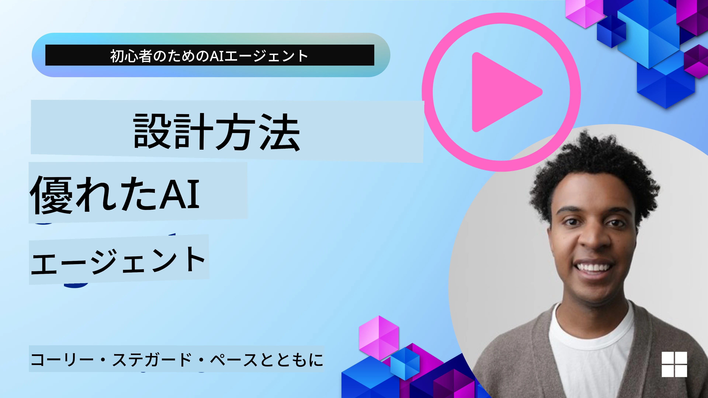
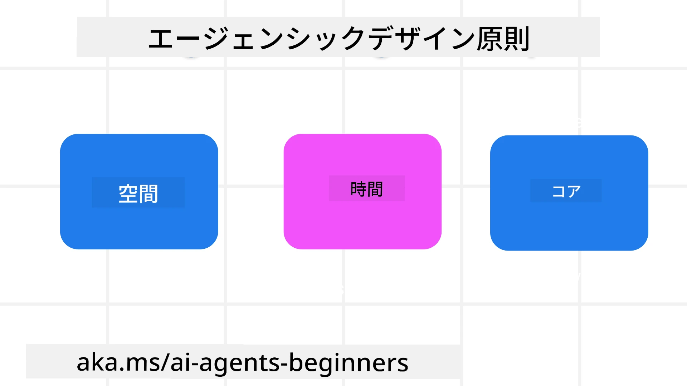

> _(上の画像をクリックするとこのレッスンの動画をご覧いただけます)_
# AIエージェント設計の原則

## はじめに

AIエージェントシステムの構築には様々な考え方があります。生成AI設計において曖昧さはバグではなく特徴であるため、エンジニアがどこから始めればよいか分かりにくいことがあります。そこで、開発者が顧客中心のエージェントシステムを構築しビジネスの課題を解決できるように、人間中心のUXデザイン原則を作成しました。これらの設計原則は指示的なアーキテクチャではなく、エージェント体験を定義・構築するチームの出発点となるものです。

一般的に、エージェントは以下のようであるべきです：

- 人間の能力を拡張・拡大すること（ブレインストーミング、問題解決、自動化など）
- 知識のギャップを埋めること（特定ドメインの知識の習得、翻訳など）
- 私たちが他者と協働する際の好みに合った方法で協働を促進し支援すること
- 私たちがより良い自分になる手助けをすること（例：ライフコーチやタスクマスターとして、感情調整やマインドフルネスのスキル習得を助け、レジリエンスを構築するなど）

## このレッスンで扱う内容

- エージェント設計原則とは何か
- これらの設計原則を実装する際のガイドライン
- 設計原則を使用した例

## 学習目標

このレッスンを完了すると、以下のことができるようになります：

1. エージェント設計原則が何かを説明できる
2. エージェント設計原則を使う際のガイドラインを説明できる
3. エージェント設計原則を用いてエージェントを構築する方法を理解する

## エージェント設計原則

### エージェント（空間）

これはエージェントが操作する環境です。これらの原則は、物理的およびデジタルの世界でエージェントを設計する際に役立ちます。

- **つなげること、崩壊させないこと** – 人と人、イベント、実行可能な知識をつなぎ、協働や繋がりを促進します。
- エージェントはイベント、知識、人をつなぎます。
- エージェントは人々をより近づけます。人を置き換えたり軽視したりするための設計ではありません。
- <strong>簡単にアクセス可能でありながら時に見えない</strong> – エージェントは主にバックグラウンドで動作し、関連性があり適切な場合にのみユーザーを促します。
  - エージェントは認可されたユーザーが任意のデバイスやプラットフォームで簡単に見つけアクセスできます。
  - エージェントは音声、テキストなどのマルチモーダル入力・出力をサポートします。
  - エージェントはユーザーのニーズを感知し、前景・背景や能動的・受動的モードをシームレスに切り替えられます。
  - エージェントは目に見えない形で動作することもありますが、そのバックグラウンドプロセスや他のエージェントとの協働はユーザーに透明で制御可能です。

### エージェント（時間）

これはエージェントが時間を通じて動作する方法です。過去・現在・未来にまたがるエージェントの設計に役立ちます。

- <strong>過去</strong>: 状態と文脈を含む履歴を振り返る。
  - エージェントはイベント、人、状態だけでなく豊富な履歴データを分析し、より関連性の高い結果を提供します。
  - エージェントは過去の出来事からつながりを作り、記憶を反映して現在の状況に関与します。
- <strong>現在</strong>: 通知以上の促し。
  - エージェントは包括的な対話アプローチを体現します。イベントが起きたときに静的な通知を超え、ユーザーの注意を適切なタイミングで誘導する流れを簡素化・動的に生成できます。
  - エージェントは文脈、社会文化の変化、ユーザー意図に応じて情報を提供します。
  - エージェントとの対話は徐々に複雑さを増しながら長期的にユーザーを強化します。
- <strong>未来</strong>: 適応と進化。
  - エージェントは様々なデバイス、プラットフォーム、モダリティに適応します。
  - ユーザーの行動やアクセシビリティのニーズに合わせ自由にカスタマイズ可能です。
  - エージェントは継続的なユーザーとの対話を通じて形成・進化します。

### エージェント（コア）

これらはエージェント設計の中心的な要素です。

- <strong>不確実性を受け入れつつ信頼を築く</strong>。
  - ある程度のエージェントの不確実性は予期されており、不確実性は設計の重要な要素です。
  - 信頼と透明性はエージェント設計の基盤です。
  - ユーザーはエージェントのオン／オフを制御でき、状況は常に明確に表示されます。

## これらの原則を実装するためのガイドライン

先の設計原則を使う際には次のガイドラインを守ってください：

1. <strong>透明性</strong>：AIの関与、機能（過去の行動含む）、フィードバック方法とシステムの変更方法をユーザーに知らせる。
2. <strong>制御</strong>：ユーザーがカスタマイズや好みの指定、個人化を行え、システムや属性をコントロールできるようにする（忘却機能を含む）。
3. <strong>一貫性</strong>：デバイスやエンドポイント全体で一貫したマルチモーダル体験を目指す。可能な限り馴染みのあるUI/UX要素（例：音声用マイクアイコン）を使用し、顧客の認知負荷を減らす（簡潔な応答、視覚補助、 「もっと学ぶ」コンテンツなどを目指す）。

## これらの原則とガイドラインを使った旅行代理店エージェントの設計方法

旅行代理店エージェントを設計すると想定して、設計原則とガイドラインをどのように使うかを考えてみましょう：

1. <strong>透明性</strong> – ユーザーに旅行代理店がAI対応エージェントであることを知らせます。開始方法の基本的な指示（例：挨拶メッセージ、サンプルプロンプト）を提供します。製品ページでこれを明確に文書化します。ユーザーが過去に尋ねたプロンプトのリストを表示し、フィードバック方法（賛成・反対のサムズアップ／ダウン、フィードバック送信ボタンなど）をはっきり示します。エージェントに利用制限や話題制限がある場合は明確にします。
2. <strong>制御</strong> – 作成後にユーザーがシステムプロンプトなどでエージェントをどのように修正できるかを明確にします。エージェントの応答の冗長さ、文体、話してはいけない内容の注意事項をユーザーが選択できるようにします。関連するファイル、データ、プロンプト、過去の会話を閲覧・削除できるようにします。
3. <strong>一貫性</strong> – 共有プロンプト、ファイルや写真添付、タグ付けのアイコンが標準的で認識しやすいものになっていることを確実にします。ファイルアップロードやエージェントとの共有にはクリップアイコン、画像アップロードには画像アイコンを使います。

## サンプルコード

- Python: [Agent Framework](./code_samples/03-python-agent-framework.ipynb)
- .NET: [Agent Framework](./code_samples/03-dotnet-agent-framework.md)

## AIエージェント設計パターンについてさらに質問がありますか？

[Microsoft Foundry Discord](https://discord.com/invite/ATgtXmAS5D) に参加して、他の学習者と交流したり、オフィスアワーに参加してAIエージェントに関する質問に答えてもらいましょう。

## 追加リソース

- <a href="https://openai.com" target="_blank">エージェントAIシステムの運用に関する実践例 | OpenAI</a>
- <a href="https://microsoft.com" target="_blank">HAXツールキットプロジェクト - Microsoft Research</a>
- <a href="https://responsibleaitoolbox.ai" target="_blank">Responsible AI Toolbox</a>

## 前のレッスン

[AIエージェントフレームワークを探る](../02-explore-agentic-frameworks/README.md)

## 次のレッスン

[ツール使用デザインパターン](../04-tool-use/README.md)

---

<!-- CO-OP TRANSLATOR DISCLAIMER START -->
**免責事項**：
本書類は AI 翻訳サービス [Co-op Translator](https://github.com/Azure/co-op-translator) を使用して翻訳されています。正確性を期していますが、自動翻訳には誤りや不正確な部分が含まれる可能性があることをご承知おきください。原文の原語版が正式な情報源とみなされるべきです。重要な情報については、専門の人間による翻訳を推奨します。本翻訳の利用により生じたいかなる誤解や解釈違いについても、当方は責任を負いかねます。
<!-- CO-OP TRANSLATOR DISCLAIMER END -->
