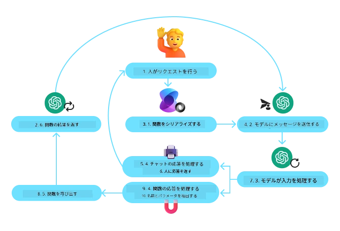
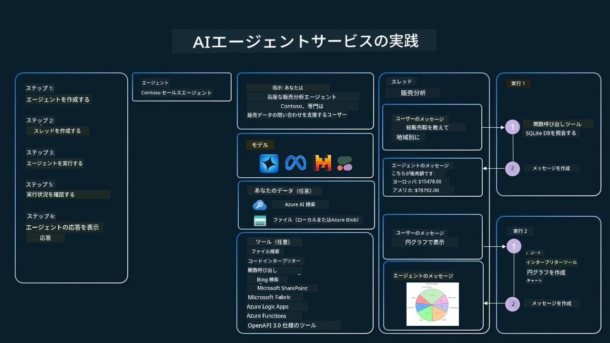

[](https://youtu.be/vieRiPRx-gI?si=cEZ8ApnT6Sus9rhn)

> _(上の画像をクリックするとこのレッスンの動画が表示されます)_

# ツール使用デザインパターン

ツールは、AIエージェントにより広い範囲の能力を付与できるため興味深いものです。エージェントが行える動作のセットが限られている代わりに、ツールを追加することで、エージェントはより幅広い動作を実行できるようになります。本章では、AIエージェントが特定のツールを使用して目標を達成する方法を説明するツール使用デザインパターンについて説明します。

## はじめに

このレッスンでは、次の問いに答えます:

- ツール使用デザインパターンとは何か？
- どのようなユースケースに適用できるのか？
- デザインパターンを実装するために必要な要素／構成要素は何か？
- 信頼できるAIエージェントを構築するためにツール使用デザインパターンを使う際の特別な考慮点は何か？

## 学習目標

このレッスンを終えた後、あなたは次のことができるようになります:

- ツール使用デザインパターンとその目的を定義できる。
- ツール使用デザインパターンが適用可能なユースケースを特定できる。
- デザインパターンを実装するために必要な主要な要素を理解できる。
- このデザインパターンを使うAIエージェントの信頼性を確保するための考慮点を認識できる。

## ツール使用デザインパターンとは？

<strong>ツール使用デザインパターン</strong>は、大規模言語モデル（LLM）が特定の目標達成のために外部ツールと連携できる能力を与えることに焦点を当てています。ツールはエージェントが動作を実行するために実行できるコードです。ツールは計算機のような単純な関数でも、株価の照会や天気予報などのサードパーティサービスへのAPI呼び出しでもかまいません。AIエージェントの文脈では、ツールは<strong>モデル生成の関数呼び出し</strong>に応答してエージェントが実行するよう設計されています。

## 適用可能なユースケースは？

AIエージェントはツールを活用して複雑なタスクを完了したり、情報を取得したり、意思決定を行うことができます。ツール使用デザインパターンは、データベース、ウェブサービス、コードインタープリターなどの外部システムとの動的なやり取りが必要なシナリオでよく使われます。以下のようなユースケースで役立ちます:

- **動的情報取得:** エージェントは外部APIやデータベースに問い合わせを行い最新データを取得できます（例：SQLiteデータベースのクエリでデータ分析、株価や天気情報の取得）。
- **コード実行と解釈:** エージェントはコードやスクリプトを実行して数学問題を解いたり、レポート作成やシミュレーションを行ったりできます。
- **ワークフロー自動化:** タスクスケジューラー、メールサービス、データパイプラインなどのツールを統合して繰り返しや複数段階のワークフローを自動化。
- **カスタマーサポート:** エージェントはCRMシステム、チケッティングプラットフォーム、ナレッジベースと連携してユーザーの問い合わせに対応。
- **コンテンツ生成と編集:** 文法チェッカー、要約ツール、コンテンツ安全評価などのツールを使ってコンテンツ作成を支援。

## ツール使用デザインパターンの実装に必要な構成要素は？

これらの構成要素により、AIエージェントは多様なタスクを実行可能になります。ツール使用デザインパターンを実装するための主要な要素を見てみましょう:

- **関数／ツールスキーマ**: 利用可能なツールの詳細定義。関数名、目的、必要なパラメーター、期待される出力など。これらのスキーマにより、LLMはどのツールが使用可能で、有効なリクエストをどのように構築するかを理解できます。

- <strong>関数実行ロジック</strong>: ユーザーの意図や会話コンテキストに基づいてツールの呼び出しを管理。プランナーモジュール、ルーティング機構、条件分岐などで動的にツール使用を決定。

- <strong>メッセージ処理システム</strong>: ユーザー入力、LLMレスポンス、ツール呼び出しおよびツール出力間の会話フローを管理。

- <strong>ツール統合フレームワーク</strong>: 単純な関数や複雑な外部サービスなど、様々なツールをエージェントに接続するインフラ。

- <strong>エラー処理と検証</strong>: ツール実行時の失敗処理、パラメーターの検証、予期せぬ応答の管理メカニズム。

- <strong>状態管理</strong>: 会話コンテキストや過去のツール使用情報、永続データを追跡し、複数ターンのやり取りにおける一貫性を保証。

次に、関数／ツール呼び出しについて詳しく見ていきましょう。
 
### 関数／ツール呼び出し

関数呼び出しは、大規模言語モデル（LLM）がツールと連携する主な方法です。『関数』と『ツール』はよく同義で使われますが、『関数』は再利用可能なコードのブロックであり、エージェントがタスクを実行するための『ツール』です。関数のコードを呼び出すには、LLMがユーザーの要求を関数の説明と比較しなければなりません。そのため、利用可能な関数の説明を含むスキーマをLLMに送ります。LLMはその中から最適な関数を選び、その名前と引数を返します。選択された関数が呼び出され、その応答がLLMに返され、LLMはそれを使ってユーザーの要求に応答します。

開発者がエージェント用の関数呼び出しを実装するには、以下が必要です:

1. 関数呼び出しをサポートするLLMモデル
2. 関数の説明を含むスキーマ
3. 各関数の実装コード

例として都市の現在時刻取得を使って説明しましょう:

1. **関数呼び出しをサポートするLLMを初期化する:**

    すべてのモデルが関数呼び出しをサポートしているわけではないため、使用中のLLMがサポートしているか確認が必要です。<a href="https://learn.microsoft.com/azure/ai-services/openai/how-to/function-calling" target="_blank">Azure OpenAI</a> は関数呼び出しをサポートします。まずAzure OpenAIの<strong>Responses API</strong>（安定版の `/openai/v1/` エンドポイントで `api_version` は不要）に対するOpenAIクライアントを起動します。

    ```python
    # Azure OpenAI（Responses API、v1エンドポイント）用のOpenAIクライアントを初期化する
    client = OpenAI(
        base_url=f"{os.environ['AZURE_OPENAI_ENDPOINT'].rstrip('/')}/openai/v1/",
        api_key=os.environ["AZURE_OPENAI_API_KEY"],
    )
    deployment_name = os.environ["AZURE_OPENAI_DEPLOYMENT"]
    ```

1. **関数スキーマを作成する:**

    続いて、関数名、関数の動作説明、パラメーター名と説明を含むJSONスキーマを定義します。
    このスキーマをさきほど作成したクライアントに渡し、ユーザーの「サンフランシスコの時刻を取得する」リクエストとともに送ります。重要なのは、返されるのは<strong>ツール呼び出し</strong>であり、質問の最終答えではありません。前述のように、LLMはタスクに最適な関数名と引数を返します。

    ```python
    # モデルが読み取るための関数説明（Responses APIフラットツール形式）
    tools = [
        {
            "type": "function",
            "name": "get_current_time",
            "description": "Get the current time in a given location",
            "parameters": {
                "type": "object",
                "properties": {
                    "location": {
                        "type": "string",
                        "description": "The city name, e.g. San Francisco",
                    },
                },
                "required": ["location"],
            },
        }
    ]
    ```
   
    ```python
  
    # 初期ユーザーメッセージ
    messages = [{"role": "user", "content": "What's the current time in San Francisco"}]

    # 最初のAPI呼び出し: モデルに関数を使うように依頼する
    response = client.responses.create(
        model=deployment_name,
        input=messages,
        tools=tools,
        tool_choice="auto",
        store=False,
    )

    # Responses APIはfunction_call項目としてのツール呼び出しをresponse.outputに返します。
    # 次のターンでモデルが完全なコンテキストを持つように、それらを会話に追加します。
    messages += response.output

    print("Model's response:")
    print(response.output)
  
    ```

    ```bash
    Model's response:
    [ResponseFunctionToolCall(arguments='{"location":"San Francisco"}', call_id='call_pOsKdUlqvdyttYB67MOj434b', name='get_current_time', type='function_call')]
    ```
  
1. **タスクを実行するための関数コード:**

    LLMが実行すべき関数を選択したので、そのタスクを実装し実行するコードが必要です。
    Pythonで現在時刻を取得するコードを実装し、さらに結果を得るために `response_message` から名前と引数を抽出するコードも書きます。

    ```python
      def get_current_time(location):
        """Get the current time for a given location"""
        print(f"get_current_time called with location: {location}")  
        location_lower = location.lower()
        
        for key, timezone in TIMEZONE_DATA.items():
            if key in location_lower:
                print(f"Timezone found for {key}")  
                current_time = datetime.now(ZoneInfo(timezone)).strftime("%I:%M %p")
                return json.dumps({
                    "location": location,
                    "current_time": current_time
                })
      
        print(f"No timezone data found for {location_lower}")  
        return json.dumps({"location": location, "current_time": "unknown"})
    ```

     ```python
    # 関数呼び出しを処理する
    tool_calls = [item for item in response.output if item.type == "function_call"]
    if tool_calls:
        for tool_call in tool_calls:
            if tool_call.name == "get_current_time":

                function_args = json.loads(tool_call.arguments)

                time_response = get_current_time(
                    location=function_args.get("location")
                )

                # ツールの結果をfunction_call_output項目として返す
                messages.append({
                    "type": "function_call_output",
                    "call_id": tool_call.call_id,
                    "output": time_response,
                })
    else:
        print("No tool calls were made by the model.")

    # 2回目のAPI呼び出し：モデルから最終応答を取得する
    final_response = client.responses.create(
        model=deployment_name,
        input=messages,
        tools=tools,
        store=False,
    )

    return final_response.output_text
     ```

     ```bash
      get_current_time called with location: San Francisco
      Timezone found for san francisco
      The current time in San Francisco is 09:24 AM.
     ```

関数呼び出しは多くのエージェントツール使用デザインの中心となりますが、ゼロから実装するのは時に困難です。
[Lesson 2](../../../02-explore-agentic-frameworks)で学んだように、エージェントフレームワークはツール使用のための構成要素を予め提供してくれます。
 
## エージェントフレームワークを用いたツール使用の例

ここでは異なるエージェントフレームワークでツール使用デザインパターンを実装する例を示します:

### Microsoft Agent Framework

<a href="https://learn.microsoft.com/azure/ai-services/agents/overview" target="_blank">Microsoft Agent Framework</a> はAIエージェント構築のためのオープンソースフレームワークです。`@tool`デコレータでPython関数としてツールを定義可能にし、関数呼び出しの処理を簡素化しています。モデルとコード間の通信を処理し、`FoundryChatClient`を介してファイル検索やコードインタープリターなどの予め組み込まれたツールにもアクセスできます。

次の図はMicrosoft Agent Frameworkにおける関数呼び出しの流れを示しています:



Microsoft Agent Frameworkでは、デコレータ付き関数としてツールを定義します。先ほどの `get_current_time` 関数を `@tool` デコレータでツールに変換し、関数とパラメーターのシリアライズやスキーマ作成をフレームワークが自動処理します。

```python
import os
from agent_framework import tool
from agent_framework.foundry import FoundryChatClient
from azure.identity import AzureCliCredential

@tool(approval_mode="never_require")
def get_current_time(location: str) -> str:
    """Get the current time for a given location"""
    ...

# クライアントを作成する
provider = FoundryChatClient(
    project_endpoint=os.environ["AZURE_AI_PROJECT_ENDPOINT"],
    model=os.environ["AZURE_AI_MODEL_DEPLOYMENT_NAME"],
    credential=AzureCliCredential(),
)

# エージェントを作成し、ツールで実行する
agent = provider.as_agent(name="TimeAgent", instructions="Use available tools to answer questions.", tools=get_current_time)
response = await agent.run("What time is it?")
```
  
### Microsoft Foundry Agent Service

<a href="https://learn.microsoft.com/azure/ai-services/agents/overview" target="_blank">Microsoft Foundry Agent Service</a> は、開発者が基盤の計算・ストレージ管理なしに安全に高品質で拡張可能なAIエージェントを構築・配備・スケールできるよう設計された新しいエージェントフレームワークです。特に企業向けに設計された完全マネージドサービスであり、企業レベルのセキュリティを備えています。

LLM APIを直接使って開発する場合と比べ、Microsoft Foundry Agent Serviceは以下の利点があります:

- ツール呼び出しの自動化—ツール呼び出しの解析、実行、応答処理をサーバー側で一括して行うため開発負荷軽減
- セキュアなデータ管理—独自に会話状態を管理する代わりにスレッドに全情報を格納
- 標準搭載のツール—BingやAzure AI Search、Azure Functionsなどデータソースと連携するツールを利用可能

Microsoft Foundry Agent Serviceで利用可能なツールは以下の2種類に分けられます:

1. ナレッジツール:
    - <a href="https://learn.microsoft.com/azure/ai-services/agents/how-to/tools/bing-grounding?tabs=python&pivots=overview" target="_blank">Bing検索によるグラウンディング</a>
    - <a href="https://learn.microsoft.com/azure/ai-services/agents/how-to/tools/file-search?tabs=python&pivots=overview" target="_blank">ファイル検索</a>
    - <a href="https://learn.microsoft.com/azure/ai-services/agents/how-to/tools/azure-ai-search?tabs=azurecli%2Cpython&pivots=overview-azure-ai-search" target="_blank">Azure AI Search</a>

2. アクションツール:
    - <a href="https://learn.microsoft.com/azure/ai-services/agents/how-to/tools/function-calling?tabs=python&pivots=overview" target="_blank">関数呼び出し</a>
    - <a href="https://learn.microsoft.com/azure/ai-services/agents/how-to/tools/code-interpreter?tabs=python&pivots=overview" target="_blank">コードインタープリター</a>
    - <a href="https://learn.microsoft.com/azure/ai-services/agents/how-to/tools/openapi-spec?tabs=python&pivots=overview" target="_blank">OpenAPI定義のツール</a>
    - <a href="https://learn.microsoft.com/azure/ai-services/agents/how-to/tools/azure-functions?pivots=overview" target="_blank">Azure Functions</a>

Agent Serviceではこれらのツールを `toolset` としてまとめて利用でき、特定の会話履歴を管理する `threads` も利用します。

例えば、Contosoという会社の営業担当者だと想像してください。営業データに関する質問に答えられる会話型エージェントを開発したいと考えています。

次の図はMicrosoft Foundry Agent Serviceを利用して営業データを分析する例です:



これらのツールをサービスで使うにはクライアントを作成し、ツールやツールセットを定義します。実際の実装例として以下のPythonコードがあります。LLMはツールセットを見て、ユーザーの要求に応じてユーザー定義の関数 `fetch_sales_data_using_sqlite_query` か、組み込みのコードインタープリターのどちらかを選択します。

```python 
import os
from azure.ai.projects import AIProjectClient
from azure.identity import DefaultAzureCredential
from fetch_sales_data_functions import fetch_sales_data_using_sqlite_query # fetch_sales_data_functions.py ファイルにある fetch_sales_data_using_sqlite_query 関数。
from azure.ai.projects.models import ToolSet, FunctionTool, CodeInterpreterTool

project_client = AIProjectClient.from_connection_string(
    credential=DefaultAzureCredential(),
    conn_str=os.environ["PROJECT_CONNECTION_STRING"],
)

# ツールセットを初期化する
toolset = ToolSet()

# fetch_sales_data_using_sqlite_query 関数を使用して関数呼び出しエージェントを初期化し、ツールセットに追加する
fetch_data_function = FunctionTool(fetch_sales_data_using_sqlite_query)
toolset.add(fetch_data_function)

# Code Interpreter ツールを初期化し、ツールセットに追加する。
code_interpreter = CodeInterpreterTool()toolset.add(code_interpreter)

agent = project_client.agents.create_agent(
    model="gpt-5-mini", name="my-agent", instructions="You are helpful agent", 
    toolset=toolset
)
```

## ツール使用デザインパターンで信頼できるAIエージェントを構築する際の特別な考慮点は？

LLMによって動的に生成されるSQLに関する一般的な懸念事項はセキュリティです。特にSQLインジェクションやデータベースの削除・改ざんといった悪質な行為のリスクが挙げられます。これらの懸念は、データベースアクセス権限を適切に設定することで効果的に軽減可能です。多くのデータベースでは読み取り専用（Read-only）として設定し、PostgreSQLやAzure SQLのようなデータベースサービスではアプリに読み取り専用（SELECT）権限を割り当てます。

アプリをセキュアな環境で実行すればさらに保護が強化されます。企業環境では、運用システムから抽出・変換されたデータをユーザーフレンドリーなスキーマの読み取り専用データベースやデータウェアハウスに保管することが一般的です。このアプローチによりデータは安全に保たれ、性能とアクセシビリティの最適化がなされ、アプリのアクセスは制限された読み取り専用にとどまります。

## サンプルコード

- Python: [Agent Framework](./code_samples/04-python-agent-framework.ipynb)
- .NET: [Agent Framework](./code_samples/04-dotnet-agent-framework.md)

## ツール使用デザインパターンについてさらに質問がありますか？

他の学習者と出会い、オフィスアワーに参加し、AIエージェントに関する質問を解決するために[Microsoft Foundry Discord](https://discord.com/invite/ATgtXmAS5D)に参加しましょう。

## 追加リソース

- <a href="https://microsoft.github.io/build-your-first-agent-with-azure-ai-agent-service-workshop/" target="_blank">Azure AI Agents Serviceワークショップ</a>
- <a href="https://github.com/Azure-Samples/contoso-creative-writer/tree/main/docs/workshop" target="_blank">Contoso Creative Writerマルチエージェントワークショップ</a>
- <a href="https://learn.microsoft.com/azure/ai-services/agents/overview" target="_blank">Microsoft Agent Framework概要</a>


## このエージェントのスモークテスト（オプション）

[Lesson 16](../16-deploying-scalable-agents/README.md)でエージェントのデプロイ方法を学んだ後、このレッスンの`TravelToolAgent`がまだツールを呼び出し回答しているかを[`tests/lesson-04-smoke-tests.json`](../../../tests/lesson-04-smoke-tests.json)でスモークテストできます。実行方法は[`tests/README.md`](../tests/README.md)を参照してください。

## 前のレッスン

[AIエージェント設計の原則](../03-agentic-design-patterns/README.md)

## 次のレッスン

[Agentic RAG](../05-agentic-rag/README.md)

---

<!-- CO-OP TRANSLATOR DISCLAIMER START -->
**免責事項**：
本書類は AI 翻訳サービス [Co-op Translator](https://github.com/Azure/co-op-translator) を使用して翻訳されています。正確性を期していますが、自動翻訳には誤りや不正確な部分が含まれる可能性があることをご承知おきください。原文の原語版が正式な情報源とみなされるべきです。重要な情報については、専門の人間による翻訳を推奨します。本翻訳の利用により生じたいかなる誤解や解釈違いについても、当方は責任を負いかねます。
<!-- CO-OP TRANSLATOR DISCLAIMER END -->
