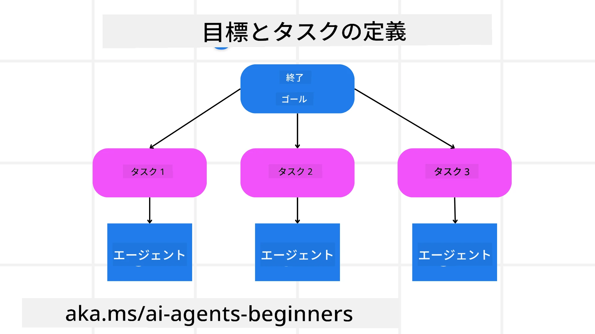

[](https://youtu.be/kPfJ2BrBCMY?si=9pYpPXp0sSbK91Dr)

> _(上の画像をクリックするとこのレッスンのビデオを視聴できます)_

# 計画デザイン

## はじめに

このレッスンで扱う内容は

* 明確な全体目標を定義し、複雑なタスクを管理可能なタスクに分割する方法。
* より信頼性があり機械が読み取りやすい応答のために構造化された出力を活用する方法。
* 動的なタスクや予期しない入力を処理するためにイベント駆動型アプローチを適用する方法。

## 学習目標

このレッスンを修了すると、以下のことが理解できるようになります：

* AIエージェントのために全体目標を特定し設定し、何を達成すべきかを明確に認識させること。
* 複雑なタスクを管理可能なサブタスクに分解し、それらを論理的な順序で整理すること。
* エージェントに適切なツール（例：検索ツールやデータ分析ツール）を装備させ、それらをいつどのように使うかを決定し、発生する予期しない状況に対処すること。
* サブタスクの結果を評価し、パフォーマンスを測定して、最終出力を改善するために行動を反復すること。

## 全体目標の定義とタスクの分解



現実の多くのタスクは1ステップで解決するには複雑すぎます。AIエージェントは計画と行動を導く簡潔な目的が必要です。たとえば、次の目標を考えてみましょう：

    "3日間の旅行日程を作成する。"

簡単に言えるものの、まだ精緻化が必要です。目標が明確であればあるほど、エージェント（および人間の協力者）はフライトの選択肢、ホテルの推薦、アクティビティの提案を含む包括的な日程表を作成するなど、正しい成果の達成に集中できます。

### タスクの分解

大きなまたは複雑なタスクは、より小さく目的指向のサブタスクに分割すると管理しやすくなります。
旅行日程の例では、目標を以下のように分解できます：

* フライト予約
* ホテル予約
* レンタカー手配
* パーソナライゼーション

各サブタスクは専用のエージェントやプロセスによって処理できます。あるエージェントは最良のフライト情報の検索に特化し、別のエージェントはホテル予約を担当するなどです。調整役や「下流」エージェントはこれらの結果をまとめてユーザーに一体的な日程表として提供します。

このモジュール式アプローチは段階的な改善も可能にします。例えば、食事の推薦や現地アクティビティの提案に特化したエージェントを追加し、日程表を時間をかけて洗練させることができます。

### 構造化出力

大規模言語モデル（LLM）は、下流のエージェントやサービスが解析・処理しやすい構造化された出力（例：JSON）を生成できます。これは計画出力を受け取った後にタスクを実行可能なマルチエージェント環境で特に有効です。

以下のPythonコードスニペットは、単純な計画エージェントが目標をサブタスクに分解し、構造化された計画を生成する例を示しています：

```python
from pydantic import BaseModel
from enum import Enum
from typing import List, Optional, Union
import json
import os
from typing import Optional
from pprint import pprint
from agent_framework.foundry import FoundryChatClient
from azure.identity import AzureCliCredential

class AgentEnum(str, Enum):
    FlightBooking = "flight_booking"
    HotelBooking = "hotel_booking"
    CarRental = "car_rental"
    ActivitiesBooking = "activities_booking"
    DestinationInfo = "destination_info"
    DefaultAgent = "default_agent"
    GroupChatManager = "group_chat_manager"

# 旅行サブタスクモデル
class TravelSubTask(BaseModel):
    task_details: str
    assigned_agent: AgentEnum  # タスクをエージェントに割り当てたい

class TravelPlan(BaseModel):
    main_task: str
    subtasks: List[TravelSubTask]
    is_greeting: bool

provider = FoundryChatClient(
    project_endpoint=os.environ["AZURE_AI_PROJECT_ENDPOINT"],
    model=os.environ["AZURE_AI_MODEL_DEPLOYMENT_NAME"],
    credential=AzureCliCredential(),
)

# ユーザーメッセージを定義する
system_prompt = """You are a planner agent.
    Your job is to decide which agents to run based on the user's request.
    Provide your response in JSON format with the following structure:
{'main_task': 'Plan a family trip from Singapore to Melbourne.',
 'subtasks': [{'assigned_agent': 'flight_booking',
               'task_details': 'Book round-trip flights from Singapore to '
                               'Melbourne.'}
    Below are the available agents specialised in different tasks:
    - FlightBooking: For booking flights and providing flight information
    - HotelBooking: For booking hotels and providing hotel information
    - CarRental: For booking cars and providing car rental information
    - ActivitiesBooking: For booking activities and providing activity information
    - DestinationInfo: For providing information about destinations
    - DefaultAgent: For handling general requests"""

user_message = "Create a travel plan for a family of 2 kids from Singapore to Melbourne"

response = client.create_response(input=user_message, instructions=system_prompt)

response_content = response.output_text
pprint(json.loads(response_content))
```

### マルチエージェントオーケストレーションを持つ計画エージェント

この例では、セマンティックルーターエージェントがユーザーからのリクエスト（例：「旅行用のホテルプランが欲しい」）を受け取ります。

計画者は以下のように進めます：

* ホテルプランを受け取る：システムプロンプト（利用可能なエージェントの詳細を含む）に基づき、ユーザーのメッセージから構造化された旅行計画を生成します。
* エージェントとツールのリストアップ：エージェントレジストリにはフライト、ホテル、レンタカー、アクティビティ用のエージェントと、それぞれの機能・ツールが登録されています。
* 計画を該当エージェントにルーティング：サブタスクの数に応じて、単一タスクの場合は専用エージェントに直接メッセージを送信し、マルチエージェントの場合はグループチャットマネージャー経由で調整します。
* 結果の要約：最後に、生成された計画の内容を明確にまとめます。
以下のPythonコード例がこれらのステップを示しています：

```python

from pydantic import BaseModel

from enum import Enum
from typing import List, Optional, Union

class AgentEnum(str, Enum):
    FlightBooking = "flight_booking"
    HotelBooking = "hotel_booking"
    CarRental = "car_rental"
    ActivitiesBooking = "activities_booking"
    DestinationInfo = "destination_info"
    DefaultAgent = "default_agent"
    GroupChatManager = "group_chat_manager"

# 旅行サブタスクモデル

class TravelSubTask(BaseModel):
    task_details: str
    assigned_agent: AgentEnum # エージェントにタスクを割り当てたい

class TravelPlan(BaseModel):
    main_task: str
    subtasks: List[TravelSubTask]
    is_greeting: bool
import json
import os
from typing import Optional

from agent_framework.foundry import FoundryChatClient
from azure.identity import AzureCliCredential

# クライアントを作成する

provider = FoundryChatClient(
    project_endpoint=os.environ["AZURE_AI_PROJECT_ENDPOINT"],
    model=os.environ["AZURE_AI_MODEL_DEPLOYMENT_NAME"],
    credential=AzureCliCredential(),
)

from pprint import pprint

# ユーザーメッセージを定義する

system_prompt = """You are a planner agent.
    Your job is to decide which agents to run based on the user's request.
    Below are the available agents specialized in different tasks:
    - FlightBooking: For booking flights and providing flight information
    - HotelBooking: For booking hotels and providing hotel information
    - CarRental: For booking cars and providing car rental information
    - ActivitiesBooking: For booking activities and providing activity information
    - DestinationInfo: For providing information about destinations
    - DefaultAgent: For handling general requests"""

user_message = "Create a travel plan for a family of 2 kids from Singapore to Melbourne"

response = client.create_response(input=user_message, instructions=system_prompt)

response_content = response.output_text

# JSONとして読み込んだ後、レスポンス内容を表示する

pprint(json.loads(response_content))
```

次に示すのは上記コードの出力例で、この構造化出力を使って`assigned_agent`へのルーティングや旅行計画の要約をユーザーに提供できます。

```json
{
    "is_greeting": "False",
    "main_task": "Plan a family trip from Singapore to Melbourne.",
    "subtasks": [
        {
            "assigned_agent": "flight_booking",
            "task_details": "Book round-trip flights from Singapore to Melbourne."
        },
        {
            "assigned_agent": "hotel_booking",
            "task_details": "Find family-friendly hotels in Melbourne."
        },
        {
            "assigned_agent": "car_rental",
            "task_details": "Arrange a car rental suitable for a family of four in Melbourne."
        },
        {
            "assigned_agent": "activities_booking",
            "task_details": "List family-friendly activities in Melbourne."
        },
        {
            "assigned_agent": "destination_info",
            "task_details": "Provide information about Melbourne as a travel destination."
        }
    ]
}
```

前述のコード例を含むノートブックは[こちら](./code_samples/07-python-agent-framework.ipynb)から入手可能です。

### 反復的な計画

一部のタスクはやり取りや再計画が必要で、あるサブタスクの結果が次のサブタスクに影響を与えます。たとえば、フライト予約中に予期しないデータ形式が見つかった場合、その後のホテル予約に進む前に戦略を調整しなければならないかもしれません。

また、ユーザーのフィードバック（例：人が早めのフライトを希望するなど）により部分的な再計画が開始されることもあります。この動的かつ反復的なアプローチにより、最終的なソリューションが現実の制約や変化するユーザーの好みに合致します。

例：サンプルコード

```python
import os
from agent_framework.foundry import FoundryChatClient
from azure.identity import AzureCliCredential
#.. 前のコードと同様で、ユーザーの履歴と現在のプランを引き継ぐ

system_prompt = """You are a planner agent to optimize the
    Your job is to decide which agents to run based on the user's request.
    Below are the available agents specialized in different tasks:
    - FlightBooking: For booking flights and providing flight information
    - HotelBooking: For booking hotels and providing hotel information
    - CarRental: For booking cars and providing car rental information
    - ActivitiesBooking: For booking activities and providing activity information
    - DestinationInfo: For providing information about destinations
    - DefaultAgent: For handling general requests"""

user_message = "Create a travel plan for a family of 2 kids from Singapore to Melbourne"

response = client.create_response(
    input=user_message,
    instructions=system_prompt,
    context=f"Previous travel plan - {TravelPlan}",
)
# .. 再計画を行い、各エージェントにタスクを送信する
```

より包括的な計画には、複雑なタスクを解決するためのMagnetic Oneの<a href="https://www.microsoft.com/research/articles/magentic-one-a-generalist-multi-agent-system-for-solving-complex-tasks" target="_blank">ブログ記事</a>を参照してください。

## まとめ

この記事では、利用可能なエージェントを動的に選択できる計画者の作成例を示しました。計画者の出力はタスクを分解し、エージェントに割り当てて実行可能にします。エージェントはタスクを実行するために必要な機能やツールにアクセス可能と仮定しています。エージェントに加えて、リフレクション、要約器、ラウンドロビンチャットなどのパターンを組み込んでさらにカスタマイズ可能です。

## 追加リソース

Magnetic One - 複雑なタスクを解決するジェネラリストのマルチエージェントシステムで、複数の難易度の高いエージェントベンチマークで優れた成果を上げています。参考：[Magentic One](https://www.microsoft.com/research/articles/magentic-one-a-generalist-multi-agent-system-for-solving-complex-tasks)。この実装ではオーケストレーターが特定タスク向けの計画を作成し、それらを利用可能なエージェントに委任します。計画に加えて、オーケストレーターはタスクの進捗を監視し必要に応じて再計画を行う追跡機構も活用します。

### 計画デザインパターンについてさらに質問がありますか？

[Microsoft Foundry Discord](https://discord.com/invite/ATgtXmAS5D) に参加して、他の学習者と交流したり、オフィスアワーに参加してAIエージェントについての質問に答えてもらいましょう。

## 前のレッスン

[信頼できるAIエージェントの構築](../06-building-trustworthy-agents/README.md)

## 次のレッスン

[マルチエージェント設計パターン](../08-multi-agent/README.md)

---

<!-- CO-OP TRANSLATOR DISCLAIMER START -->
**免責事項**：
本書類は AI 翻訳サービス [Co-op Translator](https://github.com/Azure/co-op-translator) を使用して翻訳されています。正確性を期していますが、自動翻訳には誤りや不正確な部分が含まれる可能性があることをご承知おきください。原文の原語版が正式な情報源とみなされるべきです。重要な情報については、専門の人間による翻訳を推奨します。本翻訳の利用により生じたいかなる誤解や解釈違いについても、当方は責任を負いかねます。
<!-- CO-OP TRANSLATOR DISCLAIMER END -->
