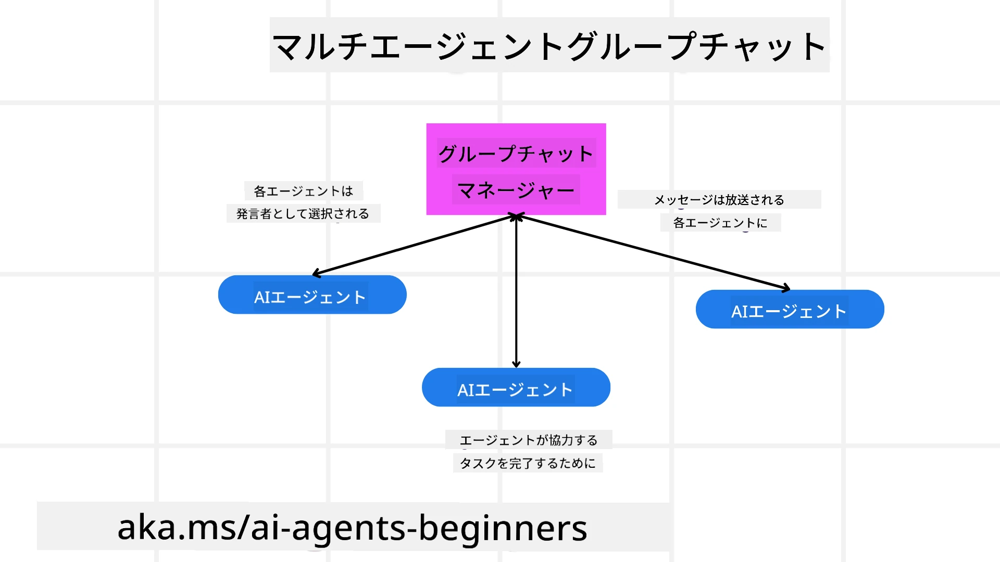
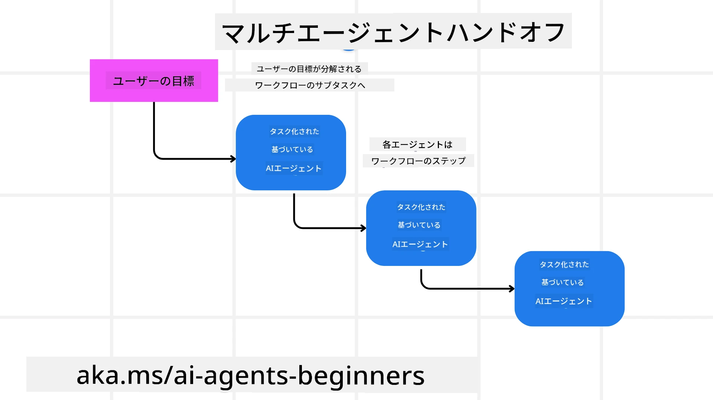
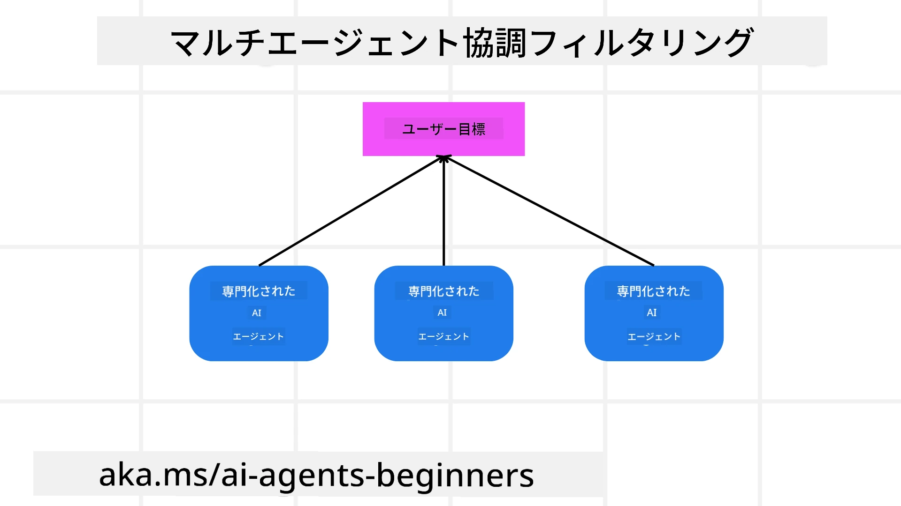

> _(このレッスンのビデオを見るには上の画像をクリックしてください)_

# マルチエージェント設計パターン

複数のエージェントが関わるプロジェクトに取り組み始めると、マルチエージェント設計パターンを考慮する必要があります。しかし、いつマルチエージェントに切り替えるべきか、その利点は何かがすぐには明確でないかもしれません。

## はじめに

このレッスンでは、次の質問に答えることを目指します：

- マルチエージェントの適用シナリオとは何か？
- 複数のタスクを単一エージェントが行う場合に比べ、マルチエージェントを使う利点は何か？
- マルチエージェント設計パターンを実装するための構成要素は何か？
- 複数のエージェントがどのように相互作用しているかを可視化するにはどうすればよいか？

## 学習目標

このレッスンの後、あなたは次のことができるようになるはずです：

- マルチエージェントが適用されるシナリオを特定できる
- 単一エージェントに比べたマルチエージェントの利点を理解できる
- マルチエージェント設計パターンの構成要素を理解できる

より大きな視点とは？

*マルチエージェントは、共通の目標を達成するために複数のエージェントが協力する設計パターンです。*

このパターンは、ロボティクス、自律システム、分散コンピューティングなど様々な分野で広く使われています。

## マルチエージェントが適用されるシナリオ

マルチエージェントを使うのに適したシナリオとは何でしょうか？多くのシナリオで複数のエージェントの利用は有益ですが、特に以下のケースが挙げられます：

- <strong>大規模な作業量</strong>：大きな作業は小さなタスクに分割され、異なるエージェントに割り当てられ、並列処理と高速な完了を可能にします。大きなデータ処理タスクはその例です。
- <strong>複雑なタスク</strong>：大規模な作業量と同様に複雑なタスクは小さなサブタスクに分割され、各タスクを専門とするエージェントに割り当てられます。例えば自動運転車では、ナビゲーション、障害物検知、他車との通信を管理するエージェントが異なります。
- <strong>多様な専門知識</strong>：異なるエージェントが異なる専門知識を持ち、単一エージェントより効果的にタスクの異なる側面を処理できます。例えば医療では、診断、治療計画、患者モニタリングを管理するエージェントがいます。

## 単一エージェントに比べたマルチエージェントの利点

単一のエージェントシステムは単純なタスクには有効ですが、より複雑なタスクでは複数のエージェントを使うことで次のような利点があります：

- <strong>専門化</strong>：各エージェントが特定のタスクに特化できます。単一エージェントはすべてをこなせるかもしれませんが、複雑なタスクに直面すると何をするべきか混乱することがあります。例えば、最適でないタスクを行ってしまう可能性があります。
- <strong>スケーラビリティ</strong>：システムを拡張するには、単一エージェントに負荷をかけるより、多くのエージェントを追加する方が容易です。
- <strong>フォールトトレランス</strong>：1つのエージェントが故障しても、他のエージェントが動作を続け、システムの信頼性を確保できます。

例として、ユーザーの旅行予約を考えましょう。単一エージェントシステムはフライトの検索からホテルやレンタカーの予約まで全てを処理しなければなりません。これを単一のエージェントで実現するには、多くの機能を持たせる必要があり、複雑で保守・拡張が難しいモノリシックなシステムになる可能性があります。一方、マルチエージェントシステムでは、フライト検索、ホテル予約、レンタカー予約それぞれに特化したエージェントを持ちます。これによりシステムはモジュール化され、保守しやすく拡張可能になります。

これを、小さな家族経営の旅行代理店とフランチャイズ型の旅行代理店の違いになぞらえることができます。家族経営店は単一エージェントが全ての予約プロセスを担当し、フランチャイズは異なるエージェントが予約プロセスの異なる側面を担当します。

## マルチエージェント設計パターンの構成要素

マルチエージェント設計パターンを実装する前に、その構成要素を理解する必要があります。

もう一度ユーザーの旅行予約の例を使って具体的に考えてみましょう。この場合、構成要素には以下が含まれます：

- <strong>エージェント間通信</strong>：フライト検索、ホテル予約、レンタカー予約のエージェントは、ユーザーの好みや制約に関する情報を共有し通信する必要があります。この通信のプロトコルや手法を決める必要があります。例えば、フライト検索エージェントはホテル予約エージェントと同じ日程でホテル予約がされるように通信しなければなりません。つまり、どのエージェントがどのように情報を共有するかを決定する必要があります。
- <strong>調整メカニズム</strong>：エージェントはユーザーの好みや制約を満たすために行動を調整する必要があります。例として、ユーザーが空港に近いホテルを希望し、レンタカーは空港でのみ利用可能といった制約があれば、ホテル予約エージェントとレンタカー予約エージェントが調整する必要があります。つまり、エージェントがどのように行動を調整するか決めることが必要です。
- <strong>エージェントアーキテクチャ</strong>：エージェントは意思決定を行い、ユーザーとのやり取りから学習できる内部構造を持つ必要があります。例えばフライト検索エージェントは、ユーザーの過去の好みに基づいて推奨フライトを決定する機械学習モデルを使うことがあります。つまり、エージェントがどのように意思決定し、学習するかを決める必要があります。
- <strong>マルチエージェント間の可視化</strong>：複数のエージェントがどのように相互作用しているかを可視化する必要があります。これには、エージェントの活動や相互作用を追跡するためのツールや手法が必要です。ログ記録やモニタリングツール、ビジュアライゼーションツール、パフォーマンス指標などが考えられます。
- <strong>マルチエージェントパターン</strong>：マルチエージェントシステムには集中型、分散型、ハイブリッド型などの異なるパターンがあります。ユースケースに最適なパターンを選択する必要があります。
- <strong>ヒューマン・イン・ザ・ループ</strong>：ほとんどの場合、人間が関与し、エージェントに人間の介入を要請するタイミングを指示する必要があります。たとえば、エージェントが推奨しなかった特定のホテルやフライトをユーザーが要求したり、予約前に確認を求めたりする場合があります。

## マルチエージェント間の相互作用の可視化

複数のエージェントがどのように相互作用しているかを可視化することは非常に重要です。これは、デバッグ、最適化、システム全体の効果を確保するために不可欠です。これを実現するために、エージェントの活動や相互作用を追跡するためのツールや手法が必要です。ログ記録やモニタリングツール、ビジュアライゼーションツール、パフォーマンス指標がその例です。

例えば、ユーザーの旅行予約の場合、各エージェントの状態、ユーザーの好みや制約、エージェント間の相互作用を示すダッシュボードを作ることができます。このダッシュボードはユーザーの旅行日程、フライト検索エージェントの推奨フライト、ホテル予約エージェントの推奨ホテル、レンタカー予約エージェントの推奨レンタカーなどを表示します。これにより、エージェント間の相互作用とユーザーの好み・制約が満たされているかを明確に確認できます。

それぞれの側面をより詳しく見ていきましょう。

- <strong>ログ記録とモニタリングツール</strong>：エージェントが行う各アクションに対してログを取りたいです。ログエントリはアクションを実行したエージェント、実行したアクション、実行時間と結果の情報を格納できます。この情報はデバッグや最適化などに活用できます。

- <strong>ビジュアライゼーションツール</strong>：ビジュアライゼーションツールはエージェント間の相互作用をより直感的に見るのに役立ちます。例えばエージェント間の情報の流れを示すグラフがあり、システム内のボトルネックや非効率、その他の問題を特定するのに有用です。

- <strong>パフォーマンス指標</strong>：マルチエージェントシステムの効果を追跡するのに役立ちます。例えば、タスクの完了にかかる時間、一単位時間あたりの完了タスク数、エージェントが行う推奨の精度などを追跡できます。これらの情報は改善点の特定やシステムの最適化に役立ちます。

## マルチエージェントパターン

マルチエージェントアプリを作成する際に使える具体的なパターンについて掘り下げましょう。ここでは検討に値する興味深いパターンを紹介します：

### グループチャット

このパターンは複数のエージェントが互いに通信できるグループチャットアプリケーションを作成したい時に有用です。典型的なユースケースはチームコラボレーション、カスタマーサポート、ソーシャルネットワーキングです。

このパターンでは、各エージェントがグループチャットのユーザーを表し、メッセージはメッセージングプロトコルを使ってエージェント間で交換されます。エージェントはグループチャットにメッセージを送り、メッセージを受け取り、他のエージェントからのメッセージに応答できます。

このパターンは中央集権型アーキテクチャで全メッセージが中央サーバーを経由する方式や、分散型アーキテクチャでエージェント同士が直接メッセージを交換する方式で実装できます。

### ハンドオフ

このパターンは複数のエージェントがタスクを互いに引き継ぐアプリケーションを作成したい時に有用です。

典型的なユースケースはカスタマーサポート、タスク管理、ワークフロー自動化です。

このパターンでは各エージェントがタスクやワークフローのステップを表し、エージェントはあらかじめ定められたルールに基づいて他のエージェントにタスクを引き継ぎます。

### 協調フィルタリング

このパターンは複数のエージェントが協力してユーザーへの推薦を行うアプリケーションに有用です。

複数のエージェントが協力する理由は、それぞれ異なる専門知識を持ち、推薦プロセスへの貢献が異なるためです。

例えば、ユーザーが株式市場で買うべき最適な株の推薦を求める場合を考えましょう。

- <strong>業界専門家</strong>：1つのエージェントは特定の業界の専門家かもしれません。
- <strong>テクニカル分析</strong>：別のエージェントはテクニカル分析の専門家かもしれません。
- <strong>ファンダメンタル分析</strong>：さらに別のエージェントはファンダメンタル分析の専門家かもしれません。これらのエージェントが協力することで、より包括的な推薦がユーザーに提供されます。

## シナリオ：返金プロセス

顧客が商品の返金を求める場合を考えます。このプロセスにはかなり多くのエージェントが関わることがありますが、この返金専用のエージェントと他のプロセスでも使える一般的なエージェントに分けてみましょう。

<strong>返金プロセス専用エージェント</strong>：

次のようなエージェントが返金プロセスに関与する可能性があります：

- <strong>顧客エージェント</strong>：顧客を表し、返金プロセスの開始を担当します。
- <strong>販売者エージェント</strong>：販売者を表し、返金処理を担当します。
- <strong>支払いエージェント</strong>：支払い処理を表し、顧客への返金を担当します。
- <strong>解決エージェント</strong>：解決プロセスを表し、返金プロセス中に生じた問題の解決を担当します。
- <strong>コンプライアンスエージェント</strong>：コンプライアンスプロセスを表し、返金プロセスが規則や方針に準拠していることを確認します。

<strong>一般的なエージェント</strong>：

これらのエージェントは事業の他の部分でも使用できます。

- <strong>発送エージェント</strong>：商品の返品をサポートし、商品の発送を担当します。このエージェントは返金プロセスでも購入に伴う商品の発送など一般の発送プロセスでも使えます。
- <strong>フィードバックエージェント</strong>：顧客からのフィードバック収集を担当します。フィードバックは返金プロセス中だけでなく、いつでも収集できます。
- <strong>エスカレーションエージェント</strong>：問題を上位のサポートレベルにエスカレーションするプロセスを担当します。問題をエスカレーションする必要のあるどのプロセスでも使えます。
- <strong>通知エージェント</strong>：返金プロセスの各段階で顧客に通知を送る役割を担います。
- <strong>分析エージェント</strong>：返金プロセスに関するデータ分析を担当します。
- <strong>監査エージェント</strong>：返金プロセスが正しく実施されているか監査します。
- <strong>報告エージェント</strong>：返金プロセスの報告書を作成します。
- <strong>ナレッジエージェント</strong>：返金プロセスに関する情報のナレッジベースを管理します。このエージェントは返金や事業の他部分の知識を持つこともできます。
- <strong>セキュリティエージェント</strong>：返金プロセスのセキュリティを確保します。
- <strong>品質エージェント</strong>：返金プロセスの品質を確保します。

以前挙げたエージェントは返金プロセス専用のものだけでなく事業の他部分でも利用可能な一般的なものも多く含まれていました。これにより、マルチエージェントシステムでどのエージェントを使うかの考え方の参考になるはずです。

## 課題

カスタマーサポートプロセスのためのマルチエージェントシステムを設計してください。プロセスに関わるエージェント、彼らの役割と責任、相互のやり取りを特定してください。カスタマーサポートプロセス専用のエージェントと事業の他部分でも使える一般エージェントの両方を考慮してください。

> 以下の解決策を読む前に考えてみてください。思っているよりも多くのエージェントが必要になるかもしれません。

> TIP: カスタマーサポートプロセスのさまざまな段階を考え、システムに必要なエージェントも検討してください。

## 解決策

[解決策](./solution/solution.md)

## 知識チェック

### 質問 1

マルチエージェントシステムに最も適しているシナリオはどれですか？

- [ ] A1: サポートボットが1つのナレッジベースと少数のツールを使って一般的な質問に答える。
- [ ] A2: 不正防止、支払い、コンプライアンスの役割がそれぞれ別で、独自のツールを持ち、結果を調整する必要がある返金ワークフロー。
- [ ] A3: 同じ単純な分類リクエストが1時間に何千回も到着する。

### 質問 2

通常、単一エージェントのほうが良いのはどんな場合ですか？

- [ ] A1: 1つの指示とツールセットで処理でき、専門的な引き継ぎが不要なタスクの場合。
- [ ] A2: エージェントが複数のツールにアクセスできる。
- [ ] A3: ワークフローが異なる権限と独立した監査証跡を持つ別々の役割を必要とする場合。

[知識チェックの解答](./solution/solution-quiz.md)

## まとめ

このレッスンでは、マルチエージェント設計パターンについて、適用可能なシナリオ、単一エージェントよりもマルチエージェントを使用する利点、実装の構成要素、そして複数のエージェントがどのように相互作用しているかを可視化する方法を学びました。

### マルチエージェント設計パターンについてもっと質問がありますか？

[Microsoft Foundry Discord](https://discord.com/invite/ATgtXmAS5D) に参加して、他の学習者と交流し、オフィスアワーに参加してAIエージェントに関する質問に答えてもらいましょう。

## 追加リソース

- <a href="https://learn.microsoft.com/azure/ai-services/agents/overview" target="_blank">Microsoft Agent Framework ドキュメント</a>
- <a href="https://www.analyticsvidhya.com/blog/2024/10/agentic-design-patterns/" target="_blank">エージェント設計パターン</a>

## 前のレッスン

[計画デザイン](../07-planning-design/README.md)

## 次のレッスン

[AIエージェントにおけるメタ認知](../09-metacognition/README.md)

---

<!-- CO-OP TRANSLATOR DISCLAIMER START -->
**免責事項**：
本書類は AI 翻訳サービス [Co-op Translator](https://github.com/Azure/co-op-translator) を使用して翻訳されています。正確性を期していますが、自動翻訳には誤りや不正確な部分が含まれる可能性があることをご承知おきください。原文の原語版が正式な情報源とみなされるべきです。重要な情報については、専門の人間による翻訳を推奨します。本翻訳の利用により生じたいかなる誤解や解釈違いについても、当方は責任を負いかねます。
<!-- CO-OP TRANSLATOR DISCLAIMER END -->
