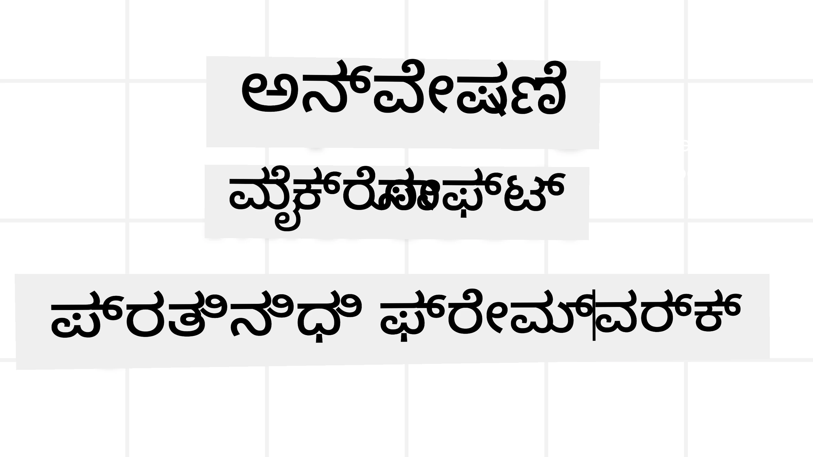
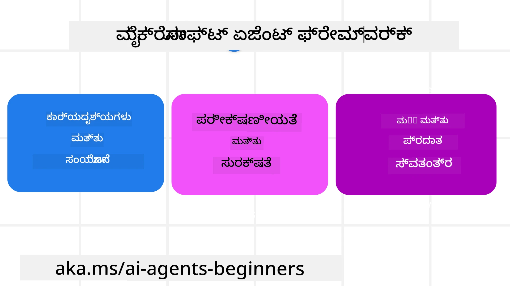

# ಮೈಕ್ರೋಸಾಫ್ಟ್ ಏಜೆಂಟ್ ಫ್ರೇಮ್‌ವರ್ಕ್ ಅನ್ವೇಷಣೆ



### ಪರಿಚಯ

ಈ ಪಾಠವು ಒಳಗೊಂಡಿದೆ:

- ಮೈಕ್ರೋಸಾಫ್ಟ್ ಏಜೆಂಟ್ ಫ್ರೇಮ್‌ವರ್ಕ್ ಅನ್ನು ಅರ್ಥಮಾಡಿಕೊಳ್ಳುವುದು: ಪ್ರಮುಖ ವೈಶಿಷ್ಟ್ಯಗಳು ಮತ್ತು ಮೌಲ್ಯ  
- ಮೈಕ್ರೋಸಾಫ್ಟ್ ಏಜೆಂಟ್ ಫ್ರೇಮ್‌ವರ್ಕ್‌ನ ಪ್ರಮುಖ ಕಲ್ಪನೆಗಳ ಅನ್ವೇಷಣೆ
- ಅಭಿವೃದ್ಧಿಶೀಲ MAF ಮಾದರಿಗಳು: ಕಾರ್ಯಪ್ರवाहಗಳು, ಮಧ್ಯವರ್ತಿ, ಮತ್ತು ಮೆಮರಿ

## ಅಧ್ಯಯನ ಗುರಿಗಳು

ಈ ಪಾಠವನ್ನು ಪೂರ್ಣಗೊಳಿಸಿದ ನಂತರ, ನೀವು ಗೊತ್ತಿರುತ್ತದೆ ಹೇಗೆ:

- ಮೈಕ್ರೋಸಾಫ್ಟ್ ಏಜೆಂಟ್ ಫ್ರೇಮ್‌ವರ್ಕ್ ಬಳಸಿ ಉತ್ಪಾದನೆಗೆ ಸಿದ್ಧ AI ಏಜೆಂಟ್‌ಗಳನ್ನು ನಿರ್ಮಿಸಲು
- ಮೈಕ್ರೋಸಾಫ್ಟ್ ಏಜೆಂಟ್ ಫ್ರೇಮ್‌ವರ್ಕ್‌ನ ಕೋರ್ ವೈಶಿಷ್ಟ್ಯಗಳನ್ನು ನಿಮ್ಮ ಏಜೆಂಟ್ ಬಳಸುವ ಪ್ರಕರಣಗಳಿಗೆ ಅನ್ವಯಿಸಲು
- ಕಾರ್ಯಪ್ರವಾಹಗಳು, ಮಧ್ಯವರ್ತಿ ಮತ್ತು ಗಮನಾರ್ಹತೆಯನ್ನು ಒಳಗೊಂಡಿರುವ ಪ್ರಗತಿಯ ಮಾದರಿಗಳನ್ನು ಬಳಸಲು

## ಕೋಡ್ ಮಾದರಿಗಳು 

[Microsoft Agent Framework (MAF)](https://aka.ms/ai-agents-beginners/agent-framework) ಗಾಗಿ ಕೋಡ್ ಮಾದರಿಗಳನ್ನು ಈ ಸಂಗ್ರಹದಲ್ಲಿ `xx-python-agent-framework` ಮತ್ತು `xx-dotnet-agent-framework` ಕಡತಗಳಲ್ಲಿ ಕಂಡುಹಿಡಿಯಬಹುದು.

## ಮೈಕ್ರೋಸಾಫ್ಟ್ ಏಜೆಂಟ್ ಫ್ರೇಮ್‌ವರ್ಕ್ ಅನ್ನು ಅರ್ಥಮಾಡಿಕೊಳ್ಳುವುದು



[Microsoft Agent Framework (MAF)](https://aka.ms/ai-agents-beginners/agent-framework) ಮೈಕ್ರೋಸಾಫ್ಟ್‌ನ ಏಐ ಏಜೆಂಟ್‌ಗಳನ್ನು ನಿರ್ಮಿಸುವ ಏಕೀಕೃತ ಫ್ರೇಮ್‌ವರ್ಕ್ ಆಗಿದೆ. ಇದು ಉತ್ಪಾದನೆ ಮತ್ತು ಸಂಶೋಧನಾ ಪರಿಸರಗಳಲ್ಲಿ ಕಂಡುಬರುವ ವಿಭಿನ್ನ ಏಜೆಂಟ್ ಬಳಸುವ ಪ್ರಕರಣಗಳನ್ನು ಪೂರೈಸಲು ವಿಸ್ತೃತ ಲವಚಿಕತೆ ನೀಡುತ್ತದೆ, ಅವುಗಳಲ್ಲಿ:

- **ಕ್ರಮವಾರು ಏಜೆಂಟ್ ನಿರ್ವಹಣೆ** - ಹಂತದಿಂದ ಹಂತದ ಕಾರ್ಯಪ್ರवाहಗಳು ಅಗತ್ಯವಿರುವ ಸಂದರ್ಭಗಳಲ್ಲಿ.
- **ಸಮಸಮಯ ನಿರ್ವಹಣೆ** - ಏಜೆಂಟ್‌ಗಳು ಒಂದೇ ಸಮಯದಲ್ಲಿ ಕಾರ್ಯಗಳನ್ನು ಪೂರ್ಣಗೊಳಿಸಬೇಕಾದ ಸಂದರ್ಭಗಳಲ್ಲಿ.
- **ಸಮೂಹ ಚಾಟ್ ನಿರ್ವಹಣೆ** - ಏಜೆಂಟ್‌ಗಳು ಒಟ್ಟಾಗಿ ಒಂದು ಕಾರ್ಯದಲ್ಲಿ ಸಹಕರಿಸಬಹುದಾದ ಸಂದರ್ಭಗಳಲ್ಲಿ.
- **ಹೋಡ್‌ಆಫ್ ನಿರ್ವಹಣೆ** - ಉಪಕಾರ್ಯಗಳು ಪೂರ್ಣಗೊಂಡಂತೆ ಏಜೆಂಟ್‌ಗಳು ಕಾರ್ಯವನ್ನು ಪರಸ್ಪರ ಹಸ್ತಾಂತರಿಸುವ ಸಂದರ್ಭಗಳಲ್ಲಿ.
- **ಮ್ಯಾಗ್ನೆಟಿಕ್ ನಿರ್ವಹಣೆ** - ವ್ಯವಸ್ಥಾಪಕ ಏಜೆಂಟ್ ಒಂದು ಕಾರ್ಯ ಪಟ್ಟಿಯನ್ನು ರಚಿಸಿ ಬದಲಾವಣೆ ಮಾಡುತ್ತದೆ ಮತ್ತು ಉಪ ಏಜೆಂಟ್‌ಗಳ ಸಂಯೋಜನೆಯನ್ನು ನಿರ್ವಹಿಸುತ್ತದೆ.

ಉತ್ಪಾದನೆಯಲ್ಲಿ AI ಏಜೆಂಟ್‌ಗಳನ್ನು ಒದಗಿಸಲು, MAF ಕೂಡಾ ಕೆಳಗಿನ ವೈಶಿಷ್ಟ್ಯಗಳನ್ನು ಒಳಗೊಂಡಿದೆ:

- **ಗಮನಾರ್ಹತೆ** - OpenTelemetry ಬಳಸಿ, ಏಐ ಏಜೆಂಟ್‌ನ ಪ್ರತಿ ಕ್ರಿಯೆಯನ್ನು (ವುಟೀಲ್ಸ್ ಕರೆ, ನಿರ್ವಹಣಾ ಹಂತಗಳು, ಯುಕ್ತಿ ಹರಿವುಗಳು ಮತ್ತು ಕಾರ್ಯಕ್ಷಮತಾ ನಿಗದಾರಿಕೆ) Microsoft Foundry ಡ್ಯಾಶ್‌ಬೋರ್ಡ್‌ಗಳಲ್ಲಿ ಟ್ರ್ಯಾಕ್ ಮಾಡುತ್ತದೆ.
- **ಸುರಕ್ಷತೆ** - Microsoft Foundry ನಲ್ಲಿ ಸ್ಥಳೀಯವಾಗಿ ಏಜೆಂಟ್‌ಗಳನ್ನು ಹೋಸ್ಟ್ ಮಾಡಿ, ಪಾತ್ರ ಆಧಾರಿತ ಪ್ರವೇಶ, ಖಾಸಗಿ ಡೇಟಾ ಹ್ಯಾಂಡ್ಲಿಂಗ್ ಮತ್ತು ಒಳಗಿನ ವಿಷಯ ಸುರಕ್ಷತೆ ಸೇರಿದಂತೆ ಭದ್ರತಾ ನಿಯಂತ್ರಣಗಳನ್ನು ಒದಗಿಸುತ್ತದೆ.
- **ದೃಢತೆ** - ಏಜೆಂಟ್ ಥ್ರೆಡ್ಗಳು ಮತ್ತು ಕಾರ್ಯಪ್ರವಾಹಗಳು ನಿಲ್ಲಿಸಬಹುದು, ಮತ್ತೆ ಪ್ರಾರಂಭಿಸಬಹುದು ಮತ್ತು ದೋಷಗಳಿಂದ ಮರುಹೊಂದಿಸಬಹುದು, ಇದರಿಂದ ಉದ್ದನೆಯ ಪ್ರಕ್ರಿಯೆ ನಡೆಸಬಹುದು.
- **ನಿಯಂತ್ರಣ** - ಮಾನವ ಸಂವಹಿತ ಕಾರ್ಯಪ್ರವಾಹಗಳನ್ನು ಬೆಂಬಲಿಸುವ ಮೂಲಕ, ಕಾರ್ಯಗಳು ಮಾನವ ಅನುಮೋದನೆ ಅಗತ್ಯವಿರುವಂತೆ ಗುರುತಿಸಲಾಗುತ್ತದೆ.

ಮೈಕ್ರೋಸಾಫ್ಟ್ ಏಜೆಂಟ್ ಫ್ರೇಮ್‌ವರ್ಕ್ ಸಹ ಸಹಕಾರ್ಯಗೊಳ್ಳುವುದರಲ್ಲಿ ಗಮನಹರಿಸುತ್ತದೆ:

- **ಮೇಘ-ನಿರಪೇಕ್ಷವಾಗಿರುವುದು** - ಏಜೆಂಟ್‌ಗಳು ಕಂಟೇನರ್‌ಗಳಲ್ಲಿ, ಆನ್-ಪ್ರೇಮ್, ಮತ್ತು ವಿವಿಧ ಮೇಘಗಳಲ್ಲಿ ಓಡಬಹುದು.
- **ಪ್ರದಾತ-ನಿರಪೇಕ್ಷವಾಗಿರುವುದು** - ನಿಮ್ಮ ಇಚ್ಛಿತ SDKಗಳ ಮೂಲಕ ಏಜೆಂಟ್‌ಗಳನ್ನು ನಿರ್ಮಿಸಬಹುದು, ಉದಾ: Azure OpenAI ಮತ್ತು OpenAI.
- **ತಿಳಿ ಮಾನದಂಡಗಳ ಏಕೀಕರಣ** - ಏಜೆಂಟ್-ಟು-ಏಜೆಂಟ್ (A2A) ಮತ್ತು ಮಾದರಿ ಸಂದರ್ಭ ಪ್ರೋಟೋಕಾಲ್ (MCP) ಮುಂತಾದ ಪ್ರೋಟೋಕಾಲ್‌ಗಳನ್ನು ಉಪಯೋಗಿಸಿ ಇತರ ಏಜೆಂಟ್‌ಗಳು ಮತ್ತು ಉಪಕರಣಗಳನ್ನು ಹುಡುಕಲು ಮತ್ತು ಬಳಸಲು.
- **ಪ್ಲಗಿನ್ ಮತ್ತು ಸಂಪರ್ಕಕಗಳು** - ಡೇಟಾ ಮತ್ತು ಮೆಮರಿ ಸೇವೆಗಳಿಗೆ, ಉದಾ: Microsoft ಫ್ಯಾಬ್ರಿಕ್, ಶೇರ್ಪಾಯಿಂಟ್, ಪಿಂಕೊನ್, ಮತ್ತು Qdrantಗೂ ಸಂಪರ್ಕಿಸುವ ವ್ಯವಸ್ಥೆ.

ಈಗ ನಾವು ಮೈಕ್ರೋಸಾಫ್ಟ್ ಏಜೆಂಟ್ ಫ್ರೇಮ್‌ವರ್ಕ್‌ನ ಕೆಲವು ಮುಖ್ಯ ಕಲ್ಪನೆಗಳಿಗೆ ಈ ವೈಶಿಷ್ಟ್ಯಗಳನ್ನು ಹೇಗೆ ಅನ್ವಯಿಸುತ್ತವೆ ಎಂಬುದನ್ನು ನೋಡೋಣ.

## ಮೈಕ್ರೋಸಾಫ್ಟ್ ಏಜೆಂಟ್ ಫ್ರೇಮ್‌ವರ್ಕ್‌ನ ಪ್ರಮುಖ ಕಲ್ಪನೆಗಳು

### ಏಜೆಂಟ್‌ಗಳು


**ಏಜೆಂಟ್ ನಿರ್ಮಾಣ**

ಏಜೆಂಟ್ ನಿರ್ಮಾಣವು ಇನ್ಫರೆನ್ಸ್ ಸೇವೆ (LLM ಪೂರೈಕೆದಾರ), ಏಐ ಏಜೆಂಟ್ ಅನುಸರಿಸಲು ಆದೇಶಗಳ ಸಮೂಹ, ಮತ್ತು `name` ಎಂಬ ನಾಮಕರಣವನ್ನು ವ್ಯಾಖ್ಯಾನಿಸುವ ಮೂಲಕ ಮಾಡಲಾಗಿದೆ:


```python
agent = AzureOpenAIChatClient(credential=AzureCliCredential()).create_agent( instructions="You are good at recommending trips to customers based on their preferences.", name="TripRecommender" )
```

ಮೇಲಿನ ಉದಾಹರಣೆ `Azure OpenAI` ಉಪಯೋಗಿಸುವುದು, ಆದರೆ ಏಜೆಂಟ್‌ಗಳನ್ನು ವಿವಿಧ ಸೇವೆಗಳ ಮೂಲಕ ನಿರ್ಮಿಸಬಹುದು, ಉದಾ: `Microsoft Foundry Agent Service`:

```python
AzureAIAgentClient(async_credential=credential).create_agent( name="HelperAgent", instructions="You are a helpful assistant." ) as agent
```

OpenAI `Responses`, `ChatCompletion` APIs

```python
agent = OpenAIResponsesClient().create_agent( name="WeatherBot", instructions="You are a helpful weather assistant.", )
```

```python
agent = OpenAIChatClient().create_agent( name="HelpfulAssistant", instructions="You are a helpful assistant.", )
```

ಅಥವಾ [MiniMax](https://platform.minimaxi.com/), ಇದು OpenAI ಹೊಂದಿಕೆಯಾಗುವ API ಅನ್ನು ದೊಡ್ಡ ಸಂಧರ್ಭ ವಿಂಡೋಗಳೊಂದಿಗೆ (204K ಟೋಕನ್ಗಳವರೆಗಿನ) ಒದಗಿಸುತ್ತದೆ:

```python
agent = OpenAIChatClient(base_url="https://api.minimax.io/v1", api_key=os.environ["MINIMAX_API_KEY"], model_id="MiniMax-M3").create_agent( name="HelpfulAssistant", instructions="You are a helpful assistant.", )
```

ಅಥವಾ A2A ಪ್ರೋಟೋಕಾಲ್ ಬಳಸಿ ದೂರದ ಏಜೆಂಟ್‌ಗಳು:

```python
agent = A2AAgent( name=agent_card.name, description=agent_card.description, agent_card=agent_card, url="https://your-a2a-agent-host" )
```

**ಏಜೆಂಟ್‌ಗಳ ಕಾರ್ಯಾಚರಣೆ**

ಏಜೆಂಟ್‌ಗಳನ್ನು `.run` ಅಥವಾ `.run_stream` ವಿಧಾನಗಳನ್ನು ಬಳಸಿ ಓಡಿಸಲಾಗುತ್ತದೆ, ಈದು ಸ್ಟ್ರೀಮಿಂಗ್ ಅಥವಾ ಅಸ್ಟ್ರೀಮಿಂಗ್ ಉತ್ತರಗಳಿಗೆ.

```python
result = await agent.run("What are good places to visit in Amsterdam?")
print(result.text)
```

```python
async for update in agent.run_stream("What are the good places to visit in Amsterdam?"):
    if update.text:
        print(update.text, end="", flush=True)

```

ಪ್ರತಿ ಏಜೆಂಟ್ ಓಡಿಸುವಿಕೆಯೂ ಆಯ್ಕೆಗಳನ್ನು ಹೊಂದಬಹುದು, ಉದಾ: ಏಜೆಂಟ್ ಬಳಸುವ `max_tokens`, ಏಜೆಂಟ್ ಕರೆಮಾಡಬಹುದಾದ `tools`, ಮತ್ತು ಬಳಕೆಯ ಮಾದರಿ.

ಇದು ವಿಶಿಷ್ಟ ಮಾದರಿ ಅಥವಾ ಉಪಕರಣಗಳು ಬಳಕೆದಾರರ ಕಾರ್ಯವನ್ನು ಪೂರ್ಣಗೊಳಿಸಲು ಅಗತ್ಯವಿರುವ ಸಂದರ್ಭಗಳಲ್ಲಿ ಉಪಯೋಗಿಸುತ್ತದೆ.

**ಉಪಕರಣಗಳು**

ಉಪಕರಣಗಳನ್ನು ಏಜೆಂಟ್ ವ್ಯಾಖ್ಯಾನಿಸುವಾಗ ವ್ಯಾಖ್ಯಾನಿಸಬಹುದು:

```python
def get_attractions( location: Annotated[str, Field(description="The location to get the top tourist attractions for")], ) -> str: """Get the top tourist attractions for a given location.""" return f"The top attractions for {location} are." 


# ನೇರವಾಗಿ ChatAgent ರಚಿಸುವಾಗ

agent = ChatAgent( chat_client=OpenAIChatClient(), instructions="You are a helpful assistant", tools=[get_attractions]

```

ಮತ್ತು ಏಜೆಂಟ್ ಓಡಿಸುವಾಗಲೂ:

```python

result1 = await agent.run( "What's the best place to visit in Seattle?", tools=[get_attractions] # ಈ ಓಟಿಗೆ ಮಾತ್ರ ಆಯ್ಕೆ ಸಲ್ಲಿಸಲಾಗಿದೆ )
```

**ಏಜೆಂಟ್ ಥ್ರೆಡ್ಗಳು**

ಏಜೆಂಟ್ ಥ್ರೆಡ್ಗಳು ಬಹು-ತಿರುವು ಸಂವಾದಗಳನ್ನು ನಿರ್ವಹಿಸಲು ಬಳಸಲಾಗುತ್ತವೆ. ಥ್ರೆಡ್ಗಳನ್ನು ರಚಿಸಲು:

- `get_new_thread()` ಬಳಸಿ ಥ್ರೆಡ್ ಸಮಯದೊಂದಿಗೆ ಉಳಿಸಬಹುದು
- ಏಜೆಂಟ್ ಓಡಿಸುವಾಗ ಸ್ವಯಂಚಾಲಿತವಾಗಿ ಥ್ರೆಡ್ ರಚಿಸಿ, ಆ ಥ್ರೆಡ್ ಪ್ರಸ್ತುತ ಓಡಿಸುವಿಕೆಯಲ್ಲೇ ಉಳಿಯುತ್ತದೆ.

ಥ್ರೆಡ್ ರಚಿಸಲು ಕೆಳಗಿನ ಕೋಡ್ ಹೇಗಿರುತ್ತದೆ:

```python
# ಹೊಸ ಥ್ರೆಡ್ ರಚಿಸಿ.
thread = agent.get_new_thread() # ಥ್ರೆಡ್ ನೊಂದಿಗೆ ಏಜೆಂಟ್ ಅನ್ನು ಚಲಾಯಿಸಿ.
response = await agent.run("Hello, I am here to help you book travel. Where would you like to go?", thread=thread)

```

ನಂತರ ಥ್ರೆಡ್ ಅನ್ನು ಸಂರಕ್ಷಿಸಲು ಸೀರಿಯಲೈಸ್ ಮಾಡಬಹುದು:

```python
# ಹೊಸ ತಂತಿಯನ್ನು ಸೃಷ್ಟಿಸಿ.
thread = agent.get_new_thread() 

# ತಂತಿಯೊಂದಿಗೆ ಏಜೆಂಟ್ ಅನ್ನು ರನ್ ಮಾಡಿ.

response = await agent.run("Hello, how are you?", thread=thread) 

# ಸಂಗ್ರಹಣೆಯಿಗಾಗಿ ತಂತಿಯನ್ನು ಸರಣಿಗೊಳಿಸಿ.

serialized_thread = await thread.serialize() 

# ಸಂಗ್ರಹಣೆಯಿಂದ ಲೋಡ್ ಮಾಡಿದ ನಂತರ ತಂತಿಯ ರಾಜ್ಯವನ್ನು ಡೀಸೆರಿಯಲೈಸ್ ಮಾಡಿ.

resumed_thread = await agent.deserialize_thread(serialized_thread)
```

**ಏಜೆಂಟ್ ಮಧ್ಯವರ್ತಿ**

ಏಜೆಂಟ್ ಉಪಕರಣಗಳು ಮತ್ತು LLM ಗಳು ಬಳಕೆದಾರರ ಕಾರ್ಯಗಳನ್ನು ಪೂರ್ಣಗೊಳಿಸಲು ಸಂವಹನ ಮಾಡುತ್ತವೆ. ಕೆಲವು ಸಂದರ್ಭಗಳಲ್ಲಿ, ನಾವು ಈ ಸಂವಹನಗಳ ಮಧ್ಯೆ ಕ್ರಿಯೆಯನ್ನು ಅಥವಾ ಟ್ರ್ಯಾಕಿಂಗ್ ನಡೆಸಬೇಕು. ಏಜೆಂಟ್ ಮಧ್ಯವರ್ತಿ ಇದನ್ನು ಅನುಮತಿಸುತ್ತದೆ:

*ಕ್ರಿಯಾಶೀಲ ಮಧ್ಯವರ್ತಿ*

ಈ ಮಧ್ಯವರ್ತಿಯು ಏಜೆಂಟ್ ಮತ್ತು ಅದು ಕರೆ ಮಾಡುವ ಫಂಕ್ಷನ್/ಉಪಕರಣದ ಮಧ್ಯೆ ಕಾರ್ಯನ್ವಯ ಮಾಡಲು ಅವಕಾಶ ಮಾಡಿಕೊಡುತ್ತದೆ. ಉದಾಹರಣೆಗಾಗಿ, ಫಂಕ್ಷನ್ ಕರೆ ಮೇಲೆ ಲಾಗಿಂಗ್ ಮಾಡಬಹುದು.

ಕೆಳಗಿನ ಕೋಡಿನಲ್ಲಿ `next` ಮುಂದಿನ ಮಧ್ಯವರ್ತಿ ಅಥವಾ ನಿಜವಾದ ಫಂಕ್ಷನ್ ಕರೆ ಮಾಡಲು ಸೂಚಿಸುತ್ತದೆ.

```python
async def logging_function_middleware(
    context: FunctionInvocationContext,
    next: Callable[[FunctionInvocationContext], Awaitable[None]],
) -> None:
    """Function middleware that logs function execution."""
    # ಪೂರ್ವ-ಪ್ರಕ್ರಿಯೆ: ಕಾರ್ಯಾಚರಣೆಯ ಮೊದಲು ಲಾಗ್ ಮಾಡಿ
    print(f"[Function] Calling {context.function.name}")

    # ಮುಂದಿನ ಮಧ್ಯವರ್ತಿ ಅಥವಾ ಕಾರ್ಯಾಚರಣೆ ನಿರ್ವಹಣೆಗೆ ಮುಂದುವರಿಸಿ
    await next(context)

    # ನಂತರ-ಪ್ರಕ್ರಿಯೆ: ಕಾರ್ಯಾಚರಣೆಯ ನಂತರ ಲಾಗ್ ಮಾಡಿ
    print(f"[Function] {context.function.name} completed")
```

*ಚಾಟ್ ಮಧ್ಯವರ್ತಿ*

ಈ ಮಧ್ಯವರ್ತಿಯು ಏಜೆಂಟ್ ಮತ್ತು LLM ನಡುವೆ ವಿನಂತಿಗಳ ನಡುವೆ ಕ್ರಿಯೆಯನ್ನು ಕಾರ್ಯನ್ವಯಿಸಲು ಅಥವಾ ಲಾಗ್ ಮಾಡಲು ಸಹಾಯ ಮಾಡುತ್ತದೆ.

ಇದರಲ್ಲಿ ಅದೇ ಆದ ಪ್ರಮುಖ ಮಾಹಿತಿ ಇದ್ದು, `messages` AI ಸೇವೆಗೆ ಕಳುಹಿಸಲಾದವುಗಳಾಗಿವೆ.

```python
async def logging_chat_middleware(
    context: ChatContext,
    next: Callable[[ChatContext], Awaitable[None]],
) -> None:
    """Chat middleware that logs AI interactions."""
    # ಪೂರ್ವ ಪ್ರಕ್ರಿಯೆ: AI ಕರೆಗೂ ಮೊದಲು ಲಾಗ್ ಮಾಡಿ
    print(f"[Chat] Sending {len(context.messages)} messages to AI")

    # ಮುಂದಿನ ಮಧ್ಯವರ್ತಿ ಅಥವಾ AI ಸೇವೆಗೆ ಮುಂದುವರಿಸಿ
    await next(context)

    # ನಂತರ ಪ್ರಕ್ರಿಯೆ: AI ಪ್ರತಿಕ್ರಿಯೆಯ ನಂತರ ಲಾಗ್ ಮಾಡಿ
    print("[Chat] AI response received")

```

**ಏಜೆಂಟ್ ಮೆಮರಿ**

`Agentic Memory` ಪಠ್ಯದಲ್ಲಿ ವಿವರಿಸಿದಂತೆ, ಮೆಮರಿ ಒಂದು ಪ್ರಮುಖ ಅಂಶವಾಗಿದೆ ಏಜೆಂಟ್‌ಗಾಗಿ ವಿಭಿನ್ನ ಸಂದರ್ಭಗಳಲ್ಲಿ ಕಾರ್ಯನಿರ್ವಹಿಸಲು. MAF ವಿವಿಧ ರೀತಿಯ ಮೆಮರಿಗಳನ್ನು ಒದಗಿಸುತ್ತದೆ:

*ಇನ್-ಮೆಮರಿ ಸ್ಟೋರೇಜ್*

ಇದು ಅಪ್ಲಿಕೇಶನ್ ರನ್‌ಟೈಮ್‌ನಲ್ಲಿ ಥ್ರೆಡ್ಗಳಲ್ಲಿ ಸಂಗ್ರಹಿಸಲಾಗುವ ಮೆಮರಿ.

```python
# ಹೊಸ ಧಾರೆಯನ್ನು ರಚಿಸಿ.
thread = agent.get_new_thread() # ಧಾರೆಯೊಂದಿಗೆ ಮತ್ತು ಏಜೆಂಟ್ ಅನ್ನು ಚಾಲನೆ ಮಾಡಿ.
response = await agent.run("Hello, I am here to help you book travel. Where would you like to go?", thread=thread)
```

*ಸ್ಥಾಯಿ ಸಂದೇಶಗಳು*

ಇದು ವಿಭಿನ್ನ ಅಧಿವೇಶನಗಳ ನಡುವೆ ಸಂಭಾಷಣೆ ಇತಿಹಾಸವನ್ನು ಸಂಗ್ರಹಿಸಲು ಬಳಕೆಯಲ್ಲಿದೆ. ಇದನ್ನು `chat_message_store_factory` ಬಳಸಿ ವ್ಯಾಖ್ಯಾನಿಸಲಾಗುತ್ತದೆ:

```python
from agent_framework import ChatMessageStore

# ಕಸ್ಟಮ್ ಸಂದೇಶ ಸಂಗ್ರಹಣೆ ರಚಿಸಿ
def create_message_store():
    return ChatMessageStore()

agent = ChatAgent(
    chat_client=OpenAIChatClient(),
    instructions="You are a Travel assistant.",
    chat_message_store_factory=create_message_store
)

```

*ಡೈನಾಮಿಕ್ ಮೆಮರಿ*

ಏಜೆಂಟ್‌ಗಳು ಓಡಿಸುವ ಮೊದಲು ಈ ಮೆಮರಿ ಸಂಧರ್ಭಗಳಿಗೆ ಸೇರಿಸಲಾಗುತ್ತದೆ. ಇವು mem0 ಮುಂತಾದ ಹೊರಗಿನ ಸೇವೆಗಳಲ್ಲಿ ಸಂಗ್ರಹಿಸಬಹುದು:

```python
from agent_framework.mem0 import Mem0Provider

# ಅಭಿವೃದ್ಧಿಶೀಲ ಮೆಮರಿ ಸಾಮರ್ಥ್ಯಗಳಿಗಾಗಿ Mem0 ಅನ್ನು ಬಳಸುವುದು
memory_provider = Mem0Provider(
    api_key="your-mem0-api-key",
    user_id="user_123",
    application_id="my_app"
)

agent = ChatAgent(
    chat_client=OpenAIChatClient(),
    instructions="You are a helpful assistant with memory.",
    context_providers=memory_provider
)

```

**ಏಜೆಂಟ್ ಗಮನಾರ್ಹತೆ**

ವಿಶ್ವಾಸಾರ್ಹ ಮತ್ತು ನಿರ್ವಹಣೀಯ ಏಜೆಂಟ್ ವ್ಯವಸ್ಥೆಗಳನ್ನು ನಿರ್ಮಿಸಲು ಗಮನಾರ್ಹತೆ ಅಗತ್ಯ. MAF OpenTelemetry ಯೊಂದಿಗೆ ಏಕೀಕೃತಗೊಂಡಿದೆ ರೆಕ್ಕಿಯಿಂಗ್ ಮತ್ತು ಮೀಟರ್‌ಗಾಗಿ ಉತ್ತಮ ಗಮನಾರ್ಹತೆಯನ್ನು ಒದಗಿಸಲು.

```python
from agent_framework.observability import get_tracer, get_meter

tracer = get_tracer()
meter = get_meter()
with tracer.start_as_current_span("my_custom_span"):
    # ಏನಾದರೂ ಮಾಡು
    pass
counter = meter.create_counter("my_custom_counter")
counter.add(1, {"key": "value"})
```

### ಕಾರ್ಯಪ್ರವಾಹಗಳು

MAF ಮುಂಚಿತವಾಗಿ ನಿರ್ಧರಿಸಿದ ಹಂತಗಳನ್ನು ಹೊಂದಿರುವ ಕಾರ್ಯಪ್ರವಾಹಗಳನ್ನು ಒದಗಿಸುತ್ತದೆ ಮತ್ತು ಅವುಗಳಲ್ಲಿನ ಹಂತಗಳಲ್ಲಿ AI ಏಜೆಂಟ್‌ಗಳು ಭಾಗವಾಗಿರುತ್ತವೆ.

ಕಾರ್ಯಪ್ರವಾಹಗಳು ವಿವಿಧ ಘಟಕಗಳಿಂದ ಮಾಡಲ್ಪಟ್ಟಿವೆ, ಇದು ಉತ್ತಮ ನಿಯಂತ್ರಣ ಹರಿವು ಒದಗಿಸುತ್ತದೆ. ಕಾರ್ಯಪ್ರವಾಹಗಳು **ಬಹು-ಏಜೆಂಟ್ ನಿರ್ವಹಣೆ** ಮತ್ತು **ಚೆಕ್ಪಾಯಿಂಟಿಂಗ್** ಅನ್ನು ಸಹ ನೆರವು ನೀಡುತ್ತದೆ ಕಾರ್ಯಪ್ರವಾಹದ ಸ್ಥಿತಿಗಳನ್ನು ಉಳಿಸಲು.

ಕಾರ್ಯಪ್ರವಾಹದ ಮುಖ್ಯ ಘಟಕಗಳು:

**ಕಾರ್ಯನಿರ್ವಹಿಸುವವರು**

ಕಾರ್ಯನಿರ್ವಹಿಸುವವರು ಇನ್‌ಪುಟ್ ಸಂದೇಶಗಳನ್ನು ಸ್ವೀಕರಿಸಿ, ತಮ್ಮ ಕಾರ್ಯವನ್ನು ನೆರವೇರಿಸಿ, ಹೊರತೊಂದು ಸಂದೇಶವನ್ನು ಉತ್ಪತ್ತಿ ಮಾಡಿ. ಇದು ಕಾರ್ಯಪ್ರವಾಹವನ್ನು ಮುಂದುವರೆಸುತ್ತದೆ. ಕಾರ್ಯನಿರ್ವಹಿಸುವವರು AI ಏಜೆಂಟ್ ಅಥವಾ ಕಸ್ಟಮ್ ಲಾಜಿಕ್ ಆಗಬಹುದು.

**ಕೀನಗಳು (Edges)**

ಕಾರ್ಯಪ್ರವಾಹದಲ್ಲಿ ಸಂದೇಶ ಹರಿವನ್ನು ವ್ಯಾಖ್ಯಾನಿಸಲು ಕೀನಗಳನ್ನು ಬಳಸಲಾಗುತ್ತದೆ. ಅವು ಹೀಗಿರಬಹುದು:

*ನೇರ ಕೀನಗಳು* - ಕಾರ್ಯನಿರ್ವಹಿಸುವವರ ನಡುವಿನ ಸರಳ ಒಂದು-ತೋರ ಒಂದು ಸಂಪರ್ಕ:

```python
from agent_framework import WorkflowBuilder

builder = WorkflowBuilder()
builder.add_edge(source_executor, target_executor)
builder.set_start_executor(source_executor)
workflow = builder.build()
```

*ನಿಬಂಧನಾತ್ಮಕ ಕೀನಗಳು* - ನಿರ್ದಿಷ್ಟ ಶರತ್ತು ತೃಪ್ತಿಯಾಗಿದ ಬಳಿಕ ಸಕ್ರಿಯವಾಗುತ್ತವೆ. ಉದಾಹರಣೆಗೆ, ಹೋಟೆಲ್ ಕೊಠಡಿಗಳು ಲಭ್ಯವಿಲ್ಲದಿದ್ದರೆ, ಕಾರ್ಯನಿರ್ವಹಿಸುವವರು ಇನ್ನೂ ಆಯ್ಕೆಗಳನ್ನು ಸೂಚಿಸಬಹುದು.

*ಸ್ವಿಚ್-ಕೇಸ್ ಕೀನಗಳು* - ವ್ಯಾಖ್ಯಾನಿತ ಶರತ್ತಿನ ಆಧಾರದ ಮೇಲೆ ಸಂದೇಶಗಳನ್ನು ವಿಭಿನ್ನ ಕಾರ್ಯನಿರ್ವಹಿಸುವವರಿಗೆ ಮಾರ್ಗನಿರ್ದೇಶನ ಮಾಡುತ್ತದೆ. ಉದಾ: ಪ್ರಯಾಣ ಗ್ರಾಹಕರು ಪ್ರಾಧಾನ್ಯ ಪ್ರವೇಶ ಹೊಂದಿದ್ದರೆ, ಅವರ ಕಾರ್ಯಗಳನ್ನು ಬೇರೆ ಕಾರ್ಯಪ್ರವಾಹ ಮೂಲಕ ನಿರ್ವಹಿಸಲಾಗುತ್ತದೆ.

*ಫ್ಯಾನ್-ಔಟ್ ಕೀನಗಳು* - ಒಂದೇ ಸಂದೇಶವನ್ನು ಅನೇಕ ಗುರಿಗಳಿಗೆ ಕಳುಹಿಸುವುದು.

*ಫ್ಯಾನ್-ಇನ್ ಕೀನಗಳು* - ವಿಭಿನ್ನ ಕಾರ್ಯನಿರ್ವಹಿಸುವವರಿಂದ ಅನೇಕ ಸಂದೇಶಗಳನ್ನು ಸಂಗ್ರಹಿಸಿ ಒಂದೇ ಗುರಿಗೆ ಕಳುಹಿಸುವುದು.

**ಘಟನೆಗಳು**

ಕಾರ್ಯಪ್ರವಾಹಗಳಿಗೆ ಉತ್ತಮ ಗಮನಾರ್ಹತೆಯನ್ನು ಒದಗಿಸಲು, MAF ಕಾರ್ಯಸಾಧನೆಯ Built-in ಘಟನೆಗಳನ್ನು ಒದಗಿಸುತ್ತದೆ:

- `WorkflowStartedEvent`  - ಕಾರ್ಯಪ್ರವಾಹ ಕಾರ್ಯಾರಂಭ
- `WorkflowOutputEvent` - ಕಾರ್ಯಪ್ರವಾಹ ಹೊರತೊಂದು ಸಂದೇಶ ಉಂಟುಮಾಡುವುದು
- `WorkflowErrorEvent` - ಕಾರ್ಯಪರವಾಹ ದೋಷ ಎದುರಿಸುವುದು
- `ExecutorInvokeEvent`  - ಕಾರ್ಯನಿರ್ವಹಿಸುವವರು ಪ್ರಕ್ರಿಯೆ ಆರಂಭಿಸುವುದು
- `ExecutorCompleteEvent`  -  ಕಾರ್ಯನಿರ್ವಹಿಸುವವರು ಪ್ರಕ್ರಿಯೆ ಪೂರ್ಣಗೊಳಿಸುವುದು
- `RequestInfoEvent` - ವಿನಂತಿ ನೀಡಲಾಗುವುದು

## ಅಭಿವೃದ್ಧಿಶೀಲ MAF ಮಾದರಿಗಳು

ಮೇಲಿನ ವಿಭಾಗಗಳು ಮೈಕ್ರೋಸಾಫ್ಟ್ ಏಜೆಂಟ್ ಫ್ರೇಮ್‌ವರ್ಕ್‌ನ ಮುಖ್ಯ ಕಲ್ಪನೆಗಳನ್ನು ಒಳಗೊಂಡಿದ್ದವು. ನೀವು ಹೆಚ್ಚು ಸಾಂಕೀರ್ಣ ಏಜೆಂಟ್‌ಗಳನ್ನು ನಿರ್ಮಿಸುವಾಗ, ಇಲ್ಲಿ ಕೆಲವು ಅಭಿವೃದ್ಧಿಶೀಲ ಮಾದರಿಗಳನ್ನು ಪರಿಗಣಿಸಬಹುದು:

- **ಮಧ್ಯವರ್ತಿ ಸಂಯೋಜನೆ**: ಲಾಗಿಂಗ್, ಪ್ರমাণೀಕರಣ, ದರ-ನಿಯಂತ್ರಣದಂತಹ ಹಲವು ಮಧ್ಯವರ್ತಿ ಹ್ಯಾಂಡ್ಲರ್‌ಗಳನ್ನು ಕಾರ್ಯ ಮತ್ತು ಚಾಟ್ ಮಧ್ಯವರ್ತಿ ಬಳಸಿ ಸರಣೀಕರು, ಏಜೆಂಟ್ ವರ್ತನೆ ಮೇಲೆ ಸೂಕ್ಷ್ಮ ನಿಯಂತ್ರಣ.
- **ಕಾರ್ಯಪ್ರವಾಹ ಚೆಕ್ಪಾಯಿಂಟಿಂಗ್**: ಕಾರ್ಯಪ್ರವಾಹ ಘಟನೆಗಳು ಮತ್ತು ಸೀರಿಯಲೈಸೇಶನ್ ಬಳಸಿ ಉದ್ದಯಮಾನ ಏಜೆಂಟ್ ಪ್ರಕ್ರಿಯೆಗಳ ಉಳಿಸಿ ಪುನಃಾರಂಭ කරන්න.
- **ಡೈನಾಮಿಕ್ ಉಪಕರಣ ಆಯ್ಕೆ**: ಉಪಕರಣ ವಿವರಣೆಗಳ ಮೇಲೆ RAG ಅನ್ನು MAF ಉಪಕರಣ ನೋಂದಣಿಯೊಂದಿಗೆ ಸಂಯೋಜಿಸಿ ಪ್ರಶ್ನೆಗಳಿಗೆ ಮಾತ್ರ ಸಂಬಂಧಿತ ಉಪಕರಣಗಳನ್ನು ಕಾಣಿಸಿಕೊಡು.
- **ಬಹು-ಏಜೆಂಟ್ ಹೋಡ್‌ಆಫ್**: ವಿಶೇಷೀಕೃತ ಏಜೆಂಟ್‌ಗಳ ನಡುವೆ ಹೋಡ್‌ಆಫ್ ನಿರ್ವಹಿಸಲು ಕಾರ್ಯಪ್ರವಾಹ ಕೀನಗಳು ಮತ್ತು ನಿಯಮಾತ್ಮಕ ಮಾರ್ಗನಿರ್ದೇಶನ ಬಳಸಿ.

## ಮೈಕ್ರೋಸಾಫ್ಟ್ ಫೌಂಡ್ರಿಯಲ್ಲಿ LangChain / LangGraph ಏಜೆಂಟ್‌ಗಳನ್ನು ಹೋಸ್ಟ್ ಮಾಡುವುದು

ಮೈಕ್ರೋಸಾಫ್ಟ್ ಏಜೆಂಟ್ ಫ್ರೇಮ್‌ವರ್ಕ್ **ಫ್ರೇಮ್‌ವರ್ಕ್-ಇಂಟರ್‌ಆಪರೇಬಲ್** ಆಗಿದ್ದು — ನೀವು MAF ನಿಂದಲೇ ಬರೆಯಲಾದ ಏಜೆಂಟ್‌ಗಳಿಗೆ ಮಿಯವಾಗಬೇಕಾಗಿಲ್ಲ. ನೀವು ಈಗಾಗಲೇ **LangChain** ಅಥವಾ **LangGraph** ನೊಂದಿಗೆ ಏಜೆಂಟ್ ನಿರ್ಮಿಸಿದ್ದರೆ, ಅದನ್ನು **Microsoft Foundry ಹೋಸ್ಟ್ ಮಾಡಿದ ಏಜೆಂಟ್** ಆಗಿ ಚಾಲನೆ ಮಾಡಬಹುದು, ಇದರಿಂದ Foundry ಸಮಯ ನಿರ್ವಹಣೆ, ಅಧಿವೇಶನ, ಮಿತಿಗೊಳಿಸುವಿಕೆ, ಗುರುತಿನೀಡು ಮತ್ತು ಪ್ರೋಟೋಕಾಲ್ ಎಂಡ್ಪಾಯಿಂಟ್‌ಗಳನ್ನು ನಿರ್ವಹಿಸುತ್ತದೆ, ನಿಮ್ಮ ಏಜೆಂಟ್ ಲಾಜಿಕ್ LangGraph ನಲ್ಲಿ ಉಳಿಯುತ್ತದೆ.

ಇದು `langchain_azure_ai.agents.hosting` ಪ್ಯಾಕೇಜ್ ಬಳಸಿ ಮಾಡಲಾಗುತ್ತದೆ, ಇದು Foundry ಹೋಸ್ಟ್ ಮಾಡಿದ ಏಜೆಂಟ್‌ಗಳು ಬಳಸುವ ಸಮಾನ ಪ್ರೋಟೋಕಾಲ್‌ಗಳ ಮೇರೆಗೆ ಸಂಯೋಜಿಸಲಾದ LangGraph ಗ್ರಾಫ್ ಅನ್ನು ಬಹಿರಂಗಪಡಿಸುತ್ತದೆ.

**1. ಹೋಸ್ಟಿಂಗ್ ಹೆಚ್ಚುವರಿ ಪ್ಯಾಕೇಜ್ ಅನ್ನು ಸ್ಥಾಪಿಸಿ:**

```bash
pip install -U "langchain-azure-ai[hosting]>=1.2.4" azure-identity
```

`hosting` ಹೆಚ್ಚುವರಿ Foundry ಪ್ರೋಟೋಕಾಲ್ ಗ್ರಂಥಾಲಯಗಳನ್ನು ಸ್ಥಾಪಿಸುತ್ತದೆ: `azure-ai-agentserver-responses` (OpenAI-ಹೊಂದಿಕೆಯಾಗುವ `/responses` ಎಂಡ್ಪಾಯಿಂಟ್) ಮತ್ತು `azure-ai-agentserver-invocations` (generic `/invocations` ಎಂಡ್ಪಾಯಿಂಟ್).

**2. ಹೋಸ್ಟಿಂಗ್ ಪ್ರೋಟೋಕಾಲ್ ಆಯ್ಕೆಯನ್ನು ಮಾಡಿ:**

| ಪ್ರೋಟೋಕಾಲ್ | ಹೋಸ್ಟ್ ಕ್ಲಾಸ್ | ಎಂಡ್ಪಾಯಿಂಟ್ | ಯಾವಾಗ ಬಳಸುವುದು |
|----------|-----------|----------|----------|
| **Responses** | `ResponsesHostServer` | `/responses` | ನೀವು OpenAI ಹೊಂದಿಕೆಯಾಗುವ ಚಾಟ್, ಸ್ಟ್ರೀಮಿಂಗ್, ಉತ್ತರ ಇತಿಹಾಸ ಮತ್ತು ಸಂವಾದ ಥ್ರೆಡ್ಡಿಂಗ್ ಬಯಸುವಾಗ — ಸಂಭಾಷಣಾತ್ಮಕ ಏಜೆಂಟ್‌ಗಳಿಗೆ ಶಿಫಾರಸು ಮಾಡಲಾದ ಪೊರಿತ. |
| **Invocations** | `InvocationsHostServer` | `/invocations` | ನೀವು ಕಸ್ಟಮ್ JSON ಆಕಾರ, ವೆಬ್‌ಹುಕ್ ಶೈಲಿ ಎಂಡ್ಪಾಯಿಂಟ್, ಅಥವಾ ಅಸಂಭಾಷಣಾತ್ಮಕ ಪ್ರಕ್ರಿಯೆ ಬೇಕಾಗಿದ್ದಾಗ. |

ಏಕೆಂದರೆ **Responses API Foundryಯಲ್ಲಿ ಏಜೆಂಟ್ ಶೈಲಿಯ ಅಭಿವೃದ್ಧಿಗೆ ಪ್ರಧಾನ API ಆಗಿದೆ**, ಹೆಚ್ಚಿನ ಏಜೆಂಟ್‌ಗಳಿಗೆ `ResponsesHostServer` ಬಳಿಕೆ ಆರಂಭಿಸಲು ಸೂಕ್ತ.

**3. ಪರಿಸರ ಚರಗಳನ್ನು ಸಂರಚಿಸಿ** (`az login` ಮೊದಲು ಮಾಡಿ `DefaultAzureCredential` ಪ್ರಾಮಾಣೀಕರಿಸಲು):

```bash
export FOUNDRY_PROJECT_ENDPOINT="https://<resource>.services.ai.azure.com/api/projects/<project>"
export FOUNDRY_MODEL_NAME="gpt-5-mini"
```

ನಂತರ Foundryದಲ್ಲಿ ಹೋಸ್ಟ್ ಆಗಿರುವ ಏಜೆಂಟ್ ಆಗಿ ಚಾಲನೆಯಲ್ಲಿರುವಾಗ, ವೇದಿಕೆ ಸ್ವಯಂಚಾಲಿತವಾಗಿ `FOUNDRY_PROJECT_ENDPOINT` ಅನ್ನು ಸೇರಿಸುತ್ತದೆ.

**4. Responses ಪ್ರೋಟೋಕಾಲ್ ಮೇಲೆ LangGraph ಏಜೆಂಟ್ ಅನ್ನು ಬಹಿರಂಗಪಡಿಸಿ:**

```python
import os

from azure.ai.projects import AIProjectClient
from azure.identity import DefaultAzureCredential, get_bearer_token_provider
from langchain.agents import create_agent
from langchain_openai import ChatOpenAI
from langchain_azure_ai.agents.hosting import ResponsesHostServer

_AZURE_AI_SCOPE = "https://ai.azure.com/.default"


def build_chat_model() -> ChatOpenAI:
    project_endpoint = os.environ["FOUNDRY_PROJECT_ENDPOINT"].rstrip("/")
    deployment = os.environ.get("FOUNDRY_MODEL_NAME", "gpt-5-mini")
    credential = DefaultAzureCredential()
    project = AIProjectClient(endpoint=project_endpoint, credential=credential)
    openai_client = project.get_openai_client()
    token_provider = get_bearer_token_provider(credential, _AZURE_AI_SCOPE)

    # ChatOpenAI ಇಲ್ಲಿ Foundry ಪ್ರಾಜೆಕ್ಟಿನ OpenAI-ಅನುಕೂಲ (ಪ್ರತಿಕ್ರಿಯೆಗಳು) ಎಂಡ್ಪಾಯಿಂಟ್ ಅನ್ನು ಗುರಿಯಾಗಿಸಿಕೊಂಡಿದೆ.
    return ChatOpenAI(
        model=deployment,
        base_url=str(openai_client.base_url),
        api_key=token_provider,
    )


def main() -> None:
    graph = create_agent(build_chat_model(), tools=[])
    port = int(os.environ.get("PORT", "8088"))
    ResponsesHostServer(graph).run(port=port)


if __name__ == "__main__":
    main()
```

ಅದನ್ನು ಲೋಕಲ್‌ನಲ್ಲಿ `python main.py` ಜೊತೆಗೆ ಚಾಲನೆ ಮಾಡಿ, ನಂತರ `http://localhost:8088/responses` ಗೆ Responses ವಿನಂತಿಯನ್ನು ಕಳುಹಿಸಿ.

**ಪ್ರಮುಖ ವರ್ತನೆಗಳು:**

- **ಸಂವಹನಗಳು**: ಗ್ರಾಹಕರು ಸಂವಾದವನ್ನು ಮುಂದುವರೆಸಲು `previous_response_id` ಅಥವಾ `conversation` ID ಅನ್ನು ಕಳುಹಿಸುತ್ತಾರೆ. ನಿಮ್ಮ ಗ್ರಾಫ್ LangGraph ಚೆಕ್ಪಾಯಿಂಟರ್‌ಗಾಗಿ ಸಂಯೋಜಿತವಾದರೆ, Foundry ಸಂವಾದ ಸ್ಥಿತಿಯನ್ನು ಚೆಕ್ಪಾಯಿಂಟ್‌ಗೆ ಕೀಲಿಮೆರುಕಾಗಿಸುತ್ತದೆ (ಉತ್ಪಾದನೆಯಲ್ಲಿ ದೃಢ ಫಲಾನುಭವ ಹೊಂದಿದ ಚೆಕ್ಪಾಯಿಂಟರ್ ಬಳಸಿರಿ; ಲೋಕರ ಫಿಕ್ಷನ್ `MemorySaver` ಒಳ್ಳೆಯದು).
- **ಮಾನವ-ರೇಖೆಯಲ್ಲಿ**: ನಿಮ್ಮ ಗ್ರಾಫ್ LangGraph `interrupt()` ಬಳಿಸಿದರೆ, `ResponsesHostServer` ಮಂಚಿತ ಸ್ಥಿತಿಯನ್ನು Responses  `function_call` / `mcp_approval_request` ಐಟಂ ಆಗಿ ತೋರಿಸುತ್ತದೆ, ಮತ್ತು ಗ್ರಾಹಕರು ಹೊಂದುವ `function_call_output` / `mcp_approval_response` ನೊಂದಿಗೆ ಮುಂದುವರಿಯುತ್ತಾರೆ.
- **Foundryಗೆ ನಿಯೋಜನೆ**: Azure Developer CLI ಬಳಸಿ — `azd ext install azure.ai.agents`, `azd ai agent init -m <manifest>`, `azd ai agent run` (ಲೋಕಲ್, ಡೋಕರ್ ಅಗತ್ಯವಿದೆ), ನಂತರ `azd provision` ಮತ್ತು `azd deploy`. ಹೋಸ್ಟ್ ಮಾಡಿದ ಏಜೆಂಟ್ ನಿಯೋಜನೆಗೆ **Foundry Project Manager** ಹಕ್ಕು ಬೇಕು.

ಈ ಉದಾಹರಣೆಯ ಓಡಾಯಿಸುವ ಸಾಧ್ಯತೆ [code-samples/14-langchain-hosted-agent.py](../../../14-microsoft-agent-framework/code-samples/14-langchain-hosted-agent.py) ನಲ್ಲಿ ಲಭ್ಯ. ಸಂಪೂರ್ಣ ಪಾಠಕ್ಕಾಗಿ (Invocations ಪ್ರೋಟೋಕಾಲ್, ಕಸ್ಟಮ್ ವಿನಂತಿ ಯೋಜನೆಗಳು ಮತ್ತು ತೊಂದರೆ ಪರಿಹಾರ) ನೋಡಿ [Host LangGraph agents as Foundry hosted agents](https://learn.microsoft.com/azure/foundry/how-to/develop/langchain-hosted-agents).

## ಕೋಡ್ ಮಾದರಿಗಳು 

ಮೈಕ್ರೋಸಾಫ್ಟ್ ಏಜೆಂಟ್ ಫ್ರೇಮ್‌ವರ್ಕ್ ಗಾಗಿ ಕೋಡ್ ಮಾದರಿಗಳನ್ನು ಈ ಸಂಗ್ರಹದಲ್ಲಿ `xx-python-agent-framework` ಮತ್ತು `xx-dotnet-agent-framework` ಕಡತಗಳಲ್ಲಿ ಕಾಣಬಹುದು.

## ಮೈಕ್ರೋಸಾಫ್ಟ್ ಏಜೆಂಟ್ ಫ್ರೇಮ್‌ವರ್ಕ್ ಬಗ್ಗೆ ಇನ್ನಷ್ಟು ಪ್ರಶ್ನೆಗಳಿವೆಯೇ?

ಇನ್ನೂ ಕಲಿಯುವವರೊಂದಿಗೆ ಭೇಟಿ ಮಾಡಲು, ಕಚೇರಿ ಗಂಟೆಗಳಲ್ಲಿ ಭಾಗವಹಿಸಲು ಮತ್ತು ನಿಮ್ಮ AI ಏಜೆಂಟ್ ಪ್ರಶ್ನೆಗಳಿಗೆ ಉತ್ತರ ಪಡೆಯಲು [Microsoft Foundry Discord](https://discord.com/invite/ATgtXmAS5D) ಸೇರಿಕೊಳ್ಳಿ.
## ಹಿಂದಿನ ಪಾಠ

[AI ಏಜೆಂಟ್‌ಗಳ ಮೆಮರಿ](../13-agent-memory/README.md)

## ಮುಂದಿನ ಪಾಠ

[ಕಂಪ್ಯೂಟರ್ ಬಳಕೆ ಏಜೆಂಟ್‌ಗಳ ನಿರ್ಮಾಣ (CUA)](../15-browser-use/README.md)

---

<!-- CO-OP TRANSLATOR DISCLAIMER START -->
**ಅಸ್ವೀಕಾರ**:
ಈ ದಸ್ತಾವೇಜು AI ಅನುವಾದ ಸೇವೆ [Co-op Translator](https://github.com/Azure/co-op-translator) ಬಳಸಿ ಅನುವಾದಿಸಲಾಗಿದೆ. ನಾವು ನಿಖರತೆಯನ್ನು ಸಾಧಿಸಲು ಪ್ರಯತ್ನಿಸುತ್ತಿದ್ದರೂ, ದಯವಿಟ್ಟು ಗಮನಿಸಿ, ಸ್ವಯಂಚಾಲಿತ ಅನುವಾದಗಳಲ್ಲಿ ದೋಷಗಳು ಅಥವಾ ಅಸಡ್ಡೆಗಳು ಇರಬಹುದು. ಮೂಲ ಭಾಷೆಯಲ್ಲಿರುವ ಮೂಲ ದಸ್ತಾವೇಜು ಪ್ರಾಮಾಣಿಕ ಮೂಲವೆಂದು ಪರಿಗಣಿಸಬೇಕು. ಪ್ರಮುಖ ಮಾಹಿತಿಗಾಗಿ, ವೃತ್ತಿಪರ ಮಾನವ ಅನುವಾದವನ್ನು ಶಿಫಾರಸು ಮಾಡಲಾಗುತ್ತದೆ. ಈ ಅನುವಾದವನ್ನು ಬಳಸುವ ಮೂಲಕ ಉಂಟಾಗುವ ಯಾವುದೇ ತಪ್ಪು ಅರ್ಥಗಳ ಅಥವಾ ತಪ್ಪು ವ್ಯಾಖ್ಯಾನಗಳ ಬಗ್ಗೆ ನಾವು ಹೊಣೆಗಾರರಲ್ಲ.
<!-- CO-OP TRANSLATOR DISCLAIMER END -->