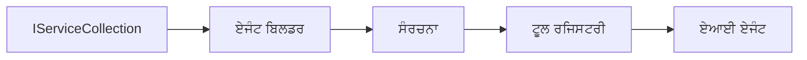

# 🎨 ਏਜੰਟਿਕ ਡਿਜ਼ਾਈਨ ਪੈਟਰਨਜ਼ ਵਿਥ ਅਜ਼ਲਰ ਓਪਨਏਆਈ (Responses API) (.NET)

## 📋 ਸਿੱਖਣ ਦੇ ਲਕਸ਼

ਇਹ ਉਦਾਹਰਣ Microsoft Agent Framework ਨੂੰ .NET ਵਿੱਚ ਅਜ਼ਲਰ ਓਪਨਏਆਈ (Responses API) ਇੰਟੀਗ੍ਰੇਸ਼ਨ ਨਾਲ ਵਰਤ ਕੇ ਬੁੱਧੀਮਾਨ ਏਜੰਟ ਬਣਾਉਣ ਲਈ ਉਦਯੋਗ ਮਿਆਰੀ ਡਿਜ਼ਾਈਨ ਪੈਟਰਨਜ਼ ਨੂੰ ਦਰਸਾਉਂਦਾ ਹੈ। ਤੁਸੀਂ ਉਹ ਪੇਸ਼ਾਵਰ ਪੈਟਰਨ ਅਤੇ ਆਰਕੀਟੈਕਚਰਲ ਤਰੀਕੇ ਸਿੱਖੋਗੇ ਜੋ ਏਜੰਟਾਂ ਨੂੰ ਪ੍ਰੋਡਕਸ਼ਨ-ਤਿਆਰ, ਸੰਭਾਲਣ ਯੋਗ ਅਤੇ ਵੱਡੇ ਪੈਮਾਨੇ 'ਤੇ ਚਲਾਉਣ ਯੋਗ ਬਣਾਉਂਦੇ ਹਨ।

### ਉਦਯੋਗ ਡਿਜ਼ਾਈਨ ਪੈਟਰਨਜ਼

- 🏭 **ਫੈਕਟਰੀ ਪੈਟਰਨ**: ਡਿਪੈਂਡੈਂਸੀ ਇੰਜੈਕਸ਼ਨ ਨਾਲ ਮਿਆਰੀਕ੍ਰਿਤ ਏਜੰਟ ਬਣਾਉਣਾ
- 🔧 **ਬਿਲਡਰ ਪੈਟਰਨ**: ਸਹਿਜ ਏਜੰਟ ਸੰਰਚਨਾ ਅਤੇ ਸੈਟਅਪ
- 🧵 **ਥਰੇਡ-ਸੁਰੱਖਿਅਤ ਪੈਟਰਨਜ਼**: ਇਕੱਠਾ ਗੱਲਬਾਤ ਪ੍ਰਬੰਧਨ
- 📋 **ਰਿਪਾਜ਼ਿਟਰੀ ਪੈਟਰਨ**: ਸੰਗਠਿਤ ਟੂਲ ਅਤੇ ਸਮਰੱਥਾ ਪ੍ਰਬੰਧਨ

## 🎯 .NET-ਖ਼ਾਸ ਆਰਕੀਟੈਕਚਰਲ ਫਾਇਦੇ

### ਉਦਯੋਗ ਫੀਚਰਜ਼

- **ਮਜ਼ਬੂਤ ਟਾਈਪਿੰਗ**: ਕੰਪਾਇਲ-ਟਾਈਮ ਵੈਰੀਫਿਕੇਸ਼ਨ ਅਤੇ ਇੰਟੈਲੀਸੈਂਸ ਸਹਾਇਤਾ
- **ਡਿਪੈਂਡੈਂਸੀ ਇੰਜੈਕਸ਼ਨ**: ਅੰਦਰੂਨੀ DI ਕੰਟੇਨਰ ਇੰਟੀਗ੍ਰੇਸ਼ਨ
- **ਕਨਫਿਗਰੇਸ਼ਨ ਪ੍ਰਬੰਧਨ**: IConfiguration ਅਤੇ ਓਪਸ਼ਨ ਪੈਟਰਨਜ਼
- **Async/Await**: ਪ੍ਰਮੁੱਖ ਅਸਿੰਕ੍ਰੋਨਸ ਪ੍ਰੋਗ੍ਰਾਮਿੰਗ ਸਹਾਇਤਾ

### ਪ੍ਰੋਡਕਸ਼ਨ-ਤਿਆਰ ਪੈਟਰਨਜ਼

- **ਲਾਗਿੰਗ ਇੰਟੀਗ੍ਰੇਸ਼ਨ**: ILogger ਅਤੇ ਸੰਰਚਿਤ ਲਾਗਿੰਗ ਸਹਾਇਤਾ
- **ਹੈਲਥ ਚੈੱਕਸ**: ਅੰਦਰੂਨੀ ਮਾਨੀਟਰੀੰਗ ਅਤੇ ਡਾਇਗਨੋਸਟਿਕਸ
- **ਕਨਫਿਗਰੇਸ਼ਨ ਵੈਰੀਫਿਕੇਸ਼ਨ**: ਮਜ਼ਬੂਤ ਟਾਈਪਿੰਗ ਨਾਲ ਡੇਟਾ ਪਰ ਅਨੇਕਸ਼ਨ
- **ਐਰਰ ਹੈਂਡਲਿੰਗ**: ਸੰਰਚਿਤ ਐਕਸਪਸ਼ਨ ਪ੍ਰਬੰਧਨ

## 🔧 ਤਕਨਾਲੋਜੀਕ ਆਰਕੀਟੈਕਚਰ

### ਮੂਲ .NET ਕੰਪੋਨੈਂਟਸ

- **Microsoft.Extensions.AI**: ਇਕਜੁੱਟ AI ਸੇਵਾ ਅਭਿਧਾਰਣਾ
- **Microsoft.Agents.AI**: ਉਦਯੋਗ ਏਜੰਟ ਵਿਵਸਥਾ ਢਾਂਚਾ
- **Azure OpenAI (Responses API)**: ਉੱਚ-ਕਾਰਗਰ API ਕਲੀਅੰਟ ਪੈਟਰਨਜ਼
- **ਕਨਫਿਗਰੇਸ਼ਨ ਸਿਸਟਮ**: appsettings.json ਅਤੇ ਵਾਤਾਵਰਣ ਇੰਟੀਗ੍ਰੇਸ਼ਨ

### ਡਿਜ਼ਾਈਨ ਪੈਟਰਨ ਲਾਗੂ ਕਰਨਾ



## 🏗️ ਉਦਯੋਗ ਪੈਟਰਨਜ਼ ਦਿਖਾਏ ਗਏ

### 1. **ਸਿਰਜਣਹਾਰ ਪੈਟਰਨਜ਼**

- **ਏਜੰਟ ਫੈਕਟਰੀ**: ਕੇਂਦਰੀਕ੍ਰਿਤ ਏਜੰਟ ਬਣਾਉਣਾ ਮੇਲ ਖਾਂਦੇ ਸੈਟਅਪ ਨਾਲ
- **ਬਿਲਡਰ ਪੈਟਰਨ**: ਜਟਿਲ ਏਜੰਟ ਸੰਰਚਨਾ ਲਈ ਸਹਿਜ API
- **ਸਿੰਗਲਟਨ ਪੈਟਰਨ**: ਸਾਂਝਾ ਸੰਸਾਧਨ ਅਤੇ ਸੈਟਅਪ ਪ੍ਰਬੰਧਨ
- **ਡਿਪੈਂਡੈਂਸੀ ਇੰਜੈਕਸ਼ਨ**: ਢੀਲੀ ਜੋੜਤੋੜ ਅਤੇ ਟੈਸਟ ਕਰਨ ਯੋਗਤਾ

### 2. **ਵਹਿਬਹਾਰਕ ਪੈਟਰਨਜ਼**

- **ਸਟ੍ਰੈਟਜੀ ਪੈਟਰਨ**: ਬਦਲ ਸਕਣ ਵਾਲੀਆਂ ਟੂਲ ਚਾਲੂ ਕਰਨ ਵਾਲੀਆਂ ਰਣਨੀਤੀਆਂ
- **ਕਮਾਂਡ ਪੈਟਰਨ**: ਏਜੰਟ ਕਾਰਜਾਂ ਦੀਆਂ ਪੇਕਜਦਾਰ ਵਿਧੀਆਂ ਨਾਲ ਅਣਡੂ/ਰੀਡੂ
- **ਓਬਜ਼ਰਵਰ ਪੈਟਰਨ**: ਘਟਨਾ-ਚਲਿਤ ਏਜੰਟ ਜੀਵਨਚੱਕਰ ਪ੍ਰਬੰਧਨ
- **ਟੈਮਪਲੇਟ ਮੈਥਡ**: ਮਿਆਰੀਕ੍ਰਿਤ ਏਜੰਟ ਕਾਰਜ ਪ੍ਰਵਾਹ

### 3. **ਸੰਰਚਨਾਤਮਕ ਪੈਟਰਨਜ਼**

- **ਐਡਾਪਟਰ ਪੈਟਰਨ**: ਅਜ਼ਲਰ ਓਪਨਏਆਈ (Responses API) ਇੰਟੀਗ੍ਰੇਸ਼ਨ ਲੇਅਰ
- **ਡੀਕੋਰੇਟਰ ਪੈਟਰਨ**: ਏਜੰਟ ਸਮਰੱਥਾ ਵਾਧਾ
- **ਫ਼ੇਸੇਡ ਪੈਟਰਨ**: ਆਸਾਨ ਏਜੰਟ ਇੰਟਰਐਕਸ਼ਨ ਇੰਟਰਫੇਸ
- **ਪ੍ਰੋਕਸੀ ਪੈਟਰਨ**: ਪੱਤਲਾ ਲੋਡਿੰਗ ਅਤੇ ਕੈਸ਼ਿੰਗ ਕਾਰਗੁਜ਼ਾਰੀ ਲਈ

## 📚 .NET ਡਿਜ਼ਾਈਨ ਪ੍ਰਿੰਸੀਪਲਜ਼

### SOLID ਅਸੂਲ

- **ਸਿੰਗਲ ਜ਼ਿੰਮੇਵਾਰੀ**: ਹਰ ਕੰਪੋਨੈਂਟ ਦਾ ਇੱਕ ਸਪਸ਼ਟ ਉਦੇਸ਼
- **ਖੁੱਲਾ/ਬੰਦ**: ਬਿਨਾ ਬਦਲਾਅ ਦੇ ਵਧਾਇਆ ਜਾ ਸਕਦਾ ਹੈ
- **ਲਿਸਕਵ ਸਬਸਟਿਟੂਸ਼ਨ**: ਇੰਟਰਫੇਸ-ਆਧਾਰਿਤ ਟੂਲ ਇੰਪਲੀਮੈਂਟੇਸ਼ਨ
- **ਇੰਟਰਫੇਸ ਵਿਭਾਜਨ**: ਧਿਆਨ ਕੇਂਦ੍ਰਿਤ, ਸੰਗਠਿਤ ਇੰਟਰਫੇਸ
- **ਡਿਪੈਂਡੈਂਸੀ ਇਨਵਰਜ਼ਨ**: ਅਭਿਧਾਰਣਾ ਤੇ ਨਿਰਭਰਤਾ, ਨਾ ਕਿ ਕਾਂਕ੍ਰੀਟ ਤੇ

### ਸਾਫ ਸਾਂਝਾ ਢਾਂਚਾ

- **ਡੋਮੇਨ ਲੇਅਰ**: ਮੁੱਖ ਏਜੰਟ ਅਤੇ ਟੂਲ ਅਭਿਧਾਰਣਾ
- **ਐਪਲੀਕੇਸ਼ਨ ਲੇਅਰ**: ਏਜੰਟ ਵਿਵਸਥਾ ਅਤੇ ਕਾਰਜਪ੍ਰਣਾਲੀ
- **ਇੰਫ੍ਰਾਸਟ੍ਰਕਚਰ ਲੇਅਰ**: ਅਜ਼ਲਰ ਓਪਨਏਆਈ (Responses API) ਇੰਟੀਗ੍ਰੇਸ਼ਨ ਅਤੇ ਬਾਹਰੀ ਸੇਵਾਵਾਂ
- **ਪ੍ਰਿਜੈਂਟੇਸ਼ਨ ਲੇਅਰ**: ਉਪਭੋਗਤਾ ਇੰਟਰਐਕਸ਼ਨ ਅਤੇ ਜਵਾਬ ਫਾਰਮੈਟਿੰਗ

## 🔒 ਉਦਯੋਗ ਦੇ ਵਿਚਾਰ

### ਸੁਰੱਖਿਆ

- **ਕ੍ਰੈਡੈਂਸ਼ਲ ਪ੍ਰਬੰਧਨ**: IConfiguration ਨਾਲ ਸੁਰੱਖਿਅਤ API ਕੁੰਜੀ ਸੰਭਾਲ
- **ਇਨਪੁੱਟ ਵੈਰੀਫਿਕੇਸ਼ਨ**: ਮਜ਼ਬੂਤ ਟਾਈਪਿੰਗ ਅਤੇ ਡੇਟਾ ਪਰ ਅਨੇਕਸ਼ਨ ਜाँच
- **ਆਉਟਪੁੱਟ ਸੇਨਿਟਾਈਜੇਸ਼ਨ**: ਸੁਰੱਖਿਅਤ ਜਵਾਬ ਪ੍ਰਕਿਰਿਆ ਅਤੇ ਛਾਂਟ
- **ਆਡਿਟ ਲਾਗਿੰਗ**: ਪੂਰੀ ਕਾਰਜਵਾਹੀ ਟ੍ਰੈਕਿੰਗ

### ਕਾਰਗੁਜ਼ਾਰੀ

- **ਅਸਿੰਕ ਪੈਟਰਨਜ਼**: ਗੈਰ-ਬੇਰੋਕ I/O ਓਪਰੇਸ਼ਨ
- **ਕਨੈਕਸ਼ਨ ਪੂਲਿੰਗ**: ਪ੍ਰਭਾਵਸ਼ਾਲੀ HTTP ਕਲੀਅੰਟ ਪ੍ਰਬੰਧਨ
- **ਕੈਸ਼ਿੰਗ**: ਬਿਹਤਰ ਕਾਰਗੁਜ਼ਾਰੀ ਲਈ ਜਵਾਬ ਕੈਸ਼ਿੰਗ
- **ਸੰਸਾਧਨ ਪ੍ਰਬੰਧਨ**: ਠੀਕ ਢੰਗ ਨਾਲ ਖਤਮ ਕਰਨ ਅਤੇ ਸਾਫ਼-ਸੁਥਰਾ ਕਰਨ ਦੇ ਤਰੀਕੇ

### ਸਕੇਲਬਿਲਟੀ

- **ਥਰੇਡ ਸੁਰੱਖਿਆ**: ਇਕੱਠੇ ਏਜੰਟ ਕਾਰਜ ਨੂੰ ਸਹਿਯੋਗ
- **ਸੰਸਾਧਨ ਪੁਲਿੰਗ**: ਪ੍ਰਭਾਵਸ਼ਾਲੀ ਸੰਸਾਧਨ ਉਪਯੋਗ
- **ਲੋਡ ਪ੍ਰਬੰਧਨ**: ਦਰ ਸੀਮਾ ਅਤੇ ਬੈਕਪ੍ਰੈਸ਼ਰ ਸੰਭਾਲ
- **ਮਾਨੀਟਰੀੰਗ**: ਕਾਰਗੁਜ਼ਾਰੀ ਮਾਪਦੰਡ ਅਤੇ ਹੈਲਥ ਚੈੱਕਸ

## 🚀 ਪ੍ਰੋਡਕਸ਼ਨ ਡਿਪਲੋਇਮੈਂਟ

- **ਕਨਫਿਗਰੇਸ਼ਨ ਪ੍ਰਬੰਧਨ**: ਵਾਤਾਵਰਣ-ਖ਼ਾਸ ਸੈਟਿੰਗਜ਼
- **ਲਾਗਿੰਗ ਰਣਨੀਤੀ**: ਸੰਰਚਿਤ ਲਾਗਿੰਗ ਨਾਲ ਸਬੰਧਿਤ ID ਗਣਾ ਕੇ
- **ਐਰਰ ਹੈਂਡਲਿੰਗ**: ਵਿਸ਼ਵਸਨੀਯ ਐਕਸਪਸ਼ਨ ਹੈਂਡਲਿੰਗ ਅਤੇ ਠੀਕ ਉੱਥਾਰ
- **ਮਾਨੀਟਰੀੰਗ**: ਐਪਲੀਕੇਸ਼ਨ ਇਨਸਾਈਟਸ ਅਤੇ ਕਾਰਗੁਜ਼ਾਰੀ ਗਿਣਤੀਆਂ
- **ਟੈਸਟਿੰਗ**: ਯੂਨਿਟ ਟੈਸਟ, ਇੰਟੀਗ੍ਰੇਸ਼ਨ ਟੈਸਟ, ਅਤੇ ਲੋਡ ਟੈਸਟਿੰਗ ਪੈਟਰਨਜ਼

.NET ਨਾਲ ਉਦਯੋਗ-ਮਿਆਰੀ ਬੁੱਧੀਮਾਨ ਏਜੰਟ ਬਨਾਉਣ ਲਈ ਤਿਆਰ? ਆਓ ਕੁਝ ਮਜ਼ਬੂਤ ਤਰੀਕਿਆਂ ਨਾਲ ਆਰਕੀਟੈਕਟ ਕਰੀਏ! 🏢✨

## 🚀 ਸ਼ੁਰੂਆਤ ਕਰਨਾ

### ਲੋੜੀਂਦੇ ਤੱਤ

- [.NET 10 SDK](https://dotnet.microsoft.com/download/dotnet/10.0) ਜਾਂ ਉੱਤੇ
- [ਅਜ਼ੁਰ ਸਬਸਕ੍ਰਿਪਸ਼ਨ](https://azure.microsoft.com/free/) ਜਿਸ ਵਿੱਚ ਅਜ਼ਲਰ ਓਪਨਏਆਈ ਸਾਧਨ ਅਤੇ ਮਾਡਲ ਡਿਪਲੋਇਮੈਂਟ ਹੈ
- [ਅਜ਼ਲਰ CLI](https://learn.microsoft.com/cli/azure/install-azure-cli) — `az login` ਨਾਲ ਸਾਈਨ ਇਨ ਕਰੋ

### ਲੋੜੀਂਦੇ ਵਾਤਾਵਰਣ ਵਿਕਲਪ

```bash
# zsh/bash
export AZURE_OPENAI_ENDPOINT=https://<your-resource>.openai.azure.com
export AZURE_OPENAI_DEPLOYMENT=gpt-5-mini
# ਫਿਰ ਸਾਈਨ ਇਨ ਕਰੋ ਤਾਂ ਜੋ AzureCliCredential ਟੋਕਨ ਪ੍ਰਾਪਤ ਕਰ ਸਕੇ
az login
```

```powershell
# پاور شیل
$env:AZURE_OPENAI_ENDPOINT = "https://<your-resource>.openai.azure.com"
$env:AZURE_OPENAI_DEPLOYMENT = "gpt-5-mini"
# پھر سائن ان کریں تاکہ AzureCliCredential ٹوکن حاصل کر سکے
az login
```

### ਉਦਾਹਰਣ ਕੋਡ

ਕੋਡ ਉਦਾਹਰਣ ਚਲਾਉਣ ਲਈ,

```bash
# zsh/bash
chmod +x ./03-dotnet-agent-framework.cs
./03-dotnet-agent-framework.cs
```

ਜਾਂ dotnet CLI ਵਰਤੋਂ ਕਰਕੇ:

```bash
dotnet run ./03-dotnet-agent-framework.cs
```

ਪੂਰਾ ਕੋਡ ਵੇਖਣ ਲਈ [`03-dotnet-agent-framework.cs`](../../../../03-agentic-design-patterns/code_samples/03-dotnet-agent-framework.cs) ਨੂੰ ਦੇਖੋ।

```csharp
#!/usr/bin/dotnet run

#:package Microsoft.Extensions.AI@10.*
#:package Microsoft.Agents.AI.OpenAI@1.*-*
#:package Azure.AI.OpenAI@2.1.0
#:package Azure.Identity@1.13.1

using System.ComponentModel;

using Microsoft.Agents.AI;
using Microsoft.Extensions.AI;

using Azure.AI.OpenAI;
using Azure.Identity;

// Tool Function: Random Destination Generator
// This static method will be available to the agent as a callable tool
// The [Description] attribute helps the AI understand when to use this function
// This demonstrates how to create custom tools for AI agents
[Description("Provides a random vacation destination.")]
static string GetRandomDestination()
{
    // List of popular vacation destinations around the world
    // The agent will randomly select from these options
    var destinations = new List<string>
    {
        "Paris, France",
        "Tokyo, Japan",
        "New York City, USA",
        "Sydney, Australia",
        "Rome, Italy",
        "Barcelona, Spain",
        "Cape Town, South Africa",
        "Rio de Janeiro, Brazil",
        "Bangkok, Thailand",
        "Vancouver, Canada"
    };

    // Generate random index and return selected destination
    // Uses System.Random for simple random selection
    var random = new Random();
    int index = random.Next(destinations.Count);
    return destinations[index];
}

// Azure OpenAI with the Responses API (stable v1 endpoint). Sign in with `az login`.
var azureEndpoint = Environment.GetEnvironmentVariable("AZURE_OPENAI_ENDPOINT")
    ?? throw new InvalidOperationException("AZURE_OPENAI_ENDPOINT is not set.");
var deployment = Environment.GetEnvironmentVariable("AZURE_OPENAI_DEPLOYMENT") ?? "gpt-5-mini";

var azureClient = new AzureOpenAIClient(new Uri(azureEndpoint), new AzureCliCredential());

// Define Agent Identity and Comprehensive Instructions
// Agent name for identification and logging purposes
var AGENT_NAME = "TravelAgent";

// Detailed instructions that define the agent's personality, capabilities, and behavior
// This system prompt shapes how the agent responds and interacts with users
var AGENT_INSTRUCTIONS = """
You are a helpful AI Agent that can help plan vacations for customers.

Important: When users specify a destination, always plan for that location. Only suggest random destinations when the user hasn't specified a preference.

When the conversation begins, introduce yourself with this message:
"Hello! I'm your TravelAgent assistant. I can help plan vacations and suggest interesting destinations for you. Here are some things you can ask me:
1. Plan a day trip to a specific location
2. Suggest a random vacation destination
3. Find destinations with specific features (beaches, mountains, historical sites, etc.)
4. Plan an alternative trip if you don't like my first suggestion

What kind of trip would you like me to help you plan today?"

Always prioritize user preferences. If they mention a specific destination like "Bali" or "Paris," focus your planning on that location rather than suggesting alternatives.
""";

// Create AI Agent with Advanced Travel Planning Capabilities
// Get the Responses client for the deployment and create the AI agent
// Configure agent with name, detailed instructions, and available tools
// This demonstrates the .NET agent creation pattern with full configuration
AIAgent agent = azureClient
    .GetChatClient(deployment)
    .AsAIAgent(
        name: AGENT_NAME,
        instructions: AGENT_INSTRUCTIONS,
        tools: [AIFunctionFactory.Create(GetRandomDestination)]
    );

// Create New Conversation Session for Context Management
// Initialize a new conversation session to maintain context across multiple interactions
// Sessions enable the agent to remember previous exchanges and maintain conversational state
// This is essential for multi-turn conversations and contextual understanding
var session = await agent.CreateSessionAsync();

// Execute Agent: First Travel Planning Request
// Run the agent with an initial request that will likely trigger the random destination tool
// The agent will analyze the request, use the GetRandomDestination tool, and create an itinerary
// Using the session parameter maintains conversation context for subsequent interactions
await foreach (var update in agent.RunStreamingAsync("Plan me a day trip", session))
{
    await Task.Delay(10);
    Console.Write(update);
}

Console.WriteLine();

// Execute Agent: Follow-up Request with Context Awareness
// Demonstrate contextual conversation by referencing the previous response
// The agent remembers the previous destination suggestion and will provide an alternative
// This showcases the power of conversation sessions and contextual understanding in .NET agents
await foreach (var update in agent.RunStreamingAsync("I don't like that destination. Plan me another vacation.", session))
{
    await Task.Delay(10);
    Console.Write(update);
}
```

---

<!-- CO-OP TRANSLATOR DISCLAIMER START -->
**ਅਸਵੀਕਾਰੋਪਣ**:
ਇਸ ਦਸਤਾਵੇਜ਼ ਦਾ ਅਨੁਵਾਦ ਏਆਈ ਅਨੁਵਾਦ ਸੇਵਾ [Co-op Translator](https://github.com/Azure/co-op-translator) ਦੀ ਵਰਤੋਂ ਕਰਕੇ ਕੀਤਾ ਗਿਆ ਹੈ। ਜਦੋਂ ਕਿ ਅਸੀਂ ਸਹੀਤਾਵਾਂ ਲਈ ਯਤਨਸ਼ੀਲ ਹਾਂ, ਕਿਰਪਾ ਕਰਕੇ ਧਿਆਨ ਰੱਖੋ ਕਿ ਸਵੈਚਾਲਿਤ ਅਨੁਵਾਦਾਂ ਵਿੱਚ ਗਲਤੀਆਂ ਜਾਂ ਅਸਮੱਤਿਆਵਾਂ ਹੋ ਸਕਦੀਆਂ ਹਨ। ਮੂਲ ਦਸਤਾਵੇਜ਼ ਆਪਣੀ ਮੂਲ ਭਾਸ਼ਾ ਵਿੱਚ ਅਧਿਕਾਰਕ ਸਰੋਤ ਮੰਨਿਆ ਜਾਣਾ ਚਾਹੀਦਾ ਹੈ। ਜਰੂਰੀ ਜਾਣਕਾਰੀ ਲਈ, ਪੇਸ਼ੇਵਰ ਮਨੁੱਖੀ ਅਨੁਵਾਦ ਦੀ ਸਿਫ਼ਾਰਸ਼ ਕੀਤੀ ਜਾਂਦੀ ਹੈ। ਅਸੀਂ ਇਸ ਅਨੁਵਾਦ ਦੇ ਉਪਯੋਗ ਤੋਂ ਪੈਦਾ ਹੋਣ ਵਾਲੀਆਂ ਕਿਸੇ ਵੀ ਗਲਤਫਹਿਮੀਆਂ ਜਾਂ ਗਲਤ ਵਿਆਖਿਆਵਾਂ ਲਈ ਜਵਾਬਦੇਹ ਨਹੀਂ ਹਾਂ।
<!-- CO-OP TRANSLATOR DISCLAIMER END -->