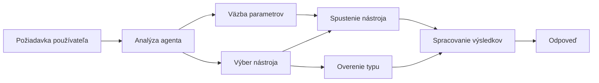

# 🛠️ Pokročilé používanie nástrojov s Azure OpenAI (Responses API) (.NET)

## 📋 Ciele učenia

Tento notebook ukazuje vzory integrácie nástrojov na úrovni podnikov pomocou Microsoft Agent Framework v .NET s Azure OpenAI (Responses API). Naučíte sa vytvárať sofistikovaných agentov s viacerými špecializovanými nástrojmi, využívajúc silné typovanie C# a podnikové vlastnosti .NET.

### Pokročilé schopnosti nástrojov, ktoré zvládnete

- 🔧 **Architektúra viacerých nástrojov**: Vytváranie agentov s viacerými špecializovanými schopnosťami
- 🎯 **Typovo bezpečné spúšťanie nástrojov**: Využitie kontroly počas kompilácie v C#
- 📊 **Podnikové vzory nástrojov**: Návrh nástrojov pripravených na produkciu a spracovanie chýb
- 🔗 **Kombinovanie nástrojov**: Spájanie nástrojov pre zložité podnikové pracovné postupy

## 🎯 Výhody architektúry nástrojov v .NET

### Podnikové vlastnosti nástrojov

- **Kontrola počas kompilácie**: Silné typovanie zabezpečuje správnosť parametrov nástrojov
- **Vstrekovanie závislostí**: Integrácia IoC kontajnera pre správu nástrojov
- **Vzory Async/Await**: Nezablokujúce spúšťanie nástrojov s riadením zdrojov
- **Štruktúrované protokolovanie**: Zabudovaná integrácia protokolovania pre sledovanie vykonávania nástrojov

### Vzory pripravené na produkciu

- **Spracovanie výnimiek**: Komplexná správa chýb s typovanými výnimkami
- **Správa zdrojov**: Správne vzory uvoľňovania a správy pamäte
- **Monitorovanie výkonu**: Zabudované merania a čítače výkonu
- **Správa konfigurácie**: Typovo bezpečná konfigurácia s validáciou

## 🔧 Technická architektúra

### Hlavné komponenty nástrojov v .NET

- **Microsoft.Extensions.AI**: Zjednotená vrstva abstrakcie nástrojov
- **Microsoft.Agents.AI**: Orchestrácia nástrojov na úrovni podniku
- **Azure OpenAI (Responses API)**: Výkonný API klient s poolovaním spojení

### Pipeline spúšťania nástrojov



## 🛠️ Kategórie a vzory nástrojov

### 1. **Nástroje na spracovanie dát**

- **Validácia vstupu**: Silné typovanie s dátovými anotáciami
- **Transformačné operácie**: Typovo bezpečná konverzia a formátovanie dát
- **Podniková logika**: Nástroje pre doménovo špecifické výpočty a analýzy
- **Formátovanie výstupu**: Generovanie štruktúrovanej odpovede

### 2. **Integračné nástroje**

- **API konektory**: Integrácia RESTful služieb pomocou HttpClient
- **Nástroje na prácu s databázou**: Integrácia Entity Framework pre prístup k dátam
- **Operácie so súbormi**: Bezpečné operácie so súborovým systémom s validáciou
- **Externé služby**: Vzory integrácie služieb tretích strán

### 3. **Užitočné nástroje**

- **Spracovanie textu**: Úprava reťazcov a formátovacie utility
- **Operácie s dátumom/časom**: Výpočty dátumu a času závislé od kultúry
- **Matematické nástroje**: Presné výpočty a štatistické operácie
- **Validácia nástrojov**: Overovanie podnikových pravidiel a dát

Pripravení vytvárať agentov na úrovni podniku s výkonnými, typovo bezpečnými nástrojmi v .NET? Poďme navrhnúť profesionálne riešenia! 🏢⚡

## 🚀 Začíname

### Predpoklady

- [.NET 10 SDK](https://dotnet.microsoft.com/download/dotnet/10.0) alebo vyšší
- [Azure predplatné](https://azure.microsoft.com/free/) s Azure OpenAI zdrojom a nasadením modelu
- [Azure CLI](https://learn.microsoft.com/cli/azure/install-azure-cli) — prihláste sa pomocou `az login`

### Požadované premenné prostredia

```bash
# zsh/bash
export AZURE_OPENAI_ENDPOINT=https://<your-resource>.openai.azure.com
export AZURE_OPENAI_DEPLOYMENT=gpt-5-mini
# Potom sa prihláste, aby AzureCliCredential mohol získať token
az login
```

```powershell
# PowerShell
$env:AZURE_OPENAI_ENDPOINT = "https://<your-resource>.openai.azure.com"
$env:AZURE_OPENAI_DEPLOYMENT = "gpt-5-mini"
# Potom sa prihláste, aby AzureCliCredential mohol získať token
az login
```

### Ukážkový kód

Pre spustenie príkladu kódu,

```bash
# zsh/bash
chmod +x ./04-dotnet-agent-framework.cs
./04-dotnet-agent-framework.cs
```

Alebo pomocou dotnet CLI:

```bash
dotnet run ./04-dotnet-agent-framework.cs
```

Pozrite si [`04-dotnet-agent-framework.cs`](../../../../04-tool-use/code_samples/04-dotnet-agent-framework.cs) pre kompletný kód.

```csharp
#!/usr/bin/dotnet run

#:package Microsoft.Extensions.AI@10.*
#:package Microsoft.Agents.AI.OpenAI@1.*-*
#:package Azure.AI.OpenAI@2.1.0
#:package Azure.Identity@1.13.1

using System.ComponentModel;

using Microsoft.Agents.AI;
using Microsoft.Extensions.AI;

using Azure.AI.OpenAI;
using Azure.Identity;

// Tool Function: Random Destination Generator
// This static method will be available to the agent as a callable tool
// The [Description] attribute helps the AI understand when to use this function
// This demonstrates how to create custom tools for AI agents
[Description("Provides a random vacation destination.")]
static string GetRandomDestination()
{
    // List of popular vacation destinations around the world
    // The agent will randomly select from these options
    var destinations = new List<string>
    {
        "Paris, France",
        "Tokyo, Japan",
        "New York City, USA",
        "Sydney, Australia",
        "Rome, Italy",
        "Barcelona, Spain",
        "Cape Town, South Africa",
        "Rio de Janeiro, Brazil",
        "Bangkok, Thailand",
        "Vancouver, Canada"
    };

    // Generate random index and return selected destination
    // Uses System.Random for simple random selection
    var random = new Random();
    int index = random.Next(destinations.Count);
    return destinations[index];
}

// Azure OpenAI with the Responses API (stable v1 endpoint). Sign in with `az login`.
var azureEndpoint = Environment.GetEnvironmentVariable("AZURE_OPENAI_ENDPOINT")
    ?? throw new InvalidOperationException("AZURE_OPENAI_ENDPOINT is not set.");
var deployment = Environment.GetEnvironmentVariable("AZURE_OPENAI_DEPLOYMENT") ?? "gpt-5-mini";

var azureClient = new AzureOpenAIClient(new Uri(azureEndpoint), new AzureCliCredential());

// Define Agent Identity and Comprehensive Instructions
// Agent name for identification and logging purposes
var AGENT_NAME = "TravelAgent";

// Detailed instructions that define the agent's personality, capabilities, and behavior
// This system prompt shapes how the agent responds and interacts with users
var AGENT_INSTRUCTIONS = """
You are a helpful AI Agent that can help plan vacations for customers.

Important: When users specify a destination, always plan for that location. Only suggest random destinations when the user hasn't specified a preference.

When the conversation begins, introduce yourself with this message:
"Hello! I'm your TravelAgent assistant. I can help plan vacations and suggest interesting destinations for you. Here are some things you can ask me:
1. Plan a day trip to a specific location
2. Suggest a random vacation destination
3. Find destinations with specific features (beaches, mountains, historical sites, etc.)
4. Plan an alternative trip if you don't like my first suggestion

What kind of trip would you like me to help you plan today?"

Always prioritize user preferences. If they mention a specific destination like "Bali" or "Paris," focus your planning on that location rather than suggesting alternatives.
""";

// Create AI Agent with Advanced Travel Planning Capabilities
// Get the Responses client for the deployment and create the AI agent
// Configure agent with name, detailed instructions, and available tools
// This demonstrates the .NET agent creation pattern with full configuration
AIAgent agent = azureClient
    .GetChatClient(deployment)
    .AsAIAgent(
        name: AGENT_NAME,
        instructions: AGENT_INSTRUCTIONS,
        tools: [AIFunctionFactory.Create(GetRandomDestination)]
    );

// Create New Conversation Session for Context Management
// Initialize a new conversation session to maintain context across multiple interactions
// Sessions enable the agent to remember previous exchanges and maintain conversational state
// This is essential for multi-turn conversations and contextual understanding
await using var session = await agent.CreateSessionAsync();

// Execute Agent: First Travel Planning Request
// Run the agent with an initial request that will likely trigger the random destination tool
// The agent will analyze the request, use the GetRandomDestination tool, and create an itinerary
// Using the session parameter maintains conversation context for subsequent interactions
await foreach (var update in agent.RunStreamingAsync("Plan me a day trip", session))
{
    await Task.Delay(10);
    Console.Write(update);
}

Console.WriteLine();

// Execute Agent: Follow-up Request with Context Awareness
// Demonstrate contextual conversation by referencing the previous response
// The agent remembers the previous destination suggestion and will provide an alternative
// This showcases the power of conversation sessions and contextual understanding in .NET agents
await foreach (var update in agent.RunStreamingAsync("I don't like that destination. Plan me another vacation.", session))
{
    await Task.Delay(10);
    Console.Write(update);
}
```

---

<!-- CO-OP TRANSLATOR DISCLAIMER START -->
**Vyhlásenie o zodpovednosti**:
Tento dokument bol preložený pomocou AI prekladateľskej služby [Co-op Translator](https://github.com/Azure/co-op-translator). Hoci sa snažíme o presnosť, vezmite prosím na vedomie, že automatické preklady môžu obsahovať chyby alebo nepresnosti. Pôvodný dokument v jeho natívnom jazyku by mal byť považovaný za autoritatívny zdroj. Pre kritické informácie sa odporúča profesionálny ľudský preklad. Nie sme zodpovední za žiadne nedorozumenia alebo nesprávne interpretácie vyplývajúce z použitia tohto prekladu.
<!-- CO-OP TRANSLATOR DISCLAIMER END -->