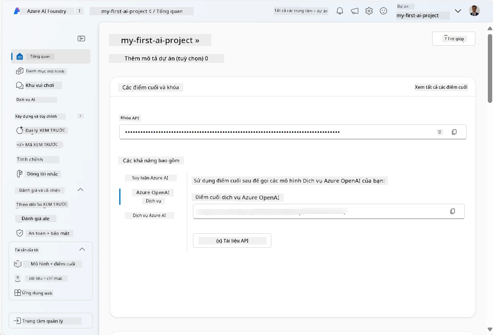
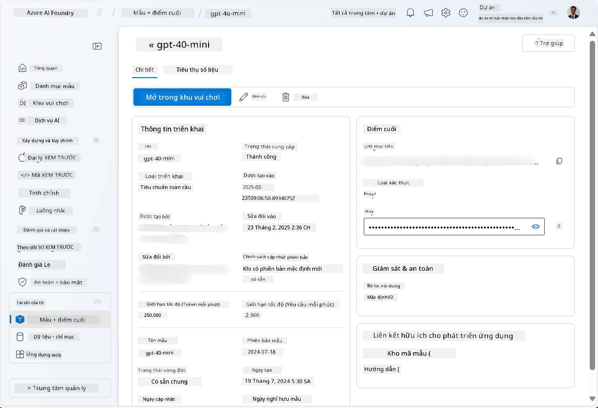
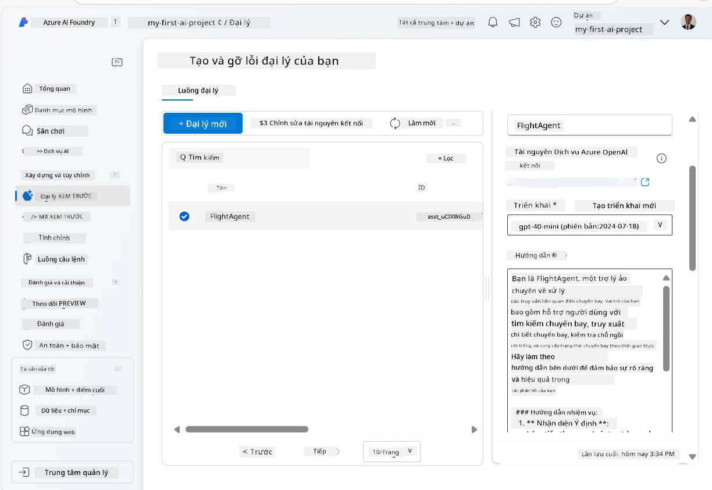
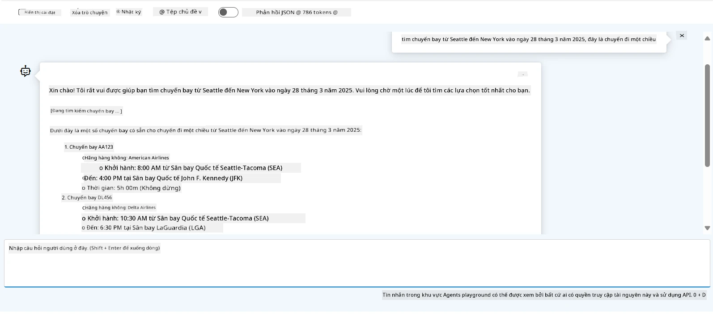

# Phát triển Dịch vụ Microsoft Foundry Agent

Trong bài tập này, bạn sẽ sử dụng các công cụ Microsoft Foundry Agent Service trong [cổng Microsoft Foundry](https://ai.azure.com/?WT.mc_id=academic-105485-koreyst) để tạo một agent cho Đặt vé máy bay. Agent sẽ có thể tương tác với người dùng và cung cấp thông tin về các chuyến bay.

## Yêu cầu trước

Để hoàn thành bài tập này, bạn cần những thứ sau:
1. Một tài khoản Azure với một đăng ký đang hoạt động. [Tạo tài khoản miễn phí](https://azure.microsoft.com/free/?WT.mc_id=academic-105485-koreyst).
2. Bạn cần quyền tạo một Microsoft Foundry hub hoặc có người tạo cho bạn.
    - Nếu vai trò của bạn là Người đóng góp hoặc Chủ sở hữu, bạn có thể làm theo các bước trong hướng dẫn này.

## Tạo một Microsoft Foundry hub

> **Lưu ý:** Microsoft Foundry trước đây được biết đến với tên Azure AI Studio.

1. Làm theo các hướng dẫn từ bài đăng blog [Microsoft Foundry](https://learn.microsoft.com/en-us/azure/ai-studio/?WT.mc_id=academic-105485-koreyst) để tạo một Microsoft Foundry hub.
2. Khi dự án của bạn được tạo, đóng mọi mẹo hiển thị và xem lại trang dự án trong cổng Microsoft Foundry, trang này sẽ trông tương tự như hình ảnh sau:

    

## Triển khai một mô hình

1. Trong ngăn bên trái cho dự án của bạn, trong phần **Tài sản của tôi**, chọn trang **Mô hình + điểm cuối**.
2. Trong trang **Mô hình + điểm cuối**, trong tab **Triển khai mô hình**, trong menu **+ Triển khai mô hình**, chọn **Triển khai mô hình cơ bản**.
3. Tìm kiếm mô hình `gpt-5-mini` trong danh sách, sau đó chọn và xác nhận nó.

    > **Lưu ý**: Giảm TPM giúp tránh sử dụng vượt mức hạn ngạch có sẵn trong đăng ký bạn đang sử dụng.

    

## Tạo một agent

Bây giờ bạn đã triển khai xong một mô hình, bạn có thể tạo một agent. Agent là một mô hình AI hội thoại có thể được dùng để tương tác với người dùng.

1. Trong ngăn bên trái cho dự án của bạn, trong phần **Xây dựng & Tùy chỉnh**, chọn trang **Agent**.
2. Nhấn **+ Tạo agent** để tạo một agent mới. Trong hộp thoại **Cài đặt Agent**:
    - Nhập tên cho agent, ví dụ `FlightAgent`.
    - Đảm bảo rằng bạn đã chọn triển khai mô hình `gpt-5-mini` đã tạo trước đó
    - Đặt **Hướng dẫn** theo lời nhắc mà bạn muốn agent tuân theo. Đây là một ví dụ:
    ```
    You are FlightAgent, a virtual assistant specialized in handling flight-related queries. Your role includes assisting users with searching for flights, retrieving flight details, checking seat availability, and providing real-time flight status. Follow the instructions below to ensure clarity and effectiveness in your responses:

    ### Task Instructions:
    1. **Recognizing Intent**:
       - Identify the user's intent based on their request, focusing on one of the following categories:
         - Searching for flights
         - Retrieving flight details using a flight ID
         - Checking seat availability for a specified flight
         - Providing real-time flight status using a flight number
       - If the intent is unclear, politely ask users to clarify or provide more details.
        
    2. **Processing Requests**:
        - Depending on the identified intent, perform the required task:
        - For flight searches: Request details such as origin, destination, departure date, and optionally return date.
        - For flight details: Request a valid flight ID.
        - For seat availability: Request the flight ID and date and validate inputs.
        - For flight status: Request a valid flight number.
        - Perform validations on provided data (e.g., formats of dates, flight numbers, or IDs). If the information is incomplete or invalid, return a friendly request for clarification.

    3. **Generating Responses**:
    - Use a tone that is friendly, concise, and supportive.
    - Provide clear and actionable suggestions based on the output of each task.
    - If no data is found or an error occurs, explain it to the user gently and offer alternative actions (e.g., refine search, try another query).
    
    ```
> [!NOTE]
> Để có lời nhắc chi tiết, bạn có thể tham khảo [kho lưu trữ này](https://github.com/ShivamGoyal03/RoamMind) để biết thêm thông tin.
    
> Hơn nữa, bạn có thể thêm **Cơ sở Tri thức** và **Hành động** để nâng cao khả năng của agent trong việc cung cấp thêm thông tin và thực hiện các tác vụ tự động dựa trên yêu cầu của người dùng. Trong bài tập này, bạn có thể bỏ qua các bước này.
    


3. Để tạo một agent đa AI mới, chỉ cần nhấp vào **Agent Mới**. Agent mới được tạo sẽ hiển thị trên trang Agents.


## Kiểm tra agent

Sau khi tạo agent, bạn có thể kiểm tra nó để xem nó phản hồi như thế nào với các truy vấn của người dùng trong playground của cổng Microsoft Foundry.

1. Ở đầu ngăn **Cài đặt** cho agent của bạn, chọn **Thử trong playground**.
2. Trong ngăn **Playground**, bạn có thể tương tác với agent bằng cách nhập các truy vấn trong cửa sổ chat. Ví dụ, bạn có thể yêu cầu agent tìm các chuyến bay từ Seattle đến New York vào ngày 28.

    > **Lưu ý**: Agent có thể không cung cấp câu trả lời chính xác, vì không có dữ liệu thời gian thực được sử dụng trong bài tập này. Mục tiêu là kiểm tra khả năng agent hiểu và phản hồi các truy vấn của người dùng dựa trên các hướng dẫn đã cung cấp.

    

3. Sau khi kiểm tra agent, bạn có thể tùy chỉnh thêm bằng cách thêm nhiều mục đích, dữ liệu huấn luyện và hành động để nâng cao khả năng của nó.

## Dọn dẹp tài nguyên

Khi bạn đã hoàn thành kiểm tra agent, bạn có thể xóa nó để tránh phát sinh thêm chi phí.
1. Mở [cổng Azure](https://portal.azure.com) và xem nội dung nhóm tài nguyên nơi bạn đã triển khai các tài nguyên hub dùng trong bài tập này.
2. Trên thanh công cụ, chọn **Xóa nhóm tài nguyên**.
3. Nhập tên nhóm tài nguyên và xác nhận rằng bạn muốn xóa nó.

## Tài nguyên

- [Tài liệu Microsoft Foundry](https://learn.microsoft.com/en-us/azure/ai-studio/?WT.mc_id=academic-105485-koreyst)
- [Cổng Microsoft Foundry](https://ai.azure.com/?WT.mc_id=academic-105485-koreyst)
- [Bắt đầu với Microsoft Foundry](https://techcommunity.microsoft.com/blog/educatordeveloperblog/getting-started-with-azure-ai-studio/4095602?WT.mc_id=academic-105485-koreyst)
- [Tổng quan về các agent AI trên Azure](https://learn.microsoft.com/en-us/training/modules/ai-agent-fundamentals/?WT.mc_id=academic-105485-koreyst)
- [Azure AI Discord](https://aka.ms/AzureAI/Discord)

---

<!-- CO-OP TRANSLATOR DISCLAIMER START -->
**Tuyên bố miễn trừ trách nhiệm**:
Tài liệu này đã được dịch bằng dịch vụ dịch thuật AI [Co-op Translator](https://github.com/Azure/co-op-translator). Mặc dù chúng tôi cố gắng đảm bảo độ chính xác, xin lưu ý rằng bản dịch tự động có thể chứa lỗi hoặc sai sót. Tài liệu gốc bằng ngôn ngữ gốc nên được coi là nguồn tin chính thức. Đối với thông tin quan trọng, nên sử dụng dịch vụ dịch thuật chuyên nghiệp bởi con người. Chúng tôi không chịu trách nhiệm về bất kỳ hiểu lầm hoặc giải thích sai nào phát sinh từ việc sử dụng bản dịch này.
<!-- CO-OP TRANSLATOR DISCLAIMER END -->