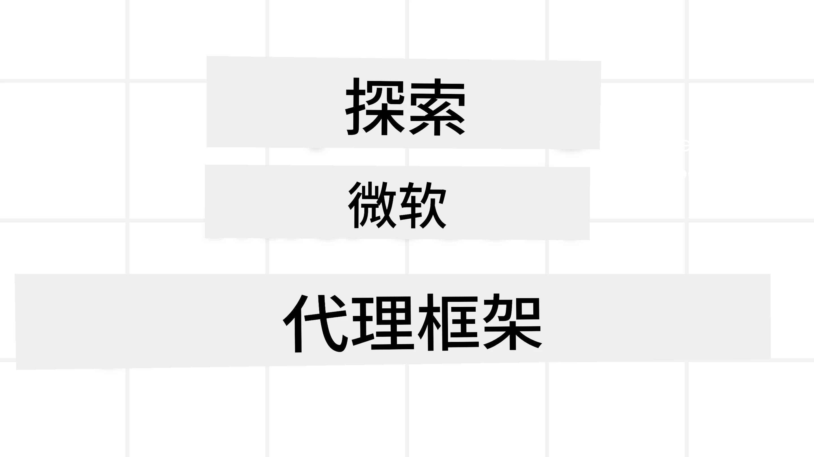
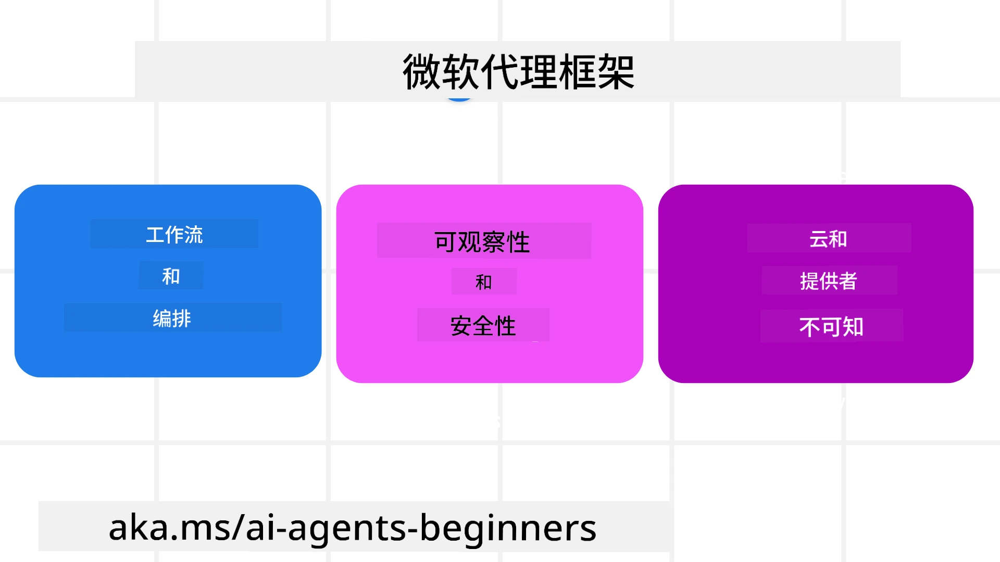
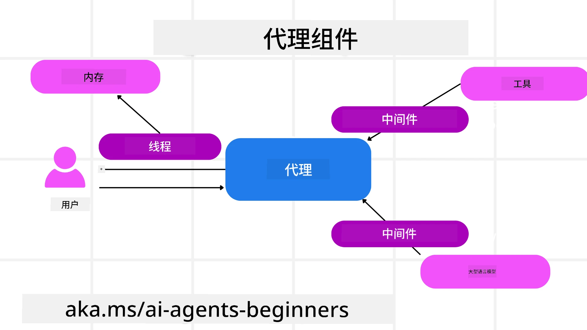

# 探索 Microsoft Agent 框架



### 介绍

本课将涵盖：

- 了解 Microsoft Agent 框架：关键特性和价值  
- 探索 Microsoft Agent 框架的核心概念
- 高级 MAF 模式：工作流、中间件和内存

## 学习目标

完成本课后，您将了解如何：

- 使用 Microsoft Agent 框架构建生产级 AI 代理
- 将 Microsoft Agent 框架的核心功能应用于您的代理使用场景
- 使用包括工作流、中间件和可观测性在内的高级模式

## 代码示例 

有关 [Microsoft Agent 框架 (MAF)](https://aka.ms/ai-agents-beginners/agent-framework) 的代码示例可以在本仓库的 `xx-python-agent-framework` 和 `xx-dotnet-agent-framework` 文件中找到。

## 了解 Microsoft Agent 框架



[Microsoft Agent 框架 (MAF)](https://aka.ms/ai-agents-beginners/agent-framework) 是微软用于构建 AI 代理的统一框架。它提供了灵活性来应对生产和研究环境中各种代理使用场景，包括：

- <strong>顺序代理编排</strong>：适用于需要逐步工作流的场景。
- <strong>并发编排</strong>：适用于代理需要同时完成任务的场景。
- <strong>群聊编排</strong>：适用于代理可以协同完成单个任务的场景。
- <strong>交接编排</strong>：适用于代理在完成子任务后相互交接任务的场景。
- <strong>磁性编排</strong>：适用于主管代理创建和修改任务列表，并协调子代理完成任务的场景。

为了在生产中交付 AI 代理，MAF 还包含以下特性：

- <strong>可观测性</strong>，通过使用 OpenTelemetry 追踪 AI 代理的每一个动作，包括工具调用、编排步骤、推理流程以及通过 Microsoft Foundry 仪表板进行性能监控。
- <strong>安全性</strong>，代理本地托管于 Microsoft Foundry，具有角色访问控制、私有数据处理和内置内容安全等安全控制。
- <strong>持久性</strong>，代理线程和工作流可以暂停、恢复并从错误中恢复，从而支持更长时间的运行过程。
- <strong>控制权</strong>，支持人机协同工作流，将任务标记为需人工审批。

Microsoft Agent 框架还注重互操作性，通过：

- <strong>云无关性</strong> — 代理可以在容器、本地和多个不同云环境中运行。
- <strong>提供商无关性</strong> — 代理可以通过您偏好的 SDK 创建，包括 Azure OpenAI 和 OpenAI。
- <strong>集成开放标准</strong> — 代理可以使用如 Agent-to-Agent (A2A) 和 Model Context Protocol (MCP) 等协议发现并使用其他代理和工具。
- <strong>插件和连接器</strong> — 可以连接到诸如 Microsoft Fabric、SharePoint、Pinecone 和 Qdrant 等数据和内存服务。

让我们看看这些特性是如何应用于 Microsoft Agent 框架的一些核心概念的。

## Microsoft Agent 框架核心概念

### 代理



<strong>创建代理</strong>

代理的创建是通过定义推理服务（LLM 提供者），
以及 AI 代理需遵循的一组指令和分配的 `name` 来完成的：


```python
agent = AzureOpenAIChatClient(credential=AzureCliCredential()).create_agent( instructions="You are good at recommending trips to customers based on their preferences.", name="TripRecommender" )
```

上述示例使用了 `Azure OpenAI`，但代理可以使用多种服务创建，包括 `Microsoft Foundry Agent Service`：

```python
AzureAIAgentClient(async_credential=credential).create_agent( name="HelperAgent", instructions="You are a helpful assistant." ) as agent
```

OpenAI `Responses`、`ChatCompletion` API

```python
agent = OpenAIResponsesClient().create_agent( name="WeatherBot", instructions="You are a helpful weather assistant.", )
```

```python
agent = OpenAIChatClient().create_agent( name="HelpfulAssistant", instructions="You are a helpful assistant.", )
```

或者使用 [MiniMax](https://platform.minimaxi.com/)，它提供了一个支持大上下文窗口（高达204K标记）的 OpenAI 兼容 API：

```python
agent = OpenAIChatClient(base_url="https://api.minimax.io/v1", api_key=os.environ["MINIMAX_API_KEY"], model_id="MiniMax-M3").create_agent( name="HelpfulAssistant", instructions="You are a helpful assistant.", )
```

或者使用基于 A2A 协议的远程代理：

```python
agent = A2AAgent( name=agent_card.name, description=agent_card.description, agent_card=agent_card, url="https://your-a2a-agent-host" )
```

<strong>运行代理</strong>

代理使用 `.run` 或 `.run_stream` 方法运行，分别用于非流式或流式响应。

```python
result = await agent.run("What are good places to visit in Amsterdam?")
print(result.text)
```

```python
async for update in agent.run_stream("What are the good places to visit in Amsterdam?"):
    if update.text:
        print(update.text, end="", flush=True)

```

每次代理运行还可以包含选项，用以自定义代理使用的参数，如 `max_tokens`，代理能够调用的 `tools`，甚至用于代理的 `model` 本身。

这在需要特定模型或工具完成用户任务时非常有用。

<strong>工具</strong>

工具可以在定义代理时指定：

```python
def get_attractions( location: Annotated[str, Field(description="The location to get the top tourist attractions for")], ) -> str: """Get the top tourist attractions for a given location.""" return f"The top attractions for {location} are." 


# 直接创建 ChatAgent 时

agent = ChatAgent( chat_client=OpenAIChatClient(), instructions="You are a helpful assistant", tools=[get_attractions]

```

也可以在运行代理时指定：

```python

result1 = await agent.run( "What's the best place to visit in Seattle?", tools=[get_attractions] # 仅为此次运行提供的工具 )
```

<strong>代理线程</strong>

代理线程用于处理多轮对话。线程可以通过以下方式创建：

- 使用 `get_new_thread()`，使线程能被保存较长时间
- 在运行代理时自动创建线程且线程只在当前运行期间存在

创建线程的代码如下：

```python
# 创建一个新线程。
thread = agent.get_new_thread() # 使用该线程运行代理。
response = await agent.run("Hello, I am here to help you book travel. Where would you like to go?", thread=thread)

```

然后你可以序列化线程以便后续存储使用：

```python
# 创建一个新线程。
thread = agent.get_new_thread() 

# 使用该线程运行代理。

response = await agent.run("Hello, how are you?", thread=thread) 

# 将线程序列化以便存储。

serialized_thread = await thread.serialize() 

# 从存储加载后反序列化线程状态。

resumed_thread = await agent.deserialize_thread(serialized_thread)
```

<strong>代理中间件</strong>

代理通过与工具和大型语言模型（LLM）交互完成用户任务。在某些场景中，我们希望执行或跟踪这些交互过程中的操作。代理中间件让我们能实现这一点，方式包括：

<em>函数中间件</em>

该中间件允许我们在代理和它将调用的函数/工具之间执行操作。例如，当你想对函数调用进行日志记录时可以使用它。

在以下代码中，`next` 定义了是调用下一个中间件还是实际的函数。

```python
async def logging_function_middleware(
    context: FunctionInvocationContext,
    next: Callable[[FunctionInvocationContext], Awaitable[None]],
) -> None:
    """Function middleware that logs function execution."""
    # 预处理：函数执行前记录日志
    print(f"[Function] Calling {context.function.name}")

    # 继续执行下一个中间件或函数
    await next(context)

    # 后处理：函数执行后记录日志
    print(f"[Function] {context.function.name} completed")
```

<em>聊天中间件</em>

该中间件允许我们在代理和向大型语言模型发送请求之间执行或记录操作。

这里包含重要信息，如发送给 AI 服务的 `messages`。

```python
async def logging_chat_middleware(
    context: ChatContext,
    next: Callable[[ChatContext], Awaitable[None]],
) -> None:
    """Chat middleware that logs AI interactions."""
    # 预处理：AI调用前记录日志
    print(f"[Chat] Sending {len(context.messages)} messages to AI")

    # 继续到下一个中间件或AI服务
    await next(context)

    # 后处理：AI响应后记录日志
    print("[Chat] AI response received")

```

<strong>代理记忆</strong>

如 `Agentic Memory` 课程中介绍的，记忆是使代理能在不同上下文中操作的重要元素。MAF 提供了几种不同类型的记忆：

<em>内存存储</em>

这是应用程序运行期间在线程中存储的记忆。

```python
# 创建一个新线程。
thread = agent.get_new_thread() # 使用该线程运行代理。
response = await agent.run("Hello, I am here to help you book travel. Where would you like to go?", thread=thread)
```

<em>持久消息</em>

此类记忆用于在不同会话间存储对话历史。它通过 `chat_message_store_factory` 定义：

```python
from agent_framework import ChatMessageStore

# 创建一个自定义消息存储
def create_message_store():
    return ChatMessageStore()

agent = ChatAgent(
    chat_client=OpenAIChatClient(),
    instructions="You are a Travel assistant.",
    chat_message_store_factory=create_message_store
)

```

<em>动态记忆</em>

该记忆在代理运行前被添加到上下文中。这些记忆可以存储于外部服务，例如 mem0：

```python
from agent_framework.mem0 import Mem0Provider

# 使用Mem0实现高级内存功能
memory_provider = Mem0Provider(
    api_key="your-mem0-api-key",
    user_id="user_123",
    application_id="my_app"
)

agent = ChatAgent(
    chat_client=OpenAIChatClient(),
    instructions="You are a helpful assistant with memory.",
    context_providers=memory_provider
)

```

<strong>代理可观测性</strong>


可观测性对于构建可靠且可维护的自主系统至关重要。MAF 集成了 OpenTelemetry，提供跟踪和计量以实现更好的可观测性。

```python
from agent_framework.observability import get_tracer, get_meter

tracer = get_tracer()
meter = get_meter()
with tracer.start_as_current_span("my_custom_span"):
    # 做某事
    pass
counter = meter.create_counter("my_custom_counter")
counter.add(1, {"key": "value"})
```

### 工作流

MAF 提供了预定义步骤以完成任务的工作流，并将 AI 代理作为这些步骤中的组件。

工作流由不同组件组成，允许更好的控制流程。工作流还支持<strong>多代理编排</strong>和<strong>检查点保存</strong>以保存工作流状态。

工作流的核心组件包括：

<strong>执行器</strong>

执行器接收输入消息，执行分配的任务，然后生成输出消息。这样推动工作流向完成更大任务前进。执行器可以是 AI 代理或自定义逻辑。

<strong>边</strong>

边用于定义工作流中消息的流向。这些可以是：

<em>直接边</em> - 执行器之间的一对一简单连接：

```python
from agent_framework import WorkflowBuilder

builder = WorkflowBuilder()
builder.add_edge(source_executor, target_executor)
builder.set_start_executor(source_executor)
workflow = builder.build()
```

<em>条件边</em> - 在满足特定条件后激活。例如，当酒店房间不可用时，执行器可以建议其他选项。

*开关-条件边* - 根据定义的条件将消息路由到不同执行器。例如，如果旅客有优先访问权限，他们的任务将通过另一个工作流处理。

<em>分发边</em> - 将一条消息发送到多个目标。

<em>合并边</em> - 收集来自不同执行器的多条消息并发送给一个目标。

<strong>事件</strong>

为了提供对工作流更好的可观测性，MAF 提供了内置的执行事件，包括：

- `WorkflowStartedEvent`  - 工作流执行开始
- `WorkflowOutputEvent` - 工作流生成输出
- `WorkflowErrorEvent` - 工作流遇到错误
- `ExecutorInvokeEvent`  - 执行器开始处理
- `ExecutorCompleteEvent`  -  执行器处理完成
- `RequestInfoEvent` - 发出请求

## 高级 MAF 模式

上述章节涵盖了 Microsoft Agent Framework 的关键概念。随着你构建更复杂的代理，以下是一些值得考虑的高级模式：

- <strong>中间件组合</strong>：使用函数和聊天中间件链式连接多个中间件处理器（日志记录、认证、限流），实现对代理行为的细粒度控制。
- <strong>工作流检查点</strong>：利用工作流事件和序列化保存并恢复长时间运行的代理进程。
- <strong>动态工具选择</strong>：结合基于工具描述的 RAG 和 MAF 的工具注册，仅展示与查询相关的工具。
- <strong>多代理交接</strong>：利用工作流边和条件路由协调专用代理之间的交接。

## 在 Microsoft Foundry 上托管 LangChain / LangGraph 代理

Microsoft Agent Framework 是<strong>框架互操作的</strong> — 你不必局限于使用 MAF 编写的代理。如果你已有使用 **LangChain** 或 **LangGraph** 构建的代理，可以将其作为 **Microsoft Foundry 托管代理** 运行，由 Foundry 管理运行时、会话、扩展、身份及协议端点，而你的代理逻辑仍保持在 LangGraph 中。

这通过 `langchain_azure_ai.agents.hosting` 包来实现，该包暴露了一个编译好的 LangGraph 图，通过 Foundry 托管代理使用的相同协议进行通信。

**1. 安装 hosting 额外组件：**

```bash
pip install -U "langchain-azure-ai[hosting]>=1.2.4" azure-identity
```

`hosting` 额外组件安装 Foundry 协议库：`azure-ai-agentserver-responses` （兼容 OpenAI 的 `/responses` 端点）和 `azure-ai-agentserver-invocations`（通用的 `/invocations` 端点）。

**2. 选择托管协议：**

| 协议 | 主机类 | 端点 | 使用场景 |
|----------|-----------|----------|----------|
| **Responses** | `ResponsesHostServer` | `/responses` | 需要兼容 OpenAI 的聊天、流式传输、响应历史和会话线程——这是对话代理推荐的默认选项。 |
| **Invocations** | `InvocationsHostServer` | `/invocations` | 需要自定义 JSON 格式、Webhook 风格端点或非对话式处理。 |

因为 **Responses API 是 Foundry 中代理开发的主要 API**，大多数代理建议从 `ResponsesHostServer` 开始。

**3. 配置环境变量**（先执行 `az login` 使 `DefaultAzureCredential` 能认证）：

```bash
export FOUNDRY_PROJECT_ENDPOINT="https://<resource>.services.ai.azure.com/api/projects/<project>"
export FOUNDRY_MODEL_NAME="gpt-5-mini"
```

当代理作为 Foundry 的托管代理运行时，平台会自动注入 `FOUNDRY_PROJECT_ENDPOINT` 变量。

**4. 通过 Responses 协议公开 LangGraph 代理：**

```python
import os

from azure.ai.projects import AIProjectClient
from azure.identity import DefaultAzureCredential, get_bearer_token_provider
from langchain.agents import create_agent
from langchain_openai import ChatOpenAI
from langchain_azure_ai.agents.hosting import ResponsesHostServer

_AZURE_AI_SCOPE = "https://ai.azure.com/.default"


def build_chat_model() -> ChatOpenAI:
    project_endpoint = os.environ["FOUNDRY_PROJECT_ENDPOINT"].rstrip("/")
    deployment = os.environ.get("FOUNDRY_MODEL_NAME", "gpt-5-mini")
    credential = DefaultAzureCredential()
    project = AIProjectClient(endpoint=project_endpoint, credential=credential)
    openai_client = project.get_openai_client()
    token_provider = get_bearer_token_provider(credential, _AZURE_AI_SCOPE)

    # ChatOpenAI这里针对Foundry项目的OpenAI兼容（响应）端点。
    return ChatOpenAI(
        model=deployment,
        base_url=str(openai_client.base_url),
        api_key=token_provider,
    )


def main() -> None:
    graph = create_agent(build_chat_model(), tools=[])
    port = int(os.environ.get("PORT", "8088"))
    ResponsesHostServer(graph).run(port=port)


if __name__ == "__main__":
    main()
```

在本地用 `python main.py` 运行，然后向 `http://localhost:8088/responses` 发送 Responses 请求。

**关键行为：**

- <strong>会话</strong>：客户端通过传递 `previous_response_id` 或 `conversation` ID 继续会话。如果你的图通过 LangGraph 检查点编译，Foundry 会将会话状态关联到检查点（生产环境使用持久化检查点；本地测试可用 `MemorySaver`）。
- <strong>人机协作</strong>：如果你的图使用 LangGraph 的 `interrupt()`，`ResponsesHostServer` 会将待处理的中断显示为 Responses 的 `function_call` / `mcp_approval_request` 项，客户端通过对应的 `function_call_output` / `mcp_approval_response` 完成恢复。
- **部署到 Foundry**：使用 Azure Developer CLI — `azd ext install azure.ai.agents`，`azd ai agent init -m <manifest>`，`azd ai agent run`（本地需 Docker），然后 `azd provision` 和 `azd deploy`。托管代理部署需要 **Foundry 项目管理员** 角色。

此示例的可运行版本位于 [code-samples/14-langchain-hosted-agent.py](../../../14-microsoft-agent-framework/code-samples/14-langchain-hosted-agent.py)。完整教程（包含 Invocations 协议、自定义请求架构及故障排查）请参见 [以 Foundry 托管代理身份托管 LangGraph 代理](https://learn.microsoft.com/azure/foundry/how-to/develop/langchain-hosted-agents)。

## 代码示例

Microsoft Agent Framework 的代码示例可在此仓库中找到，位于 `xx-python-agent-framework` 和 `xx-dotnet-agent-framework` 文件夹下。

## 想了解更多关于 Microsoft Agent Framework 的问题？

加入 [Microsoft Foundry Discord](https://discord.com/invite/ATgtXmAS5D) ，与其他学习者交流，参加办公时间，并获得你的 AI 代理相关问题的解答。
## 上一课

[AI 代理的记忆](../13-agent-memory/README.md)

## 下一课

[构建计算机使用代理(CUA)](../15-browser-use/README.md)

---

<!-- CO-OP TRANSLATOR DISCLAIMER START -->
**免责声明**：
本文件由 AI 翻译服务 [Co-op Translator](https://github.com/Azure/co-op-translator) 翻译完成。尽管我们力求准确，但请注意，自动翻译可能包含错误或不准确之处。原始语言版文件应视为权威来源。对于重要信息，建议使用专业人工翻译。我们对因使用本翻译而产生的任何误解或误释不承担责任。
<!-- CO-OP TRANSLATOR DISCLAIMER END -->