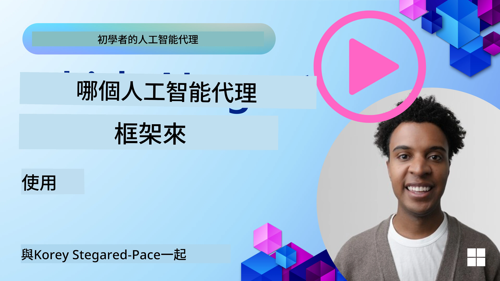

[](https://youtu.be/ODwF-EZo_O8?si=1xoy_B9RNQfrYdF7)

> _(點擊上方圖片觀看本課程影片)_

# 探索 AI Agent 框架

AI Agent 框架是設計用來簡化 AI 代理創建、部署和管理的軟件平台。這些框架為開發者提供了預先構建的組件、抽象和工具，以便簡化複雜 AI 系統的開發。

這些框架幫助開發者專注於其應用程式的獨特部分，透過為 AI 代理開發中常見挑戰提供標準化方法，提升建構 AI 系統的擴展性、可及性及效率。

## 簡介

本課程將涵蓋：

- AI Agent 框架是什麼？它們能讓開發者達成什麼目標？
- 團隊如何利用這些框架快速進行原型、迭代並提升代理能力？
- 微軟創建的框架和工具（<a href="https://aka.ms/ai-agents-beginners/ai-agent-service" target="_blank">Microsoft Foundry Agent Service</a>及<a href="https://learn.microsoft.com/azure/ai-services/openai/how-to/responses" target="_blank">Microsoft Agent Framework</a>）有何差異？
- 我是否可以直接整合現有 Azure 生態系統的工具，還是需要獨立的解決方案？
- Microsoft Foundry Agent Service 是什麼？它如何幫助我？

## 學習目標

這堂課的目標是幫助你理解：

- AI Agent 框架在 AI 開發中的角色。
- 如何利用 AI Agent 框架建構智能代理。
- AI Agent 框架啟用的關鍵能力。
- 微軟 Agent Framework 與 Microsoft Foundry Agent Service 之間的差異。

## AI Agent 框架是什麼？它們讓開發者能做什麼？

傳統 AI 框架可以幫助你將 AI 整合到應用程式中，提升應用程式的以下特點：

- <strong>個人化</strong>：AI 能分析用戶行為和偏好，提供個人化推薦、內容和體驗。
例子：Netflix 等串流服務利用 AI 根據觀看歷史推薦電影和節目，提升用戶參與感和滿意度。
- <strong>自動化與效率</strong>：AI 能自動化重複性任務、簡化工作流程及提升營運效率。
例如：客服應用使用 AI 聊天機器人處理常見查詢，縮短回應時間並釋放真人代理處理更複雜問題。
- <strong>提升用戶體驗</strong>：AI 能透過語音識別、自然語言處理及預測文字提供智能功能，提升整體用戶體驗。
例如：Siri 與 Google 助理使用 AI 理解並回應語音指令，讓使用者輕鬆與裝置互動。

### 聽起來很棒，那為什麼我們還需要 AI Agent 框架呢？

AI Agent 框架不單是 AI 框架，更用來創造能與用戶、其他代理及環境互動，完成特定目標的智能代理。這些代理能展現自主行為、做決策並適應變化環境。以下是 AI Agent 框架所支持的主要能力：

- <strong>代理協作與協調</strong>：允許多個 AI 代理同時工作、溝通與協調以解決複雜任務。
- <strong>任務自動化與管理</strong>：提供機制自動化多步驟工作流程、任務分派及代理間動態任務管理。
- <strong>情境理解與適應</strong>：賦予代理理解情境、適應環境變化並根據即時資訊做決策的能力。

總結來說，代理讓你能做更多事，提高自動化層級，建構更智能且能從環境中學習與適應的系統。

## 如何快速原型設計、迭代及提升代理能力？

這是個快速變化的領域，但大多數 AI Agent 框架共有一些特點，能幫助快速原型設計與迭代：模組化元件、協作工具與即時學習。以下深入介紹：

- <strong>使用模組化元件</strong>：AI SDK 提供預建元件，如 AI 和記憶連接器、以自然語言或程式碼外掛呼叫功能、提示模板等。
- <strong>利用協作工具</strong>：設計擁有特定角色與任務的代理，使其能測試及優化協作工作流程。
- <strong>即時學習</strong>：實現反饋迴圈，代理藉由互動學習並動態調整行為。

### 使用模組化元件

像微軟 Agent Framework 這樣的 SDK 提供預建元件，如 AI 連接器、工具定義及代理管理。

<strong>團隊如何使用這些元件</strong>：團隊可迅速組合這些元件打造功能性原型，無需從零開始，能促進快速實驗與迭代。

<strong>實務運作方式</strong>：可使用預先建好的解析器從用戶輸入中提取資訊，使用記憶模組儲存並檢索資料，並利用提示產生器與用戶互動，皆免自行重建元件。

<strong>範例程式碼</strong>：讓我們看看如何使用 Microsoft Agent Framework 與 `FoundryChatClient` 讓模型回應用戶輸入並呼叫工具：

``` python
# Microsoft Agent Framework Python 範例

import asyncio
import os

from agent_framework import tool
from agent_framework.foundry import FoundryChatClient
from azure.identity import AzureCliCredential


# 定義一個範例工具函數來預訂旅行
@tool(approval_mode="never_require")
def book_flight(date: str, location: str) -> str:
    """Book travel given location and date."""
    return f"Travel was booked to {location} on {date}"


async def main():
    provider = FoundryChatClient(
        project_endpoint=os.environ["AZURE_AI_PROJECT_ENDPOINT"],
        model=os.environ["AZURE_AI_MODEL_DEPLOYMENT_NAME"],
        credential=AzureCliCredential(),
    )
    agent = provider.as_agent(
        name="travel_agent",
        instructions="Help the user book travel. Use the book_flight tool when ready.",
        tools=[book_flight],
    )

    response = await agent.run("I'd like to go to New York on January 1, 2025")
    print(response)
    # 範例輸出：你於2025年1月1日前往紐約的航班已成功預訂。祝旅途愉快！✈️🗽


if __name__ == "__main__":
    asyncio.run(main())
```

從此範例可見，如何利用預建解析器從用戶輸入中萃取關鍵資訊，如航班訂票請求的出發地、目的地與日期。這種模組化設計讓你能聚焦於高階邏輯。

### 利用協作工具

像 Microsoft Agent Framework 這樣的框架促進多代理共同工作。

<strong>團隊如何使用這些工具</strong>：設計具有特定角色和任務的代理，使其能測試、優化協作工作流程並提升系統整體效率。

<strong>實務示例</strong>：可建立一組代理團隊，讓每個代理專注於資料檢索、分析或決策等特定功能。代理間可溝通分享資訊，以達成共通目標，如回答用戶查詢或完成任務。

**範例程式碼（Microsoft Agent Framework）**：

```python
# 使用 Microsoft Agent Framework 創建多個協同工作的代理

import os
from agent_framework.foundry import FoundryChatClient
from azure.identity import AzureCliCredential

provider = FoundryChatClient(
    project_endpoint=os.environ["AZURE_AI_PROJECT_ENDPOINT"],
    model=os.environ["AZURE_AI_MODEL_DEPLOYMENT_NAME"],
    credential=AzureCliCredential(),
)

# 資料擷取代理
agent_retrieve = provider.as_agent(
    name="dataretrieval",
    instructions="Retrieve relevant data using available tools.",
    tools=[retrieve_tool],
)

# 資料分析代理
agent_analyze = provider.as_agent(
    name="dataanalysis",
    instructions="Analyze the retrieved data and provide insights.",
    tools=[analyze_tool],
)

# 按順序執行代理完成任務
retrieval_result = await agent_retrieve.run("Retrieve sales data for Q4")
analysis_result = await agent_analyze.run(f"Analyze this data: {retrieval_result}")
print(analysis_result)
```

從前述範例可見，如何建立一個由多個代理協作分析資料的任務。每個代理負責特定功能，任務透過協調代理共同執行以達成預期結果。藉由創建專門角色的代理，可以提升任務效率與效能。

### 即時學習

進階框架提供即時情境理解與適應能力。

<strong>團隊如何使用這些能力</strong>：實作反饋迴圈，讓代理從互動中學習，並動態調整行為，不斷提升與精進能力。

<strong>實務運作</strong>：代理能分析用戶回饋、環境資料與任務結果，更新知識庫、調整決策演算法並提升性能。此迭代學習過程讓代理隨環境與用戶偏好變化適應，增強整體系統效能。

## Microsoft Agent Framework 與 Microsoft Foundry Agent Service 有何差異？

有多種方式比較這兩者，以下著重於設計、能力與目標使用情境的主要差異：

## Microsoft Agent Framework (MAF)

Microsoft Agent Framework 提供精簡的 SDK，用於構建使用 `FoundryChatClient` 的 AI 代理。它允許開發者創建利用 Azure OpenAI 模型的代理，內建工具呼叫、對話管理及通過 Azure 身分驗證的企業級安全性。

<strong>使用場景</strong>：用於構建生產就緒的 AI 代理，具工具使用、多步流程與企業整合場景。

以下是 Microsoft Agent Framework 的一些重要核心概念：

- **代理 (Agents)**。代理透過 `FoundryChatClient` 創建並設定名稱、指令及工具。代理可：
  - <strong>處理用戶訊息</strong> 並利用 Azure OpenAI 模型生成回應。
  - <strong>自動呼叫工具</strong>，根據對話上下文執行。
  - <strong>維護對話狀態</strong>，跨多次互動持續追蹤。

  以下為如何創建代理的程式碼範例：

    ```python
    import os
    from agent_framework.foundry import FoundryChatClient
    from azure.identity import AzureCliCredential

    provider = FoundryChatClient(
        project_endpoint=os.environ["AZURE_AI_PROJECT_ENDPOINT"],
        model=os.environ["AZURE_AI_MODEL_DEPLOYMENT_NAME"],
        credential=AzureCliCredential(),
    )
    agent = provider.as_agent(
        name="my_agent",
        instructions="You are a helpful assistant.",
    )

    response = await agent.run("Hello, World!")
    print(response)
    ```

- **工具 (Tools)**。框架支援定義工具，作為可被代理自動呼叫的 Python 函數。工具於創建代理時註冊：

    ```python
    def get_weather(location: str) -> str:
        """Get the current weather for a location."""
        return f"The weather in {location} is sunny, 72\u00b0F."

    agent = provider.as_agent(
        name="weather_agent",
        instructions="Help users check the weather.",
        tools=[get_weather],
    )
    ```

- **多代理協調 (Multi-Agent Coordination)**。可建立多個具有不同專長的代理並協調其工作：

    ```python
    planner = provider.as_agent(
        name="planner",
        instructions="Break down complex tasks into steps.",
    )

    executor = provider.as_agent(
        name="executor",
        instructions="Execute the planned steps using available tools.",
        tools=[execute_tool],
    )

    plan = await planner.run("Plan a trip to Paris")
    result = await executor.run(f"Execute this plan: {plan}")
    ```

- **Azure 身份整合**。框架使用 `AzureCliCredential`（或 `DefaultAzureCredential`）進行安全無密鑰驗證，免除直接管理 API 金鑰的需求。

## Microsoft Foundry Agent Service

Microsoft Foundry Agent Service 是較新推出的服務，在 Microsoft Ignite 2024 發表。它支援更靈活的模型，例如直接呼叫開源大型語言模型像是 Llama 3、Mistral 和 Cohere。

Microsoft Foundry Agent Service 提供更強企業安全機制與資料存儲方案，適用於企業級應用。

它與 Microsoft Agent Framework 無縫整合，可用於建構和部署代理。

此服務目前為公共預覽，支援 Python 和 C# 來構建代理。

使用 Microsoft Foundry Agent Service Python SDK，我們可以創建帶有自訂工具的代理：

```python
import asyncio
from azure.identity import DefaultAzureCredential
from azure.ai.projects import AIProjectClient

# 定義工具功能
def get_specials() -> str:
    """Provides a list of specials from the menu."""
    return """
    Special Soup: Clam Chowder
    Special Salad: Cobb Salad
    Special Drink: Chai Tea
    """

def get_item_price(menu_item: str) -> str:
    """Provides the price of the requested menu item."""
    return "$9.99"


async def main() -> None:
    credential = DefaultAzureCredential()
    project_client = AIProjectClient.from_connection_string(
        credential=credential,
        conn_str="your-connection-string",
    )

    agent = project_client.agents.create_agent(
        model="gpt-5-mini",
        name="Host",
        instructions="Answer questions about the menu.",
        tools=[get_specials, get_item_price],
    )

    thread = project_client.agents.create_thread()

    user_inputs = [
        "Hello",
        "What is the special soup?",
        "How much does that cost?",
        "Thank you",
    ]

    for user_input in user_inputs:
        print(f"# User: '{user_input}'")
        message = project_client.agents.create_message(
            thread_id=thread.id,
            role="user",
            content=user_input,
        )
        run = project_client.agents.create_and_process_run(
            thread_id=thread.id, agent_id=agent.id
        )
        messages = project_client.agents.list_messages(thread_id=thread.id)
        print(f"# Agent: {messages.data[0].content[0].text.value}")


if __name__ == "__main__":
    asyncio.run(main())
```

### 核心概念

Microsoft Foundry Agent Service 具有以下核心概念：

- **代理 (Agent)**。它整合於 Microsoft Foundry 中，作為「智能」微服務，用於回答問題（RAG）、執行操作或完全自動化工作流程。透過結合生成式 AI 模型與能存取及互動現實數據來源的工具，達成此目標。以下是一個代理範例：

    ```python
    agent = project_client.agents.create_agent(
        model="gpt-5-mini",
        name="my-agent",
        instructions="You are helpful agent",
        tools=code_interpreter.definitions,
        tool_resources=code_interpreter.resources,
    )
    ```

    此範例中，代理使用模型 `gpt-5-mini`，名稱為 `my-agent`，指令為「你是一個有幫助的代理」。代理配備工具與資源執行程式碼解釋任務。

- **線程與訊息 (Thread and messages)**。線程代表代理與用戶之間的對話或互動。線程可用於追蹤對話進程、儲存上下文資訊及管理互動狀態。以下為線程範例：

    ```python
    thread = project_client.agents.create_thread()
    message = project_client.agents.create_message(
        thread_id=thread.id,
        role="user",
        content="Could you please create a bar chart for the operating profit using the following data and provide the file to me? Company A: $1.2 million, Company B: $2.5 million, Company C: $3.0 million, Company D: $1.8 million",
    )
    
    # 請求代理對執行緒執行工作
    run = project_client.agents.create_and_process_run(thread_id=thread.id, agent_id=agent.id)
    
    # 擷取並記錄所有訊息以查看代理的回應
    messages = project_client.agents.list_messages(thread_id=thread.id)
    print(f"Messages: {messages}")
    ```

    在前述程式碼中，線程被建立，接著發送訊息至該線程。藉由呼叫 `create_and_process_run`，代理受命在該線程上執行工作。最後取得並記錄訊息查看代理回應。訊息指出用戶與代理間對話進展。也須了解訊息可有不同類型，如文字、圖片或檔案，代表代理工作產生的各種回應。開發者可用此資訊進一步處理回應或呈現給用戶。

- **與 Microsoft Agent Framework 整合**。Microsoft Foundry Agent Service 與 Microsoft Agent Framework 無縫整合，意味著可使用 `FoundryChatClient` 構建代理，並透過代理服務部署於生產環境。

<strong>使用場景</strong>：Microsoft Foundry Agent Service 為需安全、可擴展及靈活 AI 代理部署的企業應用設計。

## 這些方法有何差異？
 
兩者確實有重疊，但在設計、能力與目標使用案例上存在重要差異：
 
- **Microsoft Agent Framework (MAF)**：為構建 AI 代理的生產就緒 SDK，提供帶工具呼叫、對話管理及 Azure 身分整合的精簡 API。
- **Microsoft Foundry Agent Service**：位於 Microsoft Foundry 的平台和部署服務，內建與 Azure OpenAI、Azure AI 搜尋、Bing 搜尋及程式碼執行等服務連接。
 
還是不確定該選哪一個？

### 使用案例
 
讓我們看看一些常見案例，看看是否能幫助你：
 
> 問：我正在建置生產級 AI 代理應用，想快速開始
>

>答：Microsoft Agent Framework 是個好選擇。它提供簡單且符合 Python 使用習慣的 API（透過 `FoundryChatClient`），讓你只需數行程式碼即可定義帶工具與指令的代理。

>問：我需要具備 Azure 整合（如搜尋與程式碼執行）的企業級部署
>
> 答：Microsoft Foundry Agent Service 最合適。這是一個平台服務，支援多模型、Azure AI 搜尋、Bing 搜尋與 Azure Functions。讓你能輕鬆在 Foundry Portal 建構代理並大規模部署。
 
> 問：我還是不確定，給我一個選項就好
>
> 答：先從 Microsoft Agent Framework 開始建構代理，之後當你需部署與擴展到生產環境時，再使用 Microsoft Foundry Agent Service。這能讓你快速迭代代理邏輯，同時擁有明確路徑前往企業部署。
 
我們用表格總結主要差異：

| 框架 | 重點 | 核心概念 | 使用案例 |
| --- | --- | --- | --- |
| Microsoft Agent Framework | 精簡代理 SDK 並支援工具呼叫 | 代理、工具、Azure 身分 | 構建 AI 代理、工具使用、多步工作流程 |
| Microsoft Foundry Agent Service | 靈活模型、企業安全、程式碼生成、工具呼叫 | 模組化、協作、流程編排 | 安全、可擴展與靈活的 AI 代理部署 |

## 我可以直接整合現有 Azure 生態系工具，還是需要獨立解決方案？


答案是肯定的，您可以將現有的 Azure 生態系統工具直接與 Microsoft Foundry Agent Service 整合，特別是因為它已經設計成可以與其他 Azure 服務無縫協作。您例如可以整合 Bing、Azure AI 搜尋和 Azure Functions。Microsoft Foundry 也有深度整合。

Microsoft Agent Framework 也透過 `FoundryChatClient` 和 Azure 身份整合了 Azure 服務，讓您可以直接從代理工具呼叫 Azure 服務。

## 範例程式碼

- Python: [Agent Framework (Microsoft Foundry)](./code_samples/02-python-agent-framework.ipynb)
- Python: [Agent Framework (Azure OpenAI Responses API)](./code_samples/02-python-agent-framework-azure-openai.ipynb)
- .NET: [Agent Framework](./code_samples/02-dotnet-agent-framework.md)

## 有更多關於 AI Agent Framework 的問題嗎？

加入 [Microsoft Foundry Discord](https://discord.com/invite/ATgtXmAS5D) 與其他學習者交流，參加辦公時間並獲得您的 AI Agents 問題解答。

## 參考資料

- <a href="https://techcommunity.microsoft.com/blog/azure-ai-services-blog/introducing-azure-ai-agent-service/4298357" target="_blank">Azure Agent Service</a>
- <a href="https://learn.microsoft.com/azure/ai-services/openai/how-to/responses" target="_blank">Microsoft Agent Framework - Azure OpenAI Responses</a>
- <a href="https://learn.microsoft.com/azure/ai-services/agents/overview" target="_blank">Microsoft Foundry Agent Service</a>

## 上一課

[Introduction to AI Agents and Agent Use Cases](../01-intro-to-ai-agents/README.md)

## 下一課

[Understanding Agentic Design Patterns](../03-agentic-design-patterns/README.md)

---

<!-- CO-OP TRANSLATOR DISCLAIMER START -->
**免責聲明**：
本文件使用 AI 翻譯服務 [Co-op Translator](https://github.com/Azure/co-op-translator) 進行翻譯。雖然我們力求準確，但請注意，自動翻譯可能包含錯誤或不準確之處。原始文件的母語版本應被視為權威來源。對於重要資訊，建議尋求專業人工翻譯。我們不對因使用本翻譯而引起的任何誤解或曲解承擔責任。
<!-- CO-OP TRANSLATOR DISCLAIMER END -->